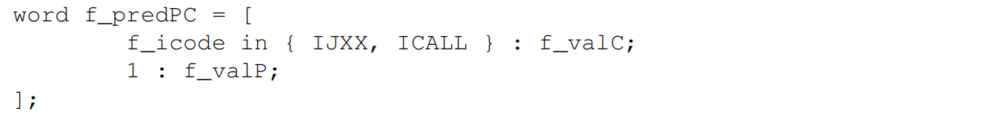
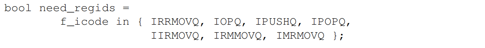
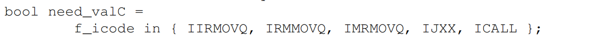
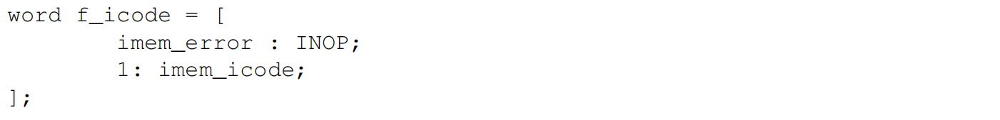
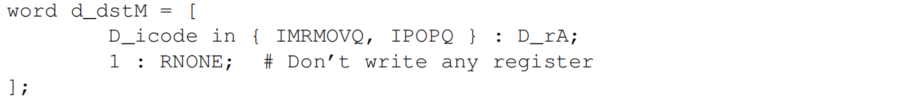

# ICS 2023 Midterm

<center><b><big><big>By WalkerCH</big></big></b></center>

<center><b><big>13 元培数科 常欣海</big></b></center>

<center>（具有部分GPT生成内容，请注意自我甄别）</center>

## 第 1 题

### 类型转换


## 第 2 题

### Symbol


### 公式

- 数学公式
  $$
  -^t_wx
  =\left\{
  \begin{aligned}
  &TMin_w &x=TMin_w\\ 
  &-x &x>TMin_w
  \end{aligned}
  \right.
  $$

- 计算机实现(位级表示)
  $$
  -x=\sim x+1\\ \ because: \ x+(-x)=^u_w2^w
  $$

### 数值

#### 1. Two's Complement Minimal Value ($ T_{\text{min}} $)
- **Binary Representation**:
  $$
  T_{\text{min}} = 1000\ldots 0_2
  $$
  - This is represented with a leading 1 followed by all 0s.
- **Decimal Representation**:
  $$
  T_{\text{min}} = -2^{n-1}
  $$
  - For an $ n $-bit signed integer, $ T_{\text{min}} $ is the most negative value.
  - For example, for a 32-bit integer:
    $$
    T_{\text{min}} = -2^{31} = -2147483648
    $$

#### 2. Two's Complement Maximal Value ($ T_{\text{max}} $)
- **Binary Representation**:
  $$
  T_{\text{max}} = 0111\ldots 1_2
  $$
  - This is represented with a leading 0 followed by all 1s.
- **Decimal Representation**:
  $$
  T_{\text{max}} = 2^{n-1} - 1
  $$
  - For an $ n $-bit signed integer, $ T_{\text{max}} $ is the largest positive value.
  - For example, for a 32-bit integer:
    $$
    T_{\text{max}} = 2^{31} - 1 = 2147483647
    $$

#### 3. Unsigned Integer Maximal Value ($ U_{\text{max}} $)
- **Binary Representation**:
  $$
  U_{\text{max}} = 1111\ldots 1_2
  $$
  - This is represented with all bits set to 1.
- **Decimal Representation**:
  $$
  U_{\text{max}} = 2^n - 1
  $$
  - For an $ n $-bit unsigned integer:
    $$
    U_{\text{max}} = 2^{32} - 1 = 4294967295
    $$

#### 4. IEEE 754 Floating-Point Representations

##### 4.1 Single Precision ($ \text{float} $)
- **Maximal Finite Value**:
  $$
  \text{Float}_{\text{max}} = (2 - 2^{-23}) \times 2^{127}
  $$
  - In decimal:
    $$
    \text{Float}_{\text{max}} \approx 3.4028235 \times 10^{38}
    $$

- **Minimal Positive Normalized Value**:
  $$
  \text{Float}_{\text{min}} = 2^{-126}
  $$
  - In decimal:
    $$
    \text{Float}_{\text{min}} \approx 1.17549435 \times 10^{-38}
    $$

##### 4.2 Double Precision ($ \text{double} $)
- **Maximal Finite Value**:
  $$
  \text{Double}_{\text{max}} = (2 - 2^{-52}) \times 2^{1023}
  $$
  - In decimal:
    $$
    \text{Double}_{\text{max}} \approx 1.7976931348623157 \times 10^{308}
    $$

- **Minimal Positive Normalized Value**:
  $$
  \text{Double}_{\text{min}} = 2^{-1022}
  $$
  - In decimal:
    $$
    \text{Double}_{\text{min}} \approx 2.2250738585072014 \times 10^{-308}
    $$

## 第 3 题

### 特殊值

$$
V=(-1)^s\times 2^E\times M
$$

$$
偏置:Bisa=2^{k-1}-1\\
指数：E=e-Bias
$$

- 最小的非规格化数： $NOT_{min}=2^{1-Bias}*2^{-n}=2^{2-2^{k-1}}*2^{-n}=2^{2-2^{k-1}-n}$
- 最大的规格化数： $NOT_{max}=2^{1-Bias}*(1-2^{-n})=2^{2-2^{k-1}}*(1-2^{-n})$
- 最小的规格化数： $YES_{min}=2^{1-Bias}*(1)=2^{2-2^{k-1}}$
- 最大的规格化数： $YES_{max}=2^{(2^k-1)-Bias-1}*(2-2^{-n})=2^{2^{k-1}-1}*(2-2^{-n})$

### 舍入与计算


$$
x+^fy=Round(x+y)\\
x\times^fy=Round(x+y)
$$


$$
(-1)^{s_1}\cdot M_1\cdot 2^{E_1} \times(-1)^{s_2}\cdot M_2\cdot 2^{E_2}=(-1)^{s}\cdot M\cdot 2^{E}\\
$$

-  $\mathrm{Sign}\ \ \  s$ :					 	 $s_1$^$s_2$
-  $\mathrm{Significand}\ \ \  M$ :	   	$M_1\times M_2$

-  $\mathrm{Exponent}\ \ \  E$ :             $E_1+E_2$

-  Note
   -  浮点加法、乘法的单调性——与无符号或补码加法的对比
   -  计算细节
      1. 符号位sign
      2. 指数exponent
      3. 小数fraction
      4. 尾数mantissa


### Inf & NaN

在 **IEEE 754 浮点数标准**中，浮点运算结果可以是无穷大（`Infinity`）或非数（`NaN`，Not a Number）。这取决于操作数的值、运算的类型以及溢出、非法操作等情况。

#### 1. **无穷大（Infinity）**

##### 什么时候出现无穷大？

无穷大在运算结果超出浮点数的表示范围（即溢出）时出现。无穷大的符号可以是正的或负的，具体取决于运算的符号。

##### 具体情况

1. **溢出**
   - 当运算结果超过浮点数的最大可表示值时，会被设为无穷大。
   - 例如：
     - $ 1 \times 10^{308} \times 10 $（对于双精度）将导致正无穷大（`+Inf`）。
     - $ -1 \times 10^{308} \times 10 $（对于双精度）将导致负无穷大（`-Inf`）。

2. **除以 0**
   - 当非零数除以 0 时，结果是无穷大：
     - $ 1 / 0 = +\infty $
     - $ -1 / 0 = -\infty $
   - 注意：0 除以 0 并不属于这一情况，而是会得到 `NaN`（见下文）。

3. **无穷大的运算**
   - **无穷大加/减非无穷大的有限数**：
     - $ +\infty + x = +\infty $，其中 `x` 是有限数。
     - $ -\infty - x = -\infty $，其中 `x` 是有限数。
   - **无穷大乘以非零有限数**：
     - $ +\infty \times x = +\infty $（如果 `x > 0`），或 $ -\infty $（如果 `x < 0`）。
     - $ -\infty \times x = -\infty $（如果 `x > 0`），或 $ +\infty $（如果 `x < 0`）。

4. **指数运算**
   - 当浮点数的指数超出最大可表示的指数范围时，结果为无穷大。

##### 特殊运算例外

- **无穷大减无穷大**：结果为 `NaN`。
- **无穷大乘以 0**：结果为 `NaN`。
- **无穷大除以无穷大**：结果为 `NaN`。

#### 2. **非数（NaN, Not a Number）**

##### 什么时候出现 NaN？

`NaN` 是在运算结果无意义或未定义的情况下出现的。它表示无法确定或非法的计算结果。

##### 具体情况

1. **0 除以 0**
   - $ 0 / 0 $ 是未定义的，因此结果为 `NaN`。

2. **无穷大减无穷大**
   - $ +\infty - +\infty = \text{NaN} $
   - $ -\infty - -\infty = \text{NaN} $

3. **无穷大乘以 0**
   - $ +\infty \times 0 = \text{NaN} $
   - $ -\infty \times 0 = \text{NaN} $

4. **无穷大除以无穷大**
   - $ \infty / \infty = \text{NaN} $

5. **浮点数的平方根**
   - 对负数进行平方根运算，如 $ \sqrt{-1} $，结果为 `NaN`。

6. **非法操作**
   - 例如，尝试将无效的比特模式转换为浮点数时，也会得到 `NaN`。

7. **无效的类型转换**
   - 如果尝试将浮点数的无效位模式（如非规范化的位模式）进行转换，可能会导致 `NaN`。

#### NaN 的特殊性质

1. **NaN 与 NaN 的比较**
   - 在 IEEE 754 标准中，`NaN` 与任何数（包括 `NaN` 本身）的比较结果都是**假**。
   - 例如：
     - $ \text{NaN} == \text{NaN} $ 是**假**。
     - $ \text{NaN} < \text{NaN} $ 是**假**。
     - $ \text{NaN} > \text{NaN} $ 是**假**。

2. **两种类型的 NaN**
   - **QNaN（Quiet NaN）**：用于传播计算中的错误，不引发异常。
   - **SNaN（Signaling NaN）**：用于引发异常，提示需要特殊处理。

#### IEEE 754 浮点运算规则总结

| 运算类型   | 结果为无穷大（Infinity） | 结果为 NaN                 |
| ---------- | ------------------------ | -------------------------- |
| 溢出       | 超出表示范围的结果       | -                          |
| 除以 0     | 非零数除以 0             | 0 除以 0                   |
| 无穷大运算 | 无穷大加/减有限数        | 无穷大减无穷大             |
| 无穷大乘法 | 无穷大乘以非零有限数     | 无穷大乘以 0               |
| 无穷大除法 | 非零有限数除以无穷大     | 无穷大除以无穷大           |
| 平方根     | -                        | 负数的平方根               |
| 类型转换   | -                        | 非规范化位模式转换为浮点数 |

#### 总结

- **无穷大（Infinity）**：主要是因为数值溢出、非零数除以 0 或某些无穷大运算（如无穷大加有限数）。
- **非数（NaN）**：则多出现在未定义的运算（如 0/0、无穷大减无穷大、无穷大乘以 0）、负数的平方根等情况下。

## 第 4 题

### 寄存器


## 第 5 题

### 寻址模式

$$
Imm(r_b,r_i,s)\Rightarrow Imm+\mathrm{R[r_b]+R[r_i]}*s
$$


## 第 6 题

### 条件码寄存器

- 进位标志 **CF**（carry flag）：无符号溢出（无论上溢还是下溢）
- 零标志 **ZF**（zero flag）：零
- 符号标志 **SF**（sign flag）：负数
- 溢出标志 **OF**（overflow flag）：有符号溢出


- leaq 不会设置任何条件码
- **逻辑操作**会置零 CF 和 OF（**无溢出**）
- **移位操作**会置零 OF，根据最后一个移出的位改变 CF（无论左移还是右移）
- INC 和 DEC 会改变 ZF 和 OF，但是**不会改变 CF**

### cmp & test

- cmp/test 用于设置 CC，后缀 b/w/l/q，行为等同 sub/and
  - testq %rax %rax（零测试） 
  - testq %rax $MASK（掩码测试）


### set


### jmp


## 第 7 题


## 第 8 题

### 指针运算

#### 指针相关

- 声明多个数组时，编译器不保证它们占用的内存空间是连续的
- void* 指针的运算的倍数为 1

#### 基本指针运算

- ==**数组下标运算**和**真实地址运算**的区别，二者相差一个 **sizeof(T)** 的倍数==


## 第 9 题

---

### 解码复杂表达式


- 指针运算动图：阅读方法：先找变量名，一层一层括号往外读

  

### 指针运算


## 第 10 题

> 略

## 第 11 题

> 略

## 第 12 题

> 略

## 第 13 题


## 第 14 题

> 略

## 第 15 题

### 解析第 15 题

#### 题目描述
给定的 C 代码如下：
```c
char s[16] = "I love ICS2023!";
for (int i = sizeof(s); i - sizeof(char) >= 0; i -= sizeof(char)) {
    printf("%c", s[i - 1]);
}
```
需要分析该代码的输出。

#### 代码分析
1. **字符数组初始化**
   ```c
   char s[16] = "I love ICS2023!";
   ```
   - `s` 是一个大小为 16 的字符数组。
   - 字符串 `"I love ICS2023!"` 的长度是 15 字节，加上一个终止符 `'\0'`，刚好占用 16 字节的空间。
   - 在大端法存储的机器上，字符数组的存储顺序与字符串的书写顺序一致。

2. **循环结构**
   ```c
   for (int i = sizeof(s); i - sizeof(char) >= 0; i -= sizeof(char)) {
       printf("%c", s[i - 1]);
   }
   ```
   - **`sizeof(s)`** 返回的是 `s` 的大小，即 16。
   - **`sizeof(char)`** 为 1。
   - 因此，循环的初始条件是 `i = 16`，并且 `i` 每次减少 1。

3. **隐式类型转换**
   - 关键在于：`sizeof` 返回的是一个 **`unsigned` 类型**（在大多数编译器中是 `unsigned long`）。
   - 变量 `i` 是一个 `int` 类型，表达式 `i - sizeof(char)` 中，`sizeof(char)` 被视为无符号数，可能会导致**隐式转换**。
   - 当 `i` 递减到 0 时，`i - sizeof(char)` 变为 -1，由于 `sizeof(char)` 是无符号类型，这会被解释为一个大的无符号数（具体为 \(2^{32} - 1\) 或 \(2^{64} - 1\)，取决于编译器）。
   - 由于是无符号数的比较，`i - sizeof(char) >= 0` 将**始终为真**，导致循环**无法停止**。

4. **循环越界**
   - 当 `i` 小于 0 时，`s[i - 1]` 将访问到数组 `s` 的越界位置。
   - 这会导致**字符数组越界**访问，可能导致未定义行为，包括潜在的程序崩溃。

#### 最终结论
- **选项 D 是正确的**：循环不会停止，字符数组会越界。

### 常见的函数返回值类型

1. **`sizeof` 操作符**
   - **返回类型**：`size_t`，是一个**无符号整数类型**。
   - **出处**：`stddef.h` 头文件。
   - **解释**：`size_t` 用于表示对象或类型的大小，因此它是无符号的，以避免负值的表示问题。
   - **机制原因**：返回无符号类型是因为对象的大小不可能为负数，这确保了类型的非负特性。
2. **`strlen` 函数**
   - **返回类型**：`size_t`。
   - **出处**：`string.h` 头文件。
   - **解释**：返回字符串的长度（不包括末尾的 `'\0'`）。
   - **机制原因**：类似于 `sizeof`，`strlen` 返回的也是无符号值，因为字符串的长度只能是非负数。
3. **`malloc` 函数**
   - **返回类型**：`void *`。
   - **出处**：`stdlib.h` 头文件。
   - **解释**：返回分配的内存块的指针。
   - **机制原因**：`void *` 类型可以被转换为任何其他指针类型，从而实现灵活的内存管理。
4. **`strcmp` 函数**
   - **返回类型**：`int`。
   - **出处**：`string.h` 头文件。
   - **解释**：比较两个字符串，返回一个整数：
     - 负数：第一个字符串小于第二个。
     - 0：两个字符串相等。
     - 正数：第一个字符串大于第二个。
   - **机制原因**：返回整数是为了能够描述字符串大小关系。

### 常见的隐式类型转换规则

#### 1. **整数提升（Integer Promotion）**
   - **规则**：当参与运算的整数类型小于 `int` 时（如 `char`、`short`），它们会被提升为 `int` 类型。
   - **机制原因**：整数提升是为了简化处理，避免溢出问题并统一运算规则。

#### 2. **无符号与有符号的混合运算**
   - **规则**：当无符号类型和有符号类型一起参与运算时，有符号类型会被转换为无符号类型。
   - **机制原因**：根据 C 标准，优先考虑较大的表示范围，即无符号类型的范围较大。
   - **出处**：C 标准（C11）中的第 6.3.1.8 节。

   - **示例**：
     
     ```c
     int a = -1;
     unsigned int b = 2;
     if (a < b)  // -1 被转换为无符号，变成一个大数
         printf("True\n");
     else
         printf("False\n");
     ```
     结果为 `"False"`，因为 `-1` 被转换成无符号的大数。

#### 3. **算术转换（Arithmetic Conversions）**
   - **规则**：当不同类型的数值参与运算时，会进行类型提升：
     - **优先级**：`long double` > `double` > `float` > `unsigned long long` > `long long` > `unsigned long` > `long` > `unsigned int` > `int`。
   - **机制原因**：优先使用精度较高的类型，以减少精度损失。

#### 4. **浮点数与整数的混合运算**
   - **规则**：当浮点数与整数一起参与运算时，整数会被转换为浮点数。
   - **机制原因**：为了保证运算结果的精度。

   - **示例**：
     ```c
     int a = 5;
     float b = 2.5;
     float result = a + b;  // a 被提升为 float
     ```

#### 5. **赋值转换（Assignment Conversions）**
   - **规则**：在赋值时，如果右值的类型不同于左值的类型，将对右值进行转换以适应左值的类型。
   - **机制原因**：确保变量在存储时符合其定义的类型要求。

   - **示例**：
     ```c
     float f = 3.14;
     int i = f;  // f 被截断，转为 int 类型，结果为 3
     ```

#### 6. **函数参数转换（Function Argument Conversions）**
   - **规则**：当调用函数时，如果实际参数的类型不同于形式参数的类型，将进行类型转换。
   - **机制原因**：确保函数的参数符合定义的类型。

   - **示例**：
     ```c
     void func(int a);
     func(3.14);  // 3.14 被转换为 3
     ```

#### 7. **指针类型转换**
   - **规则**：指针类型之间的转换需要满足兼容性要求，但可以通过 `void *` 类型进行无损转换。
   - **机制原因**：`void *` 是一种通用指针类型，可以指向任意类型的对象。

#### 8. **浮点类型的转换**
   - **规则**：`double` 转换为 `float` 时可能发生**精度损失**，但不会溢出。
   - **机制原因**：`float` 的有效位数较少，因此舍入可能导致精度丢失。

#### 总结

| 转换类型                 | 机制原因               | 解释                                       | 示例                                             |
| ------------------------ | ---------------------- | ------------------------------------------ | ------------------------------------------------ |
| 整数提升                 | 统一运算规则，避免溢出 | 小于 `int` 的类型提升为 `int`              | `char x = 1; x + 1` 转换为 `int`                 |
| 无符号与有符号的混合运算 | 优先无符号类型范围更大 | 有符号转换为无符号                         | `int a = -1; unsigned b = 2; a < b` 结果为 False |
| 算术转换                 | 优先精度较高的类型     | 提升为高精度类型                           | `int + float` 转换为 `float`                     |
| 浮点数与整数的混合运算   | 保持浮点运算的精度     | 整数转换为浮点数                           | `int a = 5; float b = 2.5; a + b` 转换为 `float` |
| 赋值转换                 | 保持变量类型的一致性   | 右值转换为左值类型                         | `float f = 3.14; int i = f;`                     |
| 函数参数转换             | 确保函数参数匹配       | 参数类型转换                               | `void func(int a); func(3.14);`                  |
| 指针类型转换             | 确保类型兼容性         | 指针类型转换通过 `void *` 实现无损转换     | `int *p; void *q = p;`                           |
| 浮点类型的转换           | 保持精度               | `double` 转 `float` 可能丢失精度，但不溢出 | `double d = 3.14; float f = d;`                  |

这些转换规则和机制源于 C/C++ 语言标准（如 C11 和 C++11 标准），它们确保了类型在运算和赋值中的一致性与安全性。


## 第 16 题

### SEQ阶段实现

##### 取指阶段

- 结构


- HCL

  - icode

  

  - ifun

  

  - **instr_vaild**

  

  - **need_rgids**

  

  - **need_valC**

  


##### 译码与写回阶段

- 结构


- HCL

  - **srcA**

  

  - **srcB**

  

  - **dstE**

  

  - **dstM**

  

##### 执行阶段

- 结构


- HCL

  - **alufun**

  

  - **aluA**

  

  - **aluB**

  

  - **set_cc**

  

##### 访存阶段

- 结构


- HCL

  - **mem_read**

  

  - **mem_write**

  

  - **mem_addr**

  

  - **mem_data**

  

  - **Stat**

  


##### 更新PC

- 结构


- HCL

  - **new_pc**

  

### PIPE阶段实现


##### PC选择和取指阶段

- 结构


- HCL

  - **f_predPC**（总是跳转版）

  

  - **f_pc**

    > **PC Select** 从三个程序计数器源中进行选择：
    >
    > - **f_predPC**：一般情况下一条指令
    > - **M_valA**：预测分支错误时，跳转到valP指向地址
    >   - 由于在 Execute 阶段之后，会用到 valP 的指令 call/jxx 不会使用 valA，因此在 Decode 阶段中，valA、valP 二者被合并
    > - **W_valM**：ret时，读出返回地址

  

  - **instr_vaild**

  

  - **need_regids**

  

  - **need_valC**

  

  - f_icode

  

  - f_ifun

  

  - f_stat

  

##### 译码和写回阶段

- 结构


- HCL

  > **合并信号：**Sel+FwdA
  >
  > **转发逻辑：**`e_valE`、`m_valM`、`M_valE`、`W_valM`和`W_valE`，从左到右依次降低的优先级

  - **d_valA**（先M后E）

  

  - **d_valB**

  

  - d_srcA

  

  - d_srcB

  

  - d_dstE（valE->R[rB]）

  

  - d_dstM（valM->R[rA]）

  

##### 执行阶段

- 结构
  - Set CC 使用了 **W_stat** 和 **m_stat** 作为控制条件，这是为了让异常能够正确处理，在异常发生后禁止更新条件码
  - 注意转发给 Decode 阶段的是 e_dstE 而不是 E_dstE，因为条件传送在条件不满足时应该把 **dstE** 设置为 **RNONE**，这是在 Execute 阶段中做的更新


- HCL

  - **aluA**

  

  - **aluB**

  

  - alufun

  

  - e_valA

  

  - **e_dstE**（考虑cmov）

  

  - **set_cc**

  

##### 访存阶段

- 结构
  - 注意 Address 与 Data 的区别消失，因为其工作合并 valA 与 valP 在 Sel + Fwd A 中被执行


- HCL

  - **mem_read**

  

  - **mem_write**

  

  - **mem_addr**

  

  - mem_data? 恒等于`valA`(include orignial `valA`,`valP`)
  - m_stat

  

  - **Stat**（考虑bubble影响）

  

  ```assembly
  wordsig SBUB ’STAT_BUB’ # Bubble in stage
  wordsig SAOK ’STAT_AOK’ # Normal execution
  wordsig SADR ’STAT_ADR’ # Invalid memory address
  wordsig SINS ’STAT_INS’ # Invalid instruction
  wordsig SHLT ’STAT_HLT’ # Halt instruction encountered
  ```

##### 控制逻辑

- 结构


## 第 17 题


## 第 18 题

### 磁盘相关计算

$$
\textbf{Capacity} = \frac{\# \text{ bytes}}{\text{sector}} \times \frac{\text{average } \# \text{ sectors}}{\text{track}} \times \frac{\# \text{ tracks}}{\text{surface}} \times \frac{\# \text{ surfaces}}{\text{platter}} \times \frac{\# \text{ platters}}{\text{disk}}
$$

$$
T_{\text{access}} = T_{\text{avg seek}} + T_{\text{avg rotation}} + T_{\text{avg transfer}}
$$

$$
T_{\text{avg transfer}} = \frac{1}{\text{RPM}} \times \left( \frac{1}{\text{average } \# \text{ sectors/track}} \right) \times \left( \frac{60 \text{ secs}}{1 \text{ min}} \right)
$$

$$
T_{\text{max rotation}} = \frac{1}{\text{RPM}} \times \left( \frac{60 \text{ secs}}{1 \text{ min}} \right)
$$

$$
T_{\text{avg rotation}} = \frac{1}{2} \times T_{\text{max rotation}}
$$

$$
\textbf{DRAM \& SRAM:} \quad K = 2^{10}, \quad M = 2^{20}, \quad G = 2^{30}, \quad T = 2^{40}
$$

$$
\textbf{Disk \& network:} \quad K = 10^{3}, \quad M = 10^{6}, \quad G = 10^{9}, \quad T = 10^{12}
$$


## 第 19 题

### 给定的 Cache 参数
- 地址空间：12 位
- Cache 配置：
  - **组数**：`S = 4`
  - **每组 Cacheline 数**：`E = 1`（即**直接映射**）
  - **每个 Cacheline 大小**：`2^b = 2^4 = 16` 字节

### 地址的分解
由于是 12 位地址，我们需要将其分解成 **标记位（Tag）**、**组索引（Index）** 和 **块内偏移（Offset）**。

1. **块内偏移**：`b = 4` 位，即**最低的 4 位**表示块内偏移。
2. **组索引**：`S = 4`，即组数为 4，所以需要 $\log_2(4) = 2$ 位来表示组索引。
3. **标记位**：剩下的位数用于表示标记。

因此，地址的分解如下：
- **标记位（Tag）**：6 位
- **组索引（Index）**：2 位
- **块内偏移（Offset）**：4 位

### 访问地址的分析
按顺序分析每个访问地址的分解及 Cache 行为。

##### 1. 访问地址：`4`
- 二进制：`0000 0000 0100`
  - 标记位：`000000`
  - 组索引：`00`
  - 块内偏移：`0100`
- **结果**：组 0，未命中，装入组 0。

##### 2. 访问地址：`14`
- 二进制：`0000 0000 1110`
  - 标记位：`000000`
  - 组索引：`00`
  - 块内偏移：`1110`
- **结果**：组 0，未命中，替换掉地址 `4`。

##### 3. 访问地址：`84`
- 二进制：`0000 0101 0100`
  - 标记位：`000001`
  - 组索引：`01`
  - 块内偏移：`0100`
- **结果**：组 1，未命中，装入组 1。

##### 4. 访问地址：`114`
- 二进制：`0000 0111 0010`
  - 标记位：`000001`
  - 组索引：`11`
  - 块内偏移：`0010`
- **结果**：组 3，未命中，装入组 3。

##### 5. 访问地址：`514`
- 二进制：`0010 0000 0010`
  - 标记位：`001000`
  - 组索引：`00`
  - 块内偏移：`0010`
- **结果**：组 0，未命中，替换掉地址 `14`。

##### 6. 访问地址：`124`
- 二进制：`0000 0111 1100`
  - 标记位：`000001`
  - 组索引：`11`
  - 块内偏移：`1100`
- **结果**：组 3，命中（因为之前装入了地址 `114`，标记位相同）。

##### 7. 访问地址：`84`
- 二进制：`0000 0101 0100`
  - 标记位：`000001`
  - 组索引：`01`
  - 块内偏移：`0100`
- **结果**：组 1，命中。

##### 8. 访问地址：`4`
- 二进制：`0000 0000 0100`
  - 标记位：`000000`
  - 组索引：`00`
  - 块内偏移：`0100`
- **结果**：组 0，未命中（之前装入的是 `514`，不同标记）。

### 最终结果
**总命中次数为 3 次**（分别是地址 `124`、第二个 `84` 的访问命中）。 

**正确答案是 D. 3**


## 第 20 题

### CPE

- cycles per element
- 延迟、吞吐量
- 延迟界限、吞吐量界限
- 吞吐量界限是程序性能的最终限制


### 数据流图+关键路径


### 提高并行度

- 循环展开：`acc = (acc OP data[i]) OP data[i+1]`
- 多个累计变量：`acc0 = acc0 OP data[i], acc1 = acc1 OP data[i+1]`
  - $CPE$ 为满，需要执行该操作的所有功能单元的流水线都是满的——**吞吐量界限**
  - $k\times k$ 循环展开：$k\ge C\cdot L$，延迟$C$，容量$L$
- 重新结合变换：`acc = acc OP (data[i] OP data[i+1])`

### 局限性

- 寄存器溢出
- 分支预测处罚
- 不可重排的运算

### 浮点运算


## 第 二 题

### IEEE表示

$$
V=(-1)^s\times 2^E\times M
$$


### 特殊值

$$
V=(-1)^s\times 2^E\times M
$$

$$
偏置:Bisa=2^{k-1}-1\\
指数：E=e-Bias
$$

- 最小的非规格化数： $NOT_{min}=2^{1-Bias}*2^{-n}=2^{2-2^{k-1}}*2^{-n}=2^{2-2^{k-1}-n}$
- 最大的规格化数： $NOT_{max}=2^{1-Bias}*(1-2^{-n})=2^{2-2^{k-1}}*(1-2^{-n})$
- 最小的规格化数： $YES_{min}=2^{1-Bias}*(1)=2^{2-2^{k-1}}$
- 最大的规格化数： $YES_{max}=2^{(2^k-1)-Bias-1}*(2-2^{-n})=2^{2^{k-1}-1}*(2-2^{-n})$

## 第 三 题

### 栈与数据传送


## 第 四 题

### SEQ阶段实现

##### 取指阶段

- 结构


- HCL

  - icode

  

  - ifun

  

  - **instr_vaild**

  

  - **need_rgids**

  

  - **need_valC**

  


##### 译码与写回阶段

- 结构


- HCL

  - **srcA**

  

  - **srcB**

  

  - **dstE**

  

  - **dstM**

  

##### 执行阶段

- 结构


- HCL

  - **alufun**

  

  - **aluA**

  

  - **aluB**

  

  - **set_cc**

  

##### 访存阶段

- 结构


- HCL

  - **mem_read**

  

  - **mem_write**

  

  - **mem_addr**

  

  - **mem_data**

  

  - **Stat**

  


##### 更新PC

- 结构


- HCL

  - **new_pc**

  

### PIPE阶段实现


##### PC选择和取指阶段

- 结构


- HCL

  - **f_predPC**（总是跳转版）

  

  - **f_pc**

    > **PC Select** 从三个程序计数器源中进行选择：
    >
    > - **f_predPC**：一般情况下一条指令
    > - **M_valA**：预测分支错误时，跳转到valP指向地址
    >   - 由于在 Execute 阶段之后，会用到 valP 的指令 call/jxx 不会使用 valA，因此在 Decode 阶段中，valA、valP 二者被合并
    > - **W_valM**：ret时，读出返回地址

  

  - **instr_vaild**

  

  - **need_regids**

  

  - **need_valC**

  

  - f_icode

  

  - f_ifun

  

  - f_stat

  

##### 译码和写回阶段

- 结构


- HCL

  > **合并信号：**Sel+FwdA
  >
  > **转发逻辑：**`e_valE`、`m_valM`、`M_valE`、`W_valM`和`W_valE`，从左到右依次降低的优先级

  - **d_valA**（先M后E）

  

  - **d_valB**

  

  - d_srcA

  

  - d_srcB

  

  - d_dstE（valE->R[rB]）

  

  - d_dstM（valM->R[rA]）

  

##### 执行阶段

- 结构
  - Set CC 使用了 **W_stat** 和 **m_stat** 作为控制条件，这是为了让异常能够正确处理，在异常发生后禁止更新条件码
  - 注意转发给 Decode 阶段的是 e_dstE 而不是 E_dstE，因为条件传送在条件不满足时应该把 **dstE** 设置为 **RNONE**，这是在 Execute 阶段中做的更新


- HCL

  - **aluA**

  

  - **aluB**

  

  - alufun

  

  - e_valA

  

  - **e_dstE**（考虑cmov）

  

  - **set_cc**

  

##### 访存阶段

- 结构
  - 注意 Address 与 Data 的区别消失，因为其工作合并 valA 与 valP 在 Sel + Fwd A 中被执行


- HCL

  - **mem_read**

  

  - **mem_write**

  

  - **mem_addr**

  

  - mem_data? 恒等于`valA`(include orignial `valA`,`valP`)
  - m_stat

  

  - **Stat**（考虑bubble影响）

  

  ```assembly
  wordsig SBUB ’STAT_BUB’ # Bubble in stage
  wordsig SAOK ’STAT_AOK’ # Normal execution
  wordsig SADR ’STAT_ADR’ # Invalid memory address
  wordsig SINS ’STAT_INS’ # Invalid instruction
  wordsig SHLT ’STAT_HLT’ # Halt instruction encountered
  ```

##### 控制逻辑

- 结构


## 第 五 题


### 题目回顾
- **地址宽度**：4 位，总容量 16 字节。
- **缓存容量**：8 字节。
- **每个缓存块大小**：2 字节。
- **直接映射缓存**，初始状态为空。

### 地址划分
- **块大小为 2 字节**，所以最低 1 位是**块内偏移**。
- **缓存总容量为 8 字节**，分为 4 个组（Set），需要 2 位表示组索引。
- **Tag 位数**：4 位地址 - 2 位组索引 - 1 位块内偏移 = 1 位。

### 地址序列模拟
地址序列为：`5、10、15、6、11、4、13`。

#### 初始缓存状态
```
Set  Valid  Tag  Block
0     0     -    -
1     0     -    -
2     0     -    -
3     0     -    -
```

#### 模拟过程

1. **访问地址 5**：
   
   - 二进制：`0101`
     - **Tag**：0
     - **Set**：`10`
     - **偏移**：1
   - **结果**：Set 2 不命中，缓存块替换为 `M[4-5]`。
   - 缓存状态更新为：
     ```
     Set  Valid  Tag  Block
     0     0     -    -
     1     0     -    -
     2     1     0    M[4-5]
     3     0     -    -
     ```
   
2. **访问地址 10**：
   - 二进制：`1010`
     - **Tag**：1
     - **Set**：`01`
     - **偏移**：0
   - **结果**：Set 1 不命中，缓存块替换为 `M[10-11]`。
   - 缓存状态更新为：
     ```
     Set  Valid  Tag  Block
     0     0     -    -
     1     1     1    M[10-11]
     2     1     0    M[4-5]
     3     0     -    -
     ```

3. **访问地址 15**：
   - 二进制：`1111`
     - **Tag**：1
     - **Set**：`11`
     - **偏移**：1
   - **结果**：Set 3 不命中，缓存块替换为 `M[14-15]`。
   - 缓存状态更新为：
     ```
     Set  Valid  Tag  Block
     0     0     -    -
     1     1     1    M[10-11]
     2     1     0    M[4-5]
     3     1     1    M[14-15]
     ```

4. **访问地址 6**：
   - 二进制：`0110`
     - **Tag**：0
     - **Set**：`11`
     - **偏移**：0
   - **结果**：Set 3 不命中，缓存块替换为 `M[6-7]`。
   - 缓存状态更新为：
     ```
     Set  Valid  Tag  Block
     0     0     -    -
     1     1     1    M[10-11]
     2     1     0    M[4-5]
     3     1     0    M[6-7]
     ```

5. **访问地址 11**：
   - 二进制：`1011`
     - **Tag**：1
     - **Set**：`01`
     - **偏移**：1
   - **结果**：Set 1 命中，因为缓存块为 `M[10-11]`，Tag 也匹配。
   - 缓存状态保持不变：
     ```
     Set  Valid  Tag  Block
     0     0     -    -
     1     1     1    M[10-11]
     2     1     0    M[4-5]
     3     1     0    M[6-7]
     ```

6. **访问地址 4**：
   - 二进制：`0100`
     - **Tag**：0
     - **Set**：`10`
     - **偏移**：0
   - **结果**：Set 2 命中，因为缓存块为 `M[4-5]`，Tag 也匹配。
   - 缓存状态保持不变：
     ```
     Set  Valid  Tag  Block
     0     0     -    -
     1     1     1    M[10-11]
     2     1     0    M[4-5]
     3     1     0    M[6-7]
     ```

7. **访问地址 13**：
   - 二进制：`1101`
     - **Tag**：1
     - **Set**：`10`
     - **偏移**：1
   - **结果**：Set 2 不命中，缓存块替换为 `M[12-13]`。
   - 缓存状态更新为：
     ```
     Set  Valid  Tag  Block
     0     0     -    -
     1     1     1    M[10-11]
     2     1     1    M[12-13]
     3     1     0    M[6-7]
     ```

### 最终缓存状态
```
Set  Valid  Tag  Block
0     0     -    -
1     1     1    M[10-11]
2     1     1    M[12-13]
3     1     0    M[6-7]
```

### 命中和未命中次数
- **命中次数**：2 次（地址 11 和 4）。
- **未命中次数**：5 次（地址 5、10、15、6、13）。

### 总结答案
1. **最终缓存状态**：
   ```
   Set  Valid  Tag  Block
   0     0     -    -
   1     1     1    M[10-11]
   2     1     1    M[12-13]
   3     1     0    M[6-7]
   ```
2. **命中次数**：2 次
3. **未命中次数**：5 次