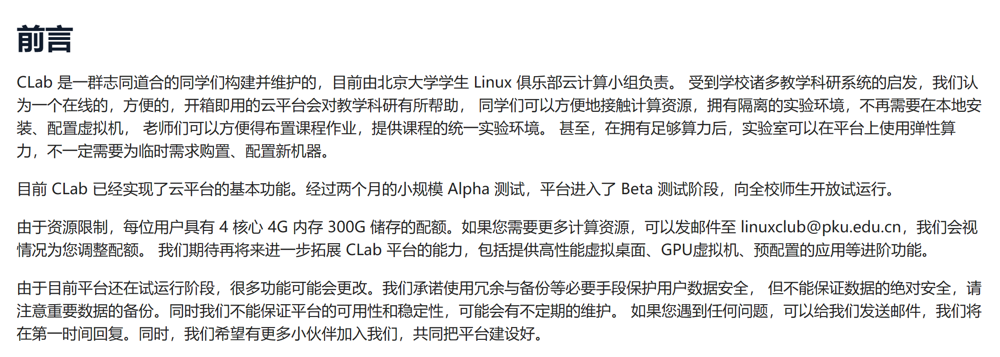

---
# You can also start simply with 'default'
theme: academic
# random image from a curated Unsplash collection by Anthony
# like them? see https://unsplash.com/collections/94734566/slidev
# background: https://cover.sli.dev
colorSchema: light
highlighter: shiki
# some information about your slides (markdown enabled)
title: Wecome to ICS
info: |
  ICS 2024 Fall Slides
  Presented by WalkerCH
titleTemplate: '%s'
# apply unocss classes to the current slide
class: text-center
# https://sli.dev/features/drawing
drawings:
  persist: false
# slide transition: https://sli.dev/guide/animations.html#slide-transitions
transition: fade-out
# enable MDC Syntax: https://sli.dev/features/mdc
mdc: true
# download: true
# hideInToc: true
layout: cover
coverBackgroundUrl: ./res/image/slides.assets/cristiano-firmani-tmTidmpILWw-unsplash.jpg
---

# Wecome to ICS

<!-- html：元培学院数据科学与大数据技术方向 常欣海 -->

  13 元培数科 常欣海

<!--  -->

  
    To the next page <carbon:arrow-right class="inline"/>
  

  <button @click="$slidev.nav.openInEditor()" title="Open in Editor" class="text-xl slidev-icon-btn opacity-50 !border-none !hover:text-white">
    <carbon:edit />
  </button>
  <a href="https://github.com/Yaenday/WalkerCH-ICS-Slides
  " target="_blank" alt="GitHub" title="Open in GitHub"
    class="text-xl slidev-icon-btn opacity-50 !border-none !hover:text-white">
    <carbon-logo-github />
  </a>

---
layout: image-right

image: ./res/image/slides.assets/book.jpg

backgroundSize: 20em 80%

hideInToc: true

---

# 目录

<Toc columns="2" minDepth="1"></Toc>

---
layout: two-cols
hideInToc: true
---

 

::right::
 

---
layout: two-cols
---

# 助教介绍
 

## 常欣海
 

- 专业：数据科学与大数据技术
- 年级：大三
- 邮箱：`changxinhai@stu.pku.edu.cn`
- 微信：`Hai20040606`
- 有事随时微信联系！助教可能并不太看邮箱！
- 不是CS方向，但很期待和大家一起学习！

::right::

---
layout: two-cols
---

# 老师介绍
 

## 张路
 

- 张路 教授
- 2000 北京大学博士，2000-2003 英国博士后
- 研究领域：软件工程
- 任教课程：编译原理
- [张路-北京大学计算机学院 (pku.edu.cn)](https://cs.pku.edu.cn/info/1086/1729.htm)

::right::
  

---
layout: two-cols
---

# 自我介绍

 

- 姓名/专业/年级
- 兴趣爱好
- 对 ICS 这门课的了解
- 建议 1min 左右

::right::

|        |        |
| :----: | :----: |
| 胡嘉驰 | 周家乐 |
| 何海东 | 孙煜琦 |
| 赵天豪 | 陈缙开 |
| 朱俊霖 | 刘昊星 |
| 贺煦轩 | 陶静宇 |
| 李尚泽 | 陈正琦 |
| 王恩博 |        |

---

# 课程安排

---
layout: two-cols-header
---

# 回课安排

::left::

- 2 人一组，分成 8 组（为了应对突发情况）
  - 组内 2 名成员自行分工，均需上台
  - 分组方式：随机分配 / 自由组队
  - 大致上，每个小组进行 3、4 次回课
  - 占比不能差别过大
  - 一种可行的分工：一人讲知识，一人讲题目
  - 原则上一节大课的回课占 20 min，视情况可以适当延长
  - 但无特殊情况控制在30min以内
- P.S.
  - 8 次 lab 也设置了回 lab（日程原因可能只有前 6 次）
  - 自愿报名，原则上时长约占 10 min

::right::

- **回课（ppt 独立）**
  - *知识*：大班课的知识梳理，可以不完全按照PPT的内容，但需要有自己的逻辑
  - *题目*：可以分享往年题，也可以自己找有意思的问题分享（不要太超纲）
- 回课形式
  - PPT周三中午12：00前发送至班级微信群、北大网盘中
    - PPT命名方式：`W2-Float-常欣海.pptx`
    - 若有额外补充材料，可同步发送在微信群中
  - 回课完成后同学互评（问卷星）+助教评分
    - `0-10`分打分，低于`6`分需解释原因
---

# 分数评定

考勤要求：除极特殊情况，每人总共可有理由请假1次

<Transform :scale="5.5">
   &nbsp&nbsp&nbsp&nbsp     暂
</Transform>

---

# Lab 安排

|                |                      |
| :------------: | :------------------: |
|   程序与数据   |       Data Lab       |
| 处理器体系结构 | Bomb Lab/ Attack Lab |
|    程序性能    |       Arch Lab       |
|  分级存储体系  |      Cache Lab       |
|    虚拟内存    |      Malloc Lab      |
|   异常控制流   |      Shell Lab       |
|   网络、并发   |      Proxy Lab       |

---

# Lab 要求

- 本学期共设置 8 个 lab，原则上每个 lab 持续 14 天
- lab 的发布、评分均在 autolab.pku.edu.cn
- **尽早开始**
  - 每次作业最多逾期 2 天，超时则无法再提交（以系统时间为准）
  - 5 grace days
- **仔细阅读要求**
  - 从 Arch Lab（第四个）开始，每个 lab 都有助教手动评分的部分
  - 特别注意代码风格
- **认真、尽量独立完成**
  - 有查重机制，如果被认定为抄袭（网络、往年代码）会被请喝茶
  - 抄课本代码不算抄袭
  - 尽量不要把自己的代码放在网上

---

# Lab 目标

 

- Data Lab：掌握整型与浮点型的存储方式与特性，熟悉部分位运算技巧
- Bomb Lab：掌握阅读二进制可执行程序与汇编代码的方法
- Attack Lab：了解栈溢出的原理，利用该原理攻击风险程序
- Arch Lab: 了解 HCL 语言，掌握流水线冒险机制，并以此优化Y86 指令实现
- Cache Lab: 掌握缓存机制，以此优化内存访问顺序
- Shell Lab: 掌握文件系统和 I/O，熟悉异常处理，实现简易 shell 终端
- Malloc Lab: 掌握内存分配机制，实现一个动态内存分配器
- Proxy Lab: 了解网络通信，熟悉并发方法，实现简易的网络代理

 

> 根据往年经验，Arch Lab、Shell Lab、Malloc Lab 三个任务较为困难，请留出充分的时间完成

---

# 环境说明

> -  Lab环境配置与说明：[CLab&ICS.pdf](res\Lab\CLab&ICS.pdf)            [PKU Clab](https://clab.pku.edu.cn/)              [VScode-SSH](https://code.visualstudio.com/docs/remote/ssh)

- `ics2024a`：bomb lab，attack lab，proxy lab
- `pku`：直接访问网络
- `sudo systemctl status lcpud`：超过30min，90%cpu占用，直接kill掉

---

# 可用资源

或许你会更想了解一些可能对你们有用的链接……

|                                                                                                     |                                                             |
| :-------------------------------------------------------------------------------------------------: | :---------------------------------------------------------: |
| [北大网盘](https://disk.pku.edu.cn/anyshare/zh-cn/link/AA7A050209F4D9440AB9CB1C79E6315680?_tb=none) |                    筛选后的关键课程资料                     |
|    [2023Fall-PKU](https://github.com/zhuozhiyongde/Introduction-To-Computer-System-2023Fall-PKU)    | 北京大学 2023 年秋计算机系统导论课程（ICS）作业、笔记、经验 |
|                       [Tag: ics • Arthals' ink](https://arthals.ink/tags/ics)                       |                 更适合北大宝宝体质的Lab讲解                 |
|                                [PKU Clab](https://clab.pku.edu.cn/)                                 |                  写Lab专用的云计算实验平台                  |
|                      [Autolab ](https://autolab.pku.edu.cn/auth/users/sign_in)                      |            Lab专用的自动评测平台  ~~卷王排行榜~~            |
|                                    [csdiy](https://csdiy.wiki/)                                     |                  CS自学指南：大学纯靠自学                   |
|      [CSAPP B站合集](https://space.bilibili.com/354767108/channel/collectiondetail?sid=373847)      |                     九曲阑干（带你去魅                      |

---

# 个人建议

- 作为一门5学分硬课，想必大家对任务量和难度有所耳闻
  - **教材**：700+，一字一句都是血泪
    1. 上完这门课，理论上至少需要通读两遍（哪怕你不预习）：做Lab之前看一遍，考试之前看一遍
    2. 有的时候遇到卡壳，不用管，继续往下读，你的问题很有可能在后面被解决；如果没有，就再读一遍
    3. 中文版有的时候有问题，去翻CSAPP，如果还有，翻校勘。
  - **Lab**：被玩命魔改的恐怖作业
    1. 网络资料？——抄袭，微调
    2. ChatGPT？——效果如何？
    3. 首先独立思考并尝试完成，如果真的想不出来可以借鉴往年思路，但切忌誊抄
    4. Lab的任何具体方法我不会在DDL之前答疑，但你有其他问题可以随时来问
    5. **请务必提早开始**！！！
  - **考试**：往年题库充分
    1. 规划好学期中、学期末的时间（并不是一个能速通的课）
    2. 最开始不会做、做的时间很长很正常，just keep on

---

# Linux命令

> 如果你没有基础，现在是开始的最佳时机：[常用 Linux 命令](https://dl.ypw.io/linux-command/)

|         |                |
| :-----: | :------------: |
|  `ls`   | 列出文件和目录 |
|  `cd`   |    切换目录    |
| `mkdir` |    创建目录    |
|  `rm`   | 删除文件或目录 |
|  `ssh`  |    远程登陆    |
|  `scp`  |    远程拷贝    |

你可能还需要了解一下 Git 和 GitHub，SSH 和 Markdown 语法，这些东西在你未来的学习中会经常用到

**强烈推荐找些博客或者 B 站/YouTube 视频学习一下它们!**

---
layout: center
---

# THANKS

Made by WalkerCH

changxinhai@stu.pku.edu.cn

  
    Reference: [Weicheng Lin]'s presentation. 
    <!-- Reference: [Arthals]'s template. -->
  

{.w-50.rounded-md}

