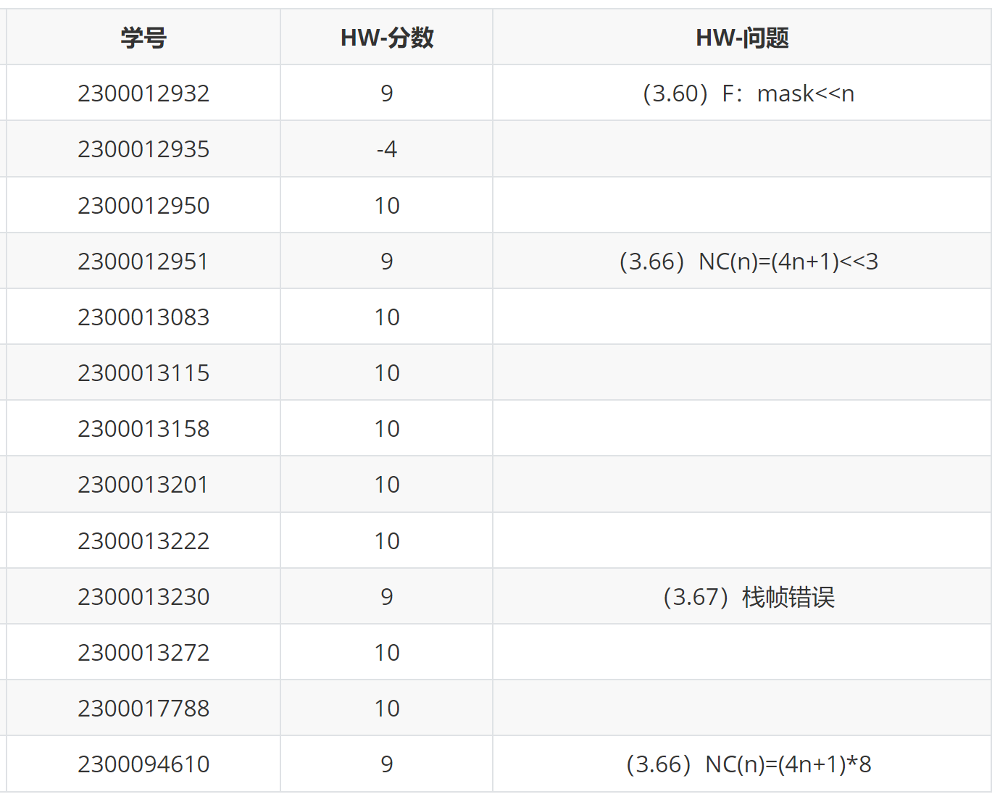
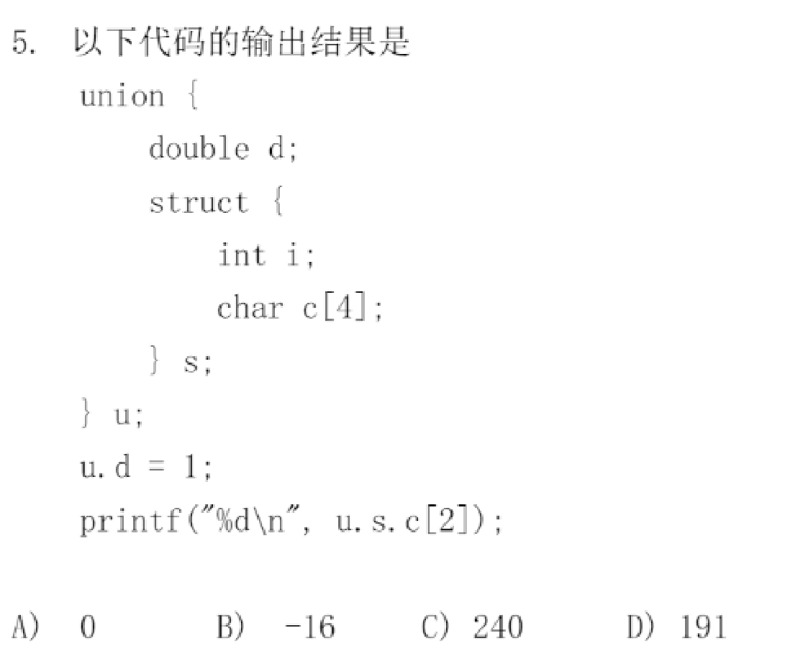
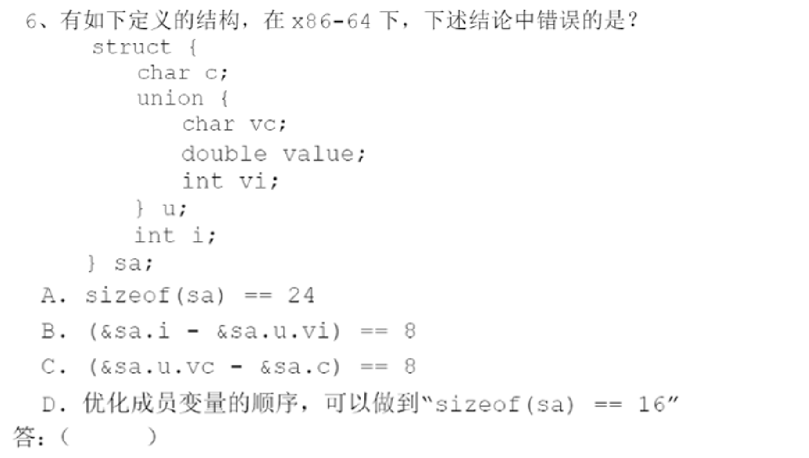
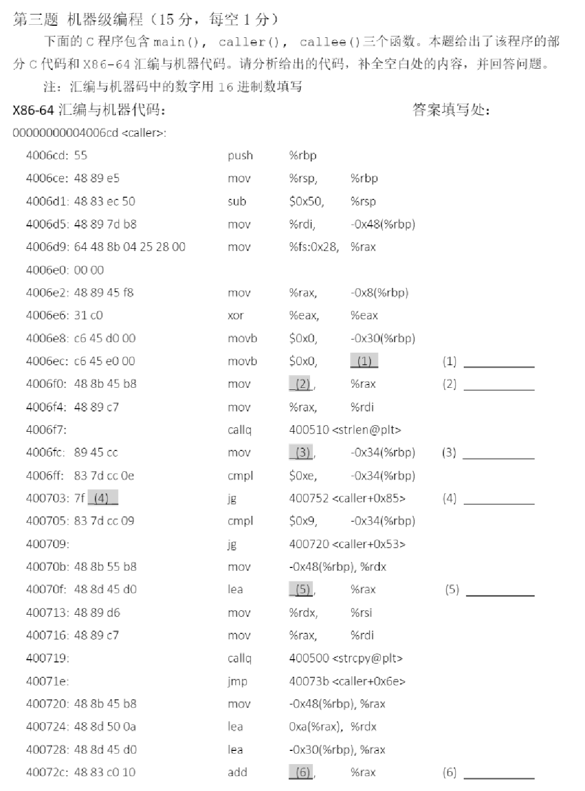
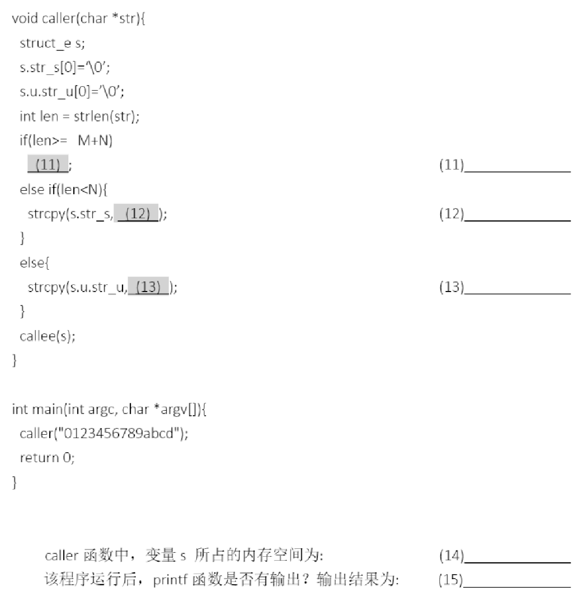
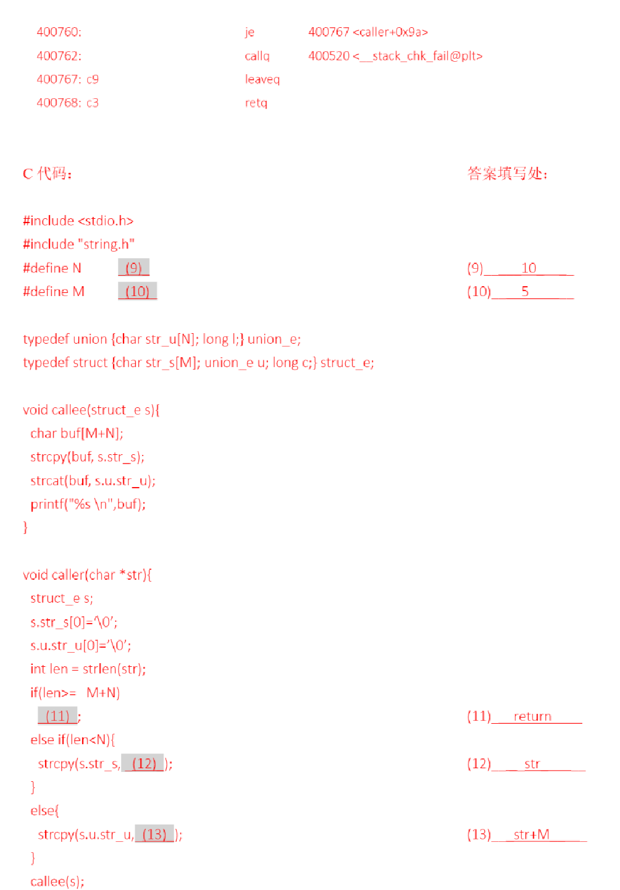
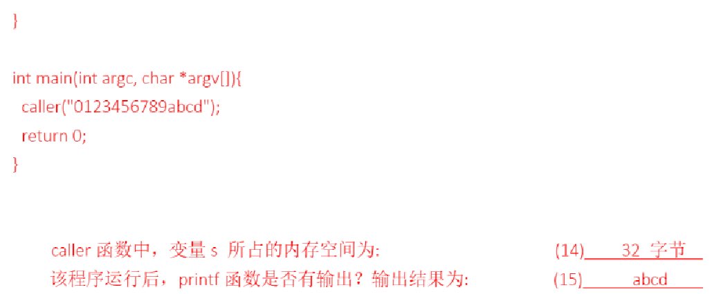
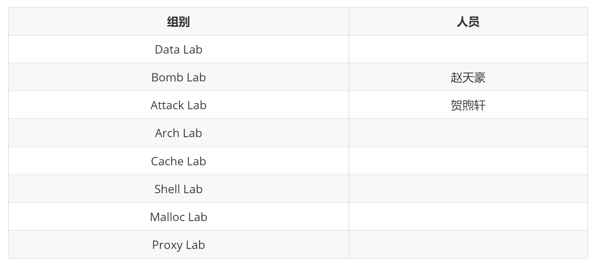

---
# You can also start simply with 'default'
theme: academic
# random image from a curated Unsplash collection by Anthony
# like them? see https://unsplash.com/collections/94734566/slidev
# background: https://cover.sli.dev
highlighter: shiki
# some information about your slides (markdown enabled)
title: 04-Machine Programming-II
info: |
  ICS 2024 Fall Slides
  Presented by WalkerCH
titleTemplate: '%s'
# apply unocss classes to the current slide
class: text-center
# https://sli.dev/features/drawing
drawings:
  persist: false
# slide transition: https://sli.dev/guide/animations.html#slide-transitions
transition: fade-out
# enable MDC Syntax: https://sli.dev/features/mdc
mdc: true
layout: cover
coverBackgroundUrl: /res/image/cover/cover_04.jpg

---

# Machine Programming {.font-bold}

<p class="text-gray-100">
<font size = '5'>
  13 元培数科 常欣海
</font>
</p>

<div class="pt-12  text-gray-1">
  <span @click="$slidev.nav.next" class="px-2 py-1 rounded cursor-pointer" hover="bg-white bg-opacity-10">
    Here we go! <carbon:arrow-right class="inline"/>
  </span>
</div>


<div class="abs-br m-6 flex gap-2">
  <button @click="$slidev.nav.openInEditor()" title="Open in Editor" class="text-xl slidev-icon-btn opacity-50 !border-none !hover:text-white">
    <carbon:edit />
  </button>
  <a href="https://github.com/Yaenday/WalkerCH-ICS-Slides
  " target="_blank" alt="GitHub" title="Open in GitHub"
    class="text-xl slidev-icon-btn opacity-50 !border-none !hover:text-white">
    <carbon-logo-github />
  </a>
</div>

<style>
  div{
   @apply text-gray-2;
  }
</style>


---

# 过程

procedure

过程是软件设计中的重要抽象概念，它提供了一种封装代码的方式。通过指定的参数和可选的返回值来实现某个特定功能。

深入到机器层面，过程基于如下机制：

- **传递控制**：在进入过程 Q 的时候，程序计数器必须被设置为 Q 的代码的起始地址，然后在返回时，要把程序计数器设置为 **P 中调用 Q 后面那条指令**{.text-sky-5} 的地址。
- **传递数据**：P 必须能够向 Q 提供一个或多个参数，Q 必须能够向 P 返回一个值。
- **分配和释放内存**：在开始时，Q 可能需要为局部变量分配空间，而在返回前，又必须释放这些存储空间。

---

# 运行时栈

runtime stack

C 语言过程调用依赖于运行时栈进行数据和指令管理。

- **过程栈帧**：每次调用会分配一个新帧，保存局部变量、参数和返回地址。
- **栈帧管理**：调用和返回过程中，栈帧通过压栈 `push` 和出栈 `pop` 操作管理数据。

    栈帧不是必要的（只有寄存器不够用时，才会在栈上分配空间）

- **栈顶与栈底**：通过调整栈顶指针 `%rsp` 和栈底指针 `%rbp` 来管理栈帧。

    注意，栈顶在低地址，栈底在高地址，栈是向下增长的。

---

<div grid="~ cols-2 gap-12">
<div>

# x86-64 的栈结构

stack structure in x86-64

1. **栈帧布局**：
   - **参数构造区**：存放函数构造的参数
   <br>看图的上面，参数 7~n 就是 P 的参数构造区，注意顺序{.text-gray-5.text-sm}
   - **局部变量区**：用于函数临时构造的局部变量。
   - **被保存的寄存器**：用于保存调用过程中使用到的寄存器状态
   <br><div text-gray-5 text-sm>被调用者保存寄存器： `%rbp` `%rbx` `%r12` `%r13` `%r14` `%r15`</div>
   - **返回地址**：调用结束时的返回地址
   <br>**返回地址属于调用者 P 的栈帧**{.text-sky-5.text-sm}
   - **对齐**：栈帧的地址必须是 16 的倍数
   <br>16 字节对齐，Attacklab 会用到哦{.text-gray-5.text-sm}

</div>

<div>

{.h-110.mx-auto}

</div>
</div>

<!--
参数构造区：准备调用新的过程
-->

---

<div grid="~ cols-2 gap-12">
<div>

# x86-64 的栈结构

stack structure in x86-64

2. **栈顶管理**：使用 `push` 和 `pop` 指令进行数据的压栈和出栈管理。
3. **帧指针和栈指针**：使用寄存器 `%rbp` 和 `%rsp` 定位和管理栈帧。

</div>

<div>

{.h-110.mx-auto}

</div>
</div>

---

# 转移控制

transfer control

转移控制是将程序的执行流程从一个函数跳转到另一个函数，并在完成任务后返回原函数。

- 指令层面，从函数 P 跳转到函数 Q，只需将程序计数器（PC）设置为 Q 的起始地址。
- 参数/数据层面，则需要通过栈帧 / 寄存器来传递。

---

# call 和 ret 指令

`call` and `ret` instructions

在x86-64体系中，这个转移过程通过指令 `call Q` 和 `ret` 来完成：

- `call Q`：调用 Q 函数，并将返回地址压入栈，返回地址是 `call` 指令的下一条指令的地址。
- `ret`：从栈中弹出压入的返回地址，并将 PC 设置为该地址。

这样，程序可以在函数间跳转，并能够正确返回。

<div grid="~ cols-2 gap-12">

<div>

### `call` 指令

- `call Label`： 直接调用，目标为标签地址
- `call *Operand`： 间接调用，目标为寄存器或内存中的地址

</div>

<div>

### `ret` 指令

- 执行返回，将返回地址从栈中弹出并跳转

</div>

</div>

---

# call 和 ret 指令

`call` and `ret` instructions 

{.h-65.mx-auto}

观察：

- 压栈后，`%rsp` -8，压入的是 `%rip` 下一条指令地址
- 弹栈后，`%rsp` +8，弹出的是栈帧中的内容，和当前运行时的 `%rip` 无关

---

# 数据传送

data transfer

<div grid="~ cols-2 gap-12">
<div>

- 前 6 个参数：通过寄存器传递
    - `%rdi` `%rsi` `%rdx` `%rcx` `%r8` `%r9`
- 剩余的参数：通过栈传递
    - 参数 7 在栈顶（低地址）
    - 参数构造区向 8 对齐

{.h-55.mx-auto}

</div>

<div>

#### C 代码

```c
void proc(long a1, long *a1p, int a2, int *a2p,
short a3, short *a3p, char a4, char *a4p) {
    *a1p += a1;
    *a2p += a2;
    *a3p += a3;
    *a4p += a4;
}
```

<br>

#### 生成的汇编代码

```asm
proc:
    movq 16(%rsp), %rax  # 取 a4p (64 位)
    addq %rdi, (%rsi)    # *a1p += a1 (64 位)
    addl %edx, (%rcx)    # *a2p += a2 (32 位)
    addw %r8w, (%r9)     # *a3p += a3 (16 位)
    movl 8(%rsp), %edx   # 取 a4 (8 位)
    addb %dl, (%rax)     # *a4p += a4 (8 位)
    ret
```

</div>
</div>

---

<div grid="~ cols-2 gap-12">
<div>

# 栈上的局部存储

local storage on the stack


有时，局部数据必须在内存中：

- 寄存器不够用
- 对一个局部变量使用地址运算符 `&`（因此必须能够为它产生一个地址，而不能放到寄存器里）
- 是数组或结构（要求连续、要求能够被引用 `&` 访问到）

注意，生长方向与参数构造区相反！

```c
long call_proc() {
    long x1 = 1; int x2 = 2;
    short x3 = 3; char x4 = 4;
    proc(x1, &x1, x2, &x2, x3, &x3, x4, &x4);
    return (x1 + x2) * (x3 - x4);
}
```

</div>

<div class="">

```asm {*}{maxHeight:'480px'}
call_proc:
    # 设置 proc 的参数
    subq $32, %rsp          # 分配 32 字节的栈帧
    movq $1, 24(%rsp)       # 将 1 存储在 &x1
    movl $2, 20(%rsp)       # 将 2 存储在 &x2
    movl $3, 18(%rsp)       # 将 3 存储在 &x3
    movw $4, 17(%rsp)       # 将 4 存储在 &x4
    leaq 17(%rsp), %rax     # 创建 &x4
    movq %rax, 8(%rsp)      # 将 &x4 作为参数 8 存储
    movl $4, (%rsp)         # 将 4 作为参数 7 存储
    leaq 18(%rsp), %r9      # 将 &x3 作为参数 6
    movl $3, %r8d           # 将 3 作为参数 5
    leaq 20(%rsp), %rcx     # 将 &x2 作为参数 4
    movl $2, %edx           # 将 2 作为参数 3
    leaq 24(%rsp), %rsi     # 将 &x1 作为参数 2
    movl $1, %edi           # 将 1 作为参数 1

    # 调用 proc
    call proc

    # 从内存中检索更改
    movslq 20(%rsp), %rdx   # 获取 x2 并转换为 long
    addq 24(%rsp), %rdx     # 计算 x1 + x2
    movswl 18(%rsp), %eax   # 获取 x3 并转换为 int
    movsbl 17(%rsp), %ecx   # 获取 x4 并转换为 int
    subl %ecx, %eax         # 计算 x3 - x4
    cltq                    # 转换为 long
    imulq %rdx, %rax        # 计算 (x1 + x2) * (x3 - x4)
    addq $32, %rsp          # 释放栈帧
    ret                     # 返回

```

</div>
</div>

<!--
代码建议大家课后读一下，书上也有，主要是要理解怎么算的
-->

---

# 寄存器上的局部存储

local storage on registers

<div grid="~ cols-2 gap-12">
<div>

###### Pro

被调用者 / 保存{.text-sky-5}


</div>

<div>

###### Con

被 / 调用者保存


</div>
</div>

被调用者保存寄存器：`%rbx` `%rbp` `%r12` `%r13` `%r14` `%r15`

其他寄存器，**再除外 `%rsp`**{.text-sky-5}， 均为 “调用者保存” 寄存器

---
layout: center
---

<div>
  <text class="text-17 font-bold gradient-text">Machine Data</text>
</div>

<style>
  .gradient-text {
    background-image: linear-gradient(45deg, #4ec5d4 10%, #146b8c 20%);
    -webkit-background-clip: text;
    color: transparent;
  }
</style>

---

# 指针运算

pointer arithmetic

<div grid="~ cols-3 gap-12">

<div>


注意步长！

指针（数组名也是指针）的加减，会乘以步长，其值是指针所代表数据类型的大小。

> 如 `int*` 加减的步长是 `int` 的大小，即 4

可以计算同一个数据结构中的两个指针之差，值等于两个地址之差 **除以该数据类型的大小**{.text-sky-5}。

> 看最后一个示例

</div>


<div grid="col-span-2">

<div text="xs">

| 表达式         | 类型   | 值                 | 汇编代码                        |
| -------------- | ------ | ------------------ | ------------------------------- |
| `E`            | `int*` | $x_E$              | `movq %rdx, %rax`               |
| `E[0]`         | `int`  | $M[x_E]$           | `movl (%rdx), %rax`             |
| `E[i]`         | `int`  | $M[x_E + 4i]$      | `movl (%rdx), %rcx, 4), %eax`   |
| `&E[2]`        | `int*` | $x_E + 8$          | `leaq 8(%rdx), %rax`            |
| `E + i - 1`    | `int*` | $x_E + 4i - 4$     | `leaq -4(%rdx, %rcx, 4), %rax`  |
| `*(E + i - 3)` | `int`  | $M[x_E + 4i - 12]$ | `movl -12(%rdx, %rcx, 4), %eax` |
| `&E[i] - E`    | `long` | i                  | `movq %rcx, %rax`               |

</div>

</div>

</div>

---

# 数组分配和访问

array allocation and access

数组声明如：

```c
T A[N];
```

其中 T 为数据类型，N 为整数常数。

初始化位置信息：

- 在内存中分配一个 $L \times N$ 字节的 **连续区域**{.text-sky-5}，$L$ 为数据类型 $T$ 的大小（单位为字节）。
- 引入标识符 $A$，可以通过指针 $x_A$ 访问数组元素。

访问公式：

$$
\&A[i] = x_A + L \cdot i
$$

数组名是指针常量，指向数组的首地址。{.text-sky-5}


---

# 数组分配和访问

array allocation and access

<div grid="~ cols-3 gap-12">
<div>


如下声明的数组：

```c
char A[12];
char B[8];
int C[6];
double D[5];
```

</div>

<div grid="col-span-2">

这些声明会生成带有以下参数的数组：

| 数组 | 元素大小    | 总的大小 | 起始地址 | 元素 `X[i]` 的地址 |
| ---- | ----------- | -------- | -------- | ------------------ |
| A    | `char`：1   | 12       | $x_A$    | $x_A + i$          |
| B    | `char`：1   | 8        | $x_B$    | $x_B + i$          |
| C    | `int`：4    | 24       | $x_C$    | $x_C + 4i$         |
| D    | `double`：8 | 40       | $x_D$    | $x_D + 8i$         |

</div>
</div>

---

# 数组分配和访问

array allocation and access


假设 `E` 是一个 `int` 型数组，其地址存放在寄存器 `%rdx` 中，`i` 存放在寄存器 `%rcx`，那么 `E[i]` 的汇编代码为：

```asm
movl (%rdx, %rcx, 4), %eax # (Start, Index, Step)
```

特别地，对于数组下标 `A[i]` 的计算，实际上是 `*(A+i)`，即 `A+i` 是一个指针，指向 `A` 的第 `i` 个元素。

### 嵌套数组{.mb-4}

```c
T D[R][C]; # Row, Column
```

数组元素 `D[i][j]` 的内存地址为（解的时候顺序从左到右）：

$$
\&D[i][j] = x_D + L \cdot (C \cdot i + j)
$$


---

# 解码复杂表达式

decode complex expression

<div grid="~ cols-2 gap-12">
<div>

1. 从变量名开始
2. 往右读直到读到右括号或到底
3. 往左，忽略读过的
4. 上面的括号均不包括成对的括号
5. `*` 读作 “指针，指向”
6. `[x]` 读作 “长为 x 的数组，元素类型为”
7. `(…)` 读作 “函数，返回值为” + 上面提的成对括号（参数列表可选）
8. 如果为匿名类型，手动补充变量名（参数列表里会出现）

</div>

<div>

```c
int *(*p[2])[3];
```

<div text-sm>

1. `p`：变量名
2. `[2]`：往右读，这是一个长度为 2 的数组，元素类型为...
3. `)`：往左读，忽略读过的
4. `(*p[2])`：这是一个指针，指向...
5. `(*p[2])[3]`：一个长度为 3 的数组
6. `;`：到底了，往左读
7. `*(*p[2])[3]`：一个指针，指向...
8. `int *(*p[2])[3]`：`int` 类型

合并：这是一个长度为 2 的数组，元素类型为<span text-sky-5>指针，指向一个长度为 3 的数组</span>，<span text-yellow-5>数组元素类型为指针，指向 `int`</span>。

</div>

</div>
</div>

---

# 解码复杂表达式

decode complex expression

<div grid="~ cols-2 gap-12">
<div>

1. 从变量名开始
2. 往右读直到读到右括号或到底
3. 往左，忽略读过的
4. 上面的括号均不包括成对的括号
5. `*` 读作 “指针，指向”
6. `[x]` 读作 “长为 x 的数组，元素类型为”
7. <span text-sky-5>`(…)` 读作 “函数，返回值为” + 上面提的成对括号（参数列表可选）</span>
8. 如果为匿名类型，手动补充变量名（参数列表里会出现）

</div>

<div>

<div text-sm>

```c
int func(); 
```

函数，返回值为 `int`

```c
void func(int a, float b); 
```

函数，返回值为 `void`，参数列表为 `int a` 和 `float b`

```c
int* func();
```

函数，返回值为 `int*`

```c
int (*func)();
```

函数指针，指向返回值为 `int` 的函数


</div>

</div>
</div>


---

# 解码复杂表达式

decode complex expression

<div grid="~ cols-2 gap-12">
<div>

#### Quiz

```c
int *(*p[2])[3];
```

你可以在 [cdecl.org](https://cdecl.org/) 验证，或者尝试其他表达式。

</div>

<div v-click>

让我们逐步解码：

1. `p`：变量名
2. `p[2]`：一个长度为 2 的数组，元素类型为...
3. `*p[2]`：一个指针，指向...
4. `(*p[2])[3]`：一个长度为 3 的数组，元素类型为...
5. `*(*p[2])[3]`：一个指针，指向...
6. `int *(*p[2])[3]`：`int` 类型

合并：声明 `p` 为一个包含 2 个元素的<span text-sky-5> 数组 </span>，每个元素是<span text-sky-5> 指向一个包含 3 个元素的<span text-yellow-5> 数组 </span>的指针 </span>，<span text-yellow-5> 这些数组的元素是指向 `int` 类型的指针 </span>。

</div>
</div>


---

# 解码复杂表达式

- 指针运算动图：阅读方法：先找变量名，一层一层括号往外读

  

---

# 数组名和指针

array name and pointer

数组名在大多数情况下的行为类似于指针。

<div grid="~ cols-2 gap-12">
<div>

###### 相同

- 数组名在表达式中会被隐式转换为指向数组第一个元素的指针
- 可以对数组名和指针进行类似的指针算术操作
    ```c
    int value = *(arr + 2); // 等价于 arr[2]
    ```

</div>

<div>

###### 相异

- 数组名指向的是编译时分配的一块连续内存，而指针可以指向动态分配的内存或其他变量。
    ```c
    int arr[5]; // 静态分配的数组
    int *p = malloc(5 * sizeof(int)); // 动态分配的内存
    ```
- 数组名是一个常量指针，不能被修改；而指针是一个变量，可以被修改。
    ```c
    int arr[5];
    int *p = arr;
    p = NULL; // 合法，p 可以重新赋值
    arr = NULL; // 非法，arr 不能重新赋值
    ```

</div>
</div>

---

# 数组名和指针

array name and pointer

数组名在大多数情况下的行为类似于指针。

###### 相异

- 数组在声明时必须指定大小或初始化，而指针在声明时可以不初始化。
    ```c
    int arr[5] = {1, 2, 3, 4, 5}; // 数组声明并初始化
    int *p; // 指针声明，无需初始化
    p = arr; // 之后初始化
    ```
- 对数组名使用 `sizeof` 操作符时，返回的是整个数组的大小，而对指针使用 `sizeof` 操作符时，返回的是指针本身的大小。
    ```c
    int arr[5];
    int *p = arr;
    // %zu 代表 size_t 类型，通常用于表示 sizeof 操作符的结果
    printf("%zu\n", sizeof(arr)); // 输出数组的总大小，20
    printf("%zu\n", sizeof(p));   // 输出指针的大小，8
    printf("%zu\n", sizeof(*p));  // 输出指针所指向的类型的大小，4
    ```

---

# 数组名和指针

array name and pointer

<div grid="~ cols-2 gap-12">
<div>

```c
sizeof(q) = 4;
sizeof(A) = 16;
int* p = A; // 只是完成了赋值（数据一样了），
            // 但是没有让他们附带的信息（指向的内容大小）一样
sizeof(p) = 8; // 从而 sizeof 有不同的结果
```

理解为两张照片，像素一模一样，
但是元数据（在哪里拍的 / 怎么修的图→指向空间大小）不一样

</div>

<div>

{.mx-auto}

</div>
</div>

---

# sizeof 与数组名

`sizeof` and array name

注意，当 `A` 是数组名，调用 `sizeof(A)` 时，返回的是整个数组的大小，如下所示：

```c
int main() {
    int A[5][3];
    cout << sizeof(&A) << endl; // 8，因为 A 是数组名，也就是指针，其内容是一串 8 字节地址常量
    // ↑ 所以 sizeof(&A) 是指针类型的大小，即 8 字节
    cout << sizeof(A) << endl; // 60，A 是指针，指向一块 5 * 3 * sizeof(int) 大小的空间，即 int[5][3]
    cout << sizeof(*A) << endl; // 12，*A 是指针，指向一块 3 * sizeof(int) 大小的空间，即 int[3]
    cout << sizeof(A[0]) << endl; // 12，A[0] 等价于 *A，即 int[3]
    cout << sizeof(**A) << endl; // 4，**A 是指针，指向一块 sizeof(int) 大小的空间，即 int
    cout << sizeof(A[0][0]) << endl; // 4，A[0][0] 等价于 **A
    cout << &A << " " << (&A + 1) << endl; // 0x8c 0xc8，可以看到差值为 0x3c，即 60
}
```

*此页内容可能存在不严谨之处，能理解、会算就行，考试真的会考{.text-sm.text-gray-5}

---

# 指针的大小与类型

pointer size and type

对于一个 `int* p`，`sizeof(p)` 等于？

<div v-click>

答：因为 `p` 本身是一个变量名，它对应一个 `int*` 类型的变量，所以 `sizeof(p)` 返回的是指针的大小（8），而不是 `int` 的大小（4）。但是，`sizeof(*p)` 返回的是 `int` 的大小（4）。

辨析： `int q`

此时，`q` 也是一个变量名，但它对应一个 `int` 类型的变量，所以 `sizeof(q)` 返回的是其指向的内容，也即一个 `int` 的大小（4）。

- 变量名是内存空间的名字（好比人的名字），调用 `sizeof(p)` 时，返回的是其对应的内容的大小
- 地址是指内存空间的编号（好比人的身份证号码），是一个值、一段数据，调用 `sizeof(p)` 时，返回的是其指向的内容的大小
- 通过变量名或者地址都能获取这块内存空间的内容（就好比通过名字或者身份证都能找到这个人）。

</div>

---

# 定长数组

fixed-length array

在处理定长数组时，编译器通过优化，可以尽可能避免开销较大的乘法运算。

<div grid="~ cols-2 gap-12">

<div>

###### 原始的 C 代码

```c
int fix_prod_ele(fix_matrix A, fix_matrix B, long i, long k) {
    long j;
    int result = 0;
    for (j = 0; j < N; j++) {
        result += A[i][j] * B[j][k];
    }
    return result;
}
```

- 这是常规的固定矩阵乘法实现
- 迭代访问元素并计算乘积
- 因为使用了 `A[i][j]` 这种形式，所以每次访问一个矩阵元素时，都需要进行一次乘法运算。

</div>

<div>

###### 优化的 C 代码

```c
int fix_prod_ele_opt(fix_matrix A, fix_matrix B, long i, long k) {
    int *Aptr = &A[i][0];  
    int *Bptr = &B[0][k];  
    int *Bend = &B[N][k];  
    int result = 0;

    do {
        result += *Aptr * *Bptr;  
        Aptr++;  
        Bptr += N;  
    } while (Bptr != Bend);  

    return result;
}
```

- 利用指针加速元素访问和乘法操作

</div>

</div>


---

# 变长数组

variable-length array

变长数组为灵活的数据存储解决方案。由于数组长度的不确定性，使用单个索引时容易导致性能问题。

<div grid="~ cols-2 gap-12">
<div>

###### 初始 C 代码


```c
/* 计算变量矩阵乘积的函数 */
int var_prod_ele(long n, int A[n][n], int B[n][n], long i, long k) {
    long j;
    int result = 0;
    for (j = 0; j < n; j++) {
        result += A[i][j] * B[j][k];
    }
    return result;
}
```

<div text-sm>

- 由于使用了 `A[n][n]` 这种形式，而 `n` 是不能在编译时确定的变量，所以每次访问一个矩阵元素时，都需要进行一次乘法运算。
- 所以在访问变长数组元素时，被迫使用 `imulq`，这可能会导致性能下降。

</div>

</div>

<div>

###### 优化后的 C 代码

```c
/* 优化后的变量矩阵乘积计算函数 */
int var_prod_ele_opt(long n, int A[n][n], int B[n][n], long i, long k) {
    int *Arow = A[i];
    int *Bptr = &B[0][k];
    int result = 0;
    long j;

    for (j = 0; j < n; j++) {
        result += Arow[j] * *Bptr;
        Bptr += n; // 向后移动指针，以减少访问时间
    }
    return result;
}
```

<div text-sm>

- 规律性的访问仍能被优化：通过定位数组指针，避免重复计算索引。

</div>

</div>
</div>


---

# 数据结构

data structure

<div grid="~ cols-2 gap-12">
<div>

#### `struct`

所有组分存放在内存中一段连续的区域内。


```c
struct S3 {
    char c;
    int i[2];
    double v;
};
```

</div>

<div>

#### `union`

用不同的字段引用相同的内存块。

```c
union U3 {
    char c;
    int i[2];
    double v;
};
```

</div>
</div>

<div text="sm" mt-4>

| 类型 | `c` | `i` | `v` | 大小 |
| ---- | --- | --- | --- | ---- |
| S3   | 0   | 4   | 16  | 24   |
| U3   | 0   | 0   | 0   | 8    |

可以看到，对于 `Union`，所有字段的偏移都是 0，因为它们共享同一块内存。

</div>

---

# 对齐

alignment

任何 `K` 字节的基本对象的地址必须是 `K` 的倍数。


| K   | 类型                    |
| --- | ----------------------- |
| 1   | `char`                  |
| 2   | `short`                 |
| 4   | `int` `float`           |
| 8   | `long` `double` `char*` |


---

# 结构体对齐示例

structure alignment example

下面的例子展示了如何对结构体进行对齐：

```c
struct S1 {
    int i;
    char c;
    int j;
};
```

虽然结构体的三个元素总共只占 9 字节，但为了满足变量 `j` 的对齐，内存布局要求填充一个 3 字节的间隙，这样 `j` 的偏移量将是 8，也就导致了整个结构体的大小达到 12 字节。

{.h-50.mx-auto}

---

# 结构体对齐示例

structure alignment example

继续考虑另一个结构体的定义：

```c
struct S2 {
    int i;
    int j;
    char c;
};
```

此时，正常排确实可以只需要 9 字节，且同时满足了 `i` 和 `j` 的对齐要求。

但是，因为要考虑可能会有 `S2[]` 这种数组声明，且数组又要求各元素在内存中连续，所以编译器实际上会为结构体分配 12 字节，最后 3 个字节是浪费的空间。

{.w-100.mx-auto}

<div text-sm text-gray-5>

`.align 8` 命令可以确保数据的开始地址满足 8 的倍数。

</div>


---

# 结构体对齐示例

structure alignment example

在 x86-64 平台下，Linux 操作系统中，定义如下的 C 结构体：

<div grid="~ cols-3 gap-12">
<div>

#### 定义

```c
struct A {
    char CC1[6];
    int II1;
    long LL1;
    char CC2[10];
    long LL2;
    int II2;
};
```

</div>

<div grid-col-span-2>

#### 回答以下问题：

1. `sizeof(A)` 为？<span class="text-red-5" v-click>6(2) + 4(4) + 8 + 10(6) + 8 + 4(4) = 56</span>
2. 若将结构体重排，尽量减少结构体的大小，得到的新结构体大小？
    <br><span class="text-red-5" v-click>6 + 10 + 4 + 4 + 8 + 8= 40</span>

</div>
</div>

<div v-click text-sky-5>

技巧：
- 尽量减少结构体的大小：依据数据类型大小排序，从小到大 / 从大到小都可
- 结构体的对齐以其中最大的数据类型为准，对于嵌套的 `union` `struct` 以其内部最大的为准

</div>

---

# 结构体对齐示例

structure alignment example

<div grid="~ cols-3 gap-12">
<div>


#### 定义

```c
typedef union {
    char c[7];
    short h;
} union_e;

typedef struct {
    char d[3];  // 4
    union_e u;  // 8
    int i;      // 4
} struct_e;

struct_e s;
```

</div>

<div grid-col-span-2>


#### 回答以下问题：

1. `s.u.c` 的首地址相对于 `s` 的首地址的偏移量是？<span class="text-red-5" v-click>4</span>
2. `sizeof(union_e)`为？<span class="text-red-5" v-click>8</span>
3. `s.i` 的首地址相对于 `s` 的首地址的偏移量是？<span class="text-red-5" v-click>12</span>
4. `sizeof(struct_e)`为？<span class="text-red-5" v-click>16</span>
5. 若只将 `i` 的类型改成 `short`，那么 `sizeof(struct_e)`为？<span class="text-red-5" v-click>14</span>
6. 若只将 `h` 的类型改成 `int`，那么 `sizeof(union_e)`为？<span class="text-red-5" v-click>8</span>
7. 若将 `i` 的类型改成 `short`，将 `h` 的类型改成 `int`，那么 `sizeof(union_e)`为？`sizeof(struct_e)`为？<span class="text-red-5" v-click>8 16</span>
8. 若将 `short h` 的定义删除，那么 (1)~(4) 间的答案分别是？<span class="text-red-5" v-click>3 7 12 16</span>

</div>
</div>

---

# 强制对齐

force alignment

- 任何内存分配函数（`alloca` `malloc` `calloc` `realloc`）生成的块的起始地址都必须是 16 的倍数
- 大多数函数的栈帧的边界都必须是 16 字节的倍数（这个要求有一些例外）
- 参数构造区向 8 对齐


---

# 浮点型

- 浮点数使用的寄存器叫做向量寄存器，共有 16 个，每个有 256 位，最多能保存 4 个 double 类型的数据

- 但在进行标量操作时，引用的寄存器是 xmm 而不是 ymm，且只会使用寄存器的最低 32 位或 64 位（寄存器的其他部分用于高级的优化技术）

---
layout: center
---

<div>
  <text class="text-17 font-bold gradient-text">Machine Advanced</text>
</div>

<style>
  .gradient-text {
    background-image: linear-gradient(45deg, #4ec5d4 10%, #146b8c 20%);
    -webkit-background-clip: text;
    color: transparent;
  }
</style>


---

# 内存越界引用与缓冲区溢出

## 攻击手段

- **直接攻击**：让 gets 读入的字符串长度超过栈上分配空间的大小，覆盖返回地址，使返回地址被修改为攻击者希望的位置，这个位置可以有任何一个函数，比如可以是执行关机程序的系统调用

  

---

# 内存越界引用与缓冲区溢出

## 攻击手段

- 对抗 ASLR：nop sled

  - 在跳转到的函数前放置大段 nop，只要跳转到 nop 所在区域就能攻击成功

- 对抗 canary

  - 在程序运行过程中直接输出，暴力获取 canary 值
  - 崩溃后自动重启程序 ASLR 偏移和 canary 值都不变，暴力破解所有 canary 位

- 对抗 NX：ROP 攻击

  - 利用各类已经存在的函数的 ret 语句（c3）前的最后一段机器码（可能是某个指令的一部分）帮助实现特定的操作，从而实现攻击

---


# 内存越界引用与缓冲区溢出


---

# 防御手段

- **栈随机化**：地址空间布局随机化（ASLR）的一部分，每次启动栈的空间都被随机分配，从而攻击者难以指定返回地址的具体位置
- **栈破坏检测**：金丝雀 **canary**，在返回地址和栈的其余部分之间存储一个金丝雀值，如果函数即将返回时金丝雀值被改动，说明受到了攻击
- **限制可执行代码区域**：NX（No Execute）位，保证栈上大部分内容不可执行


- 以上所有方法均无法彻底防范栈溢出攻击
- 如果你现在还没明白，没有关系，**attacklab** 会让你明白

---
layout: center
---

<div>
  <text class="text-17 font-bold gradient-text">Homework Review</text>
</div>

<style>
  .gradient-text {
    background-image: linear-gradient(45deg, #4ec5d4 10%, #146b8c 20%);
    -webkit-background-clip: text;
    color: transparent;
  }
</style>
---

# HW3

{.w-130}

---


# Q1

> - P217 3.60 考虑下面的汇编代码……

<br/>

## **Ans**

```c
long loop(long x, long n) {
    long result = 0;     // Initial value of result
    long mask;       // Initial value of mask

    // Loop as long as mask is non-zero
    for (mask = 1; mask != 0; mask = mask << n) {
        result |= (x & mask);   // Update result with x & mask
    }

    return result;  // Return result
}
```

---

# Q1

## **Sol**


<div grid="~ cols-2 gap-12">
<div>

- 很多同学注意到了n的溢出问题，但是到底该如何处理？
  - ` mask = mask << n`
  - ` mask = mask << (n & 0xFF)`
  - ` mask = mask << (n & 0x3F)`

```c{*}{maxHeight:'200px'}
long loop(long x, long n) {
    long result = 0;     // Initial value of result
    long mask;       // Initial value of mask

    // Loop as long as mask is non-zero
    for (mask = 1; mask != 0; mask = mask << (n & 0x3F)) {
        result |= (x & mask);   // Update result with x & mask
    }

    return result;  // Return result
}
```

</div>

<div>

{.w-200}

</div>
</div>


---


# Q2

> - P219 3.63 这个程序给你……

<br/>

## **Ans**

```c{*}{maxHeight:'200px'}
long switch_prob(long x, long n)
{
    long result = x;
    switch (n)
    {
    case 60:
    case 62:
        result *= 8;
        break;
    case 61:
        result += 75; // 0x4b = 75
        break;
    case 63:
        result >>= 3;
        break;
    case 64:
        result = ((result << 4) - x); // (x << 4) - x
    case 65:
        result *= result;
    default:
        result = result + 75; // 0x4b = 75
    }
    return result;
}
```

<br/>

## **Sol**

怎么写都没啥问题，但是可以注意一下程序的优化`long result = x;`（`archlab` 少写一行是一行）


---

# Q3

> - P221 3.66 考虑下面的源代码……

<br/>

## **Ans**

```c
#define NR(n) (3*(n))
#define NC(n) (4*(n) + 1)
```

- 基于 `leaq 1(,%rdi,4), %r8` 和 `addq %r8, %rcx` 确定 `NC`
  - `salq $3, %r8`，注意到了很好，但注意到了一定更要想清楚
- 基于 `leaq (%rdi,%rdi,2), %rax` 和 `testq %rax, %rax` 确定 `NR`

---


## **Sol**

```asm
long sum_col(long n, long A[NR(n)][NC(n)], long j)
n in %rdi, A in %rsi, j in %rdx
1 sum_col:
2   leaq 1(,%rdi,4), %r8         # r8 = 4*n + 1
3   leaq (%rdi,%rdi,2), %rax     # rax = 3*n
4   movq %rax, %rdi              # rdi = 3*n
5   testq %rax, %rax             # 测试 rax 是否为零
6   jle .L4                       # 如果 3*n <= 0，跳转到 .L4（返回 0）
7   salq $3, %r8                  # r8 = (4*n + 1) << 3 = (4*n + 1) * 8 = 32*n + 8
8   leaq (%rsi,%rdx,8), %rcx      # rcx = A + j*8
9   movl $0, %eax                 # result = 0
10  movl $0, %edx                 # i = 0
11 .L3:
12  addq (%rcx), %rax             # result += A[i][j]
13  addq $1, %rdx                  # i++
14  addq %r8, %rcx                 # rcx += 32*n + 8
15  cmpq %rdi, %rdx                # 比较 i 和 3*n
16  jne .L3                        # 如果 i < 3*n，继续循环
17  rep; ret
18 .L4:
19  movl $0, %eax                 # 返回 0
20  ret
```

---

# Q4

> - P221 3.67 这个作业要查看GCC……

A. 图示 `eval` 函数的栈帧，显示在调用 `process` 之前存储在栈上的值

**答案：**

在调用 `process` 函数之前，`eval` 函数的栈帧如下所示（从低地址到高地址）：

```lua
+--------------------------+ <-- %rsp + 104  
|          ...              |  
+--------------------------+ <-- %rsp + 88  
|        strB r (64-80(%rsp)) | // 返回值结构体 r 的存储空间  
+--------------------------+ <-- %rsp + 32  
|          ...             |  
+--------------------------+ <-- %rsp + 24  
|          z (24(%rsp))     | // z 的值  
+--------------------------+ <-- %rsp + 16  
|       &z (16(%rsp))      | // s.p = &z  
+--------------------------+ <-- %rsp + 8  
|          y (8(%rsp))     | // s.a[1] = y  
+--------------------------+ <-- %rsp + 0  
|          x (0(%rsp))     | // s.a[0] = x  
+--------------------------+  
```

---

# Q4

B. `eval` 在调用 `process` 时传递了什么值？


**答案：**

`eval` 函数在调用 `process` 时，传递了一个指向返回值结构体 `strB r` 的存储地址，即 `64(%rsp)`，通过寄存器 `%rdi` 传递给 `process` 函数。

---

# Q4

C. `process` 函数如何访问结构体参数 `s` 的各个元素？

**答案：**

`process` 函数通过固定的栈偏移量访问结构体参数 `s` 的各个成员：

- `s.a[0]` 存储在栈偏移 `16(%rsp)`。
- `s.a[1]` 存储在栈偏移 `8(%rsp)`。
- `s.p` 存储在栈偏移 `24(%rsp)`。


---

# Q4

C. `process` 函数如何访问结构体参数 `s` 的各个元素？

**具体对应关系：**

- **`s.p`（指向 `z` 的指针）：**
  - 指令 `movq 24(%rsp), %rdx` 从栈偏移 `24(%rsp)` 加载 `s.p` 的值（即 `&z`）到寄存器 `%rdx`。
  - 指令 `movq (%rdx), %rdx` 解引用指针，加载 `*s.p`（即 `z` 的值）到 `%rdx`。
- **`s.a[0]`（即 `x`）：**
  - 指令 `movq 16(%rsp), %rcx` 从栈偏移 `16(%rsp)` 加载 `s.a[0]` 的值到 `%rcx`。
- **`s.a[1]`（即 `y`）：**
  - 指令 `movq 8(%rsp), %rcx` 从栈偏移 `8(%rsp)` 加载 `s.a[1]` 的值到 `%rcx`。


---

# Q4

D. `process` 函数如何设置结果结构体 `r` 的字段？

**答案：**

`process` 函数通过返回值地址 `%rdi` 指向的内存位置，依次将 `s.a[0]`, `s.a[1]` 和 `*s.p` 的值赋给 `r.u[0]`, `r.u[1]` 和 `r.q`，具体操作如下：

- `r.u[0] = s.a[0]`：`movq %rcx, (%rdi)`
- `r.u[1] = s.a[1]`：`movq %rcx, 8(%rdi)`
- `r.q = *s.p`：`movq %rdx, 16(%rdi)`

---

# Q4

E. 完成 `eval` 函数的栈帧图示，显示 `eval` 在 `process` 返回后如何访问结构体 `r` 的元素

**答案：**

```lua
+--------------------------+ <-- %rsp + 104  
|          ...              |  
+--------------------------+ <-- %rsp + 88  
|            z              |   
+--------------------------+ <-- %rsp + 80  
|            x              |   
+--------------------------+ <-- %rsp + 72  
|            y              | 
+--------------------------+ <-- %rsp + 64  
|          ...              |  
+--------------------------+ <-- %rsp + 24  
|          z (24(%rsp))     | // z 的值  
+--------------------------+ <-- %rsp + 16  
|       &z (16(%rsp))       | // s.p = &z  
+--------------------------+ <-- %rsp + 8  
|          y (8(%rsp))      | // s.a[1] = y  
+--------------------------+ <-- %rsp + 0  
|          x (0(%rsp))      | // s.a[0] = x  
+--------------------------+  
```

---

# Q4

F. 关于结构体作为函数参数传递和作为函数返回值的一般原则有哪些？

**答案:**

**结构体参数传递**：

- **小结构体**：可能通过寄存器传递。
- **大结构体**：通过栈传递，成员按顺序存储，使用固定栈偏移量访问。

**结构体返回值**：

- 通常通过隐藏的返回值指针传递，调用者预留内存空间并传递其地址给被调用函数。
- **小结构体**：在某些情况下，可能通过寄存器返回。

**调用约定**：

- 遵循 x86-64 调用约定，使用寄存器和栈进行参数传递和返回值管理。
- 隐藏参数用于传递返回值地址，优化函数调用效率。


---

# Q4

## **Sol**

- `process` 函数：实际上，许多函数不需要栈帧，当所有局部变量都可以保存在寄存集中，而且该函数不会调用任何其他函数。


```asm{*}{maxHeight:'150px'}
process:
1   movq %rdi, %rax        # 将返回值地址（指向 strB r 的地址）存储到 %rax
2   movq 24(%rsp), %rdx    # 加载 s.p（即 &z）到 %rdx
3   movq (%rdx), %rdx      # 加载 *s.p（即 z 的值）到 %rdx
4   movq 16(%rsp), %rcx    # 加载 s.a[0]（x）到 %rcx
5   movq %rcx, (%rdi)      # 将 s.a[0] 存储到 r.u[0]（%rdi 指向 strB r）
6   movq 8(%rsp), %rcx     # 加载 s.a[1]（y）到 %rcx
7   movq %rcx, 8(%rdi)     # 将 s.a[1] 存储到 r.u[1]（%rdi + 8）
8   movq %rdx, 16(%rdi)    # 将 *s.p（z 的值）存储到 r.q（%rdi + 16）
9   ret                     # 返回
```
<br/>

```asm{*}{maxHeight:'150px'}
long eval(long x, long y, long z)
x in %rdi, y in %rsi, z in %rdx
1   eval:
2   subq $104, %rsp          # 为栈帧分配 104 字节空间
3   movq %rdx, 24(%rsp)      # 将 z 的值存储到 24(%rsp)
4   leaq 24(%rsp), %rax      # 加载 &z 的地址到 %rax
5   movq %rdi, (%rsp)        # 将 x 存储到 0(%rsp)
6   movq %rsi, 8(%rsp)       # 将 y 存储到 8(%rsp)
7   movq %rax, 16(%rsp)      # 将 &z 存储到 16(%rsp)
8   leaq 64(%rsp), %rdi      # 加载 strB r 的存储地址（%rsp + 64）到 %rdi
9   call process              # 调用 process 函数
10  movq 72(%rsp), %rax      # 加载 r.u[1] 到 %rax
11  addq 64(%rsp), %rax      # 将 r.u[0] 加到 %rax
12  addq 80(%rsp), %rax      # 将 r.q 加到 %rax
13  addq $104, %rsp           # 恢复栈指针
14  ret                       # 返回结果
```

---


# Q5

> - P223 3.68 在下面的代码中……

<br/>

## **Ans**

```c
#define A 9
#define B 5
```

---

# Q5

## **Sol**

```c
typedef struct {
    int x[A][B]; // 占用 A * B * 4 字节
    long y;      // 占用 8 字节
} str1;
```

```c
typedef struct {
    char array[B]; // 占用 B 字节
    int t;         // 占用 4 字节
    short s[A];    // 占用 2A 字节
    long u;        // 占用 8 字节
} str2;
```

1. `movslq 8(%rsi), %rax` $\rightarrow$  $B \in (4,8]$ ，由于对齐原则无法确定
2. `addq 32(%rsi), %rax ` $\rightarrow$  $A \in (6,10]$ ，由于对齐原则无法确定
3. `movq %rax, 184(%rdi)` $\rightarrow$ $A\times B \in (44,46]$，由于对齐原则无法确定
4. 综上，有唯一整数解 `A=9` ，`B=5`


---
layout: center
---

<div>
  <text class="text-17 font-bold gradient-text">Exercises</text>
</div>

<style>
  .gradient-text {
    background-image: linear-gradient(45deg, #4ec5d4 10%, #146b8c 20%);
    -webkit-background-clip: text;
    color: transparent;
  }
</style>

---

# E1


<!--  -->

---

# E1


---

# E2


---

# E2

{.w-150}


---

# E3

{.w-200}

<!-- {.w-150} -->

---

# E3

{.w-200}

{.w-150}

---

# E4


<!-- {.w-50} -->


---

# E4


{.w-50}


---

# E5
{.w-120}

---

# E5

{.w-200}

---

# E6
{.w-150}

<!-- {.w-120} -->

---

# E6
{.w-150}

{.w-120}


---

# E7
{.w-180}

---

# E7


---

# E8


<!--  -->

---

# E8


---

# E9


<!--  -->

---

# E9


---

# E10


<!--  -->

---

# E10


---

# E11


<!--  -->

---

# E11


---

# E12


<!--  -->

---

# E12


---

# E13

<div grid="~ cols-3 gap-12">

<div>



</div>
<div>


</div>

<div>



</div>
</div>

---

# E13

{.w-200}

---

# E13
<div grid="~ cols-3 gap-12">

<div>


</div>
<div>



</div>
<div>



</div>
</div>

---
layout: center
---

<div>
  <text class="text-17 font-bold gradient-text">Notices</text>
</div>

<style>
  .gradient-text {
    background-image: linear-gradient(45deg, #4ec5d4 10%, #146b8c 20%);
    -webkit-background-clip: text;
    color: transparent;
  }
</style>
---

# 作业要求

- 小班分数占比15%，其中作业占比40%左右，课上表现占比60%左右
- 作业从本周开始的评分要求如下：
  - **基本分：60%**，只要按时提交即可得到
    - 提交时间要求：
      - 请于**周二晚18：00**，按照格式提交至邮箱中（我会批改，答案有申诉权利）**【尽量！！！】**
      - 最晚**周三午12：00**，最后DDL（我可能没时间看了，所以会之后直接给出分数）
      - 如果你还想要补交，请于**周三晚23：59**之前提交，会扣除部分分数，再后无需提交。
  - **正确率：40%**，这一部分你可以根据网上答案自行修正，但需明确给出最后你认可的答案
    - 推荐用其他颜色的笔更正，属于你自己写的作业范畴，不会扣分
- 提交到邮箱：`changxinhai@stu.pku.edu.cn`
  - 邮件主题/文件命名格式：**ICS13-常欣海-HWi**，表示第i次作业
  - 文件提交1份，使用**pdf格式**


---

# 回Lab

- 我的回Lab参考： [tshlab.pptx](res\mydoc\tshlab.pptx) 




---
layout: center
---

<div flex="~ gap-20"  mt-2 justify-center items-center>

<div  w-fit h-fit mb-2>

# THANKS

Made by WalkerCH 

changxinhai@stu.pku.edu.cn

<p class="text-gray-40">
  <font size = '3'>
    Reference: [Weicheng Lin]'s presentation.<br>
    Reference: [Arthals]'s templates and content.
  </font>
</p>

</div>

{.w-50.rounded-md}

</div>
