---
# You can also start simply with 'default'
theme: academic
# random image from a curated Unsplash collection by Anthony
# like them? see https://unsplash.com/collections/94734566/slidev
# background: https://cover.sli.dev
highlighter: shiki
# some information about your slides (markdown enabled)
title: 06-Processor Arch
info: |
  ICS 2024 Fall Slides
  Presented by WalkerCH
titleTemplate: '%s'
# apply unocss classes to the current slide
class: text-center
# https://sli.dev/features/drawing
drawings:
  persist: false
# slide transition: https://sli.dev/guide/animations.html#slide-transitions
transition: fade-out
# enable MDC Syntax: https://sli.dev/features/mdc
mdc: true
layout: cover
coverBackgroundUrl: /res/image/cover/cover_05.jpg

---

# Processor Arch {.font-bold}

<p class="text-gray-100">
<font size = '5'>
  13 元培数科 常欣海
</font>
</p>

<div class="pt-12  text-gray-1">
  <span @click="$slidev.nav.next" class="px-2 py-1 rounded cursor-pointer" hover="bg-white bg-opacity-10">
    Here we go! <carbon:arrow-right class="inline"/>
  </span>
</div>


<div class="abs-br m-6 flex gap-2">
  <button @click="$slidev.nav.openInEditor()" title="Open in Editor" class="text-xl slidev-icon-btn opacity-50 !border-none !hover:text-white">
    <carbon:edit />
  </button>
  <a href="https://github.com/Yaenday/WalkerCH-ICS-Slides
  " target="_blank" alt="GitHub" title="Open in GitHub"
    class="text-xl slidev-icon-btn opacity-50 !border-none !hover:text-white">
    <carbon-logo-github />
  </a>
</div>

<style>
  div{
   @apply text-gray-2;
  }
</style>

---
layout: center
---

<div>
  <text class="text-17 font-bold gradient-text">Knowledge Review</text>
</div>

<style>
  .gradient-text {
    background-image: linear-gradient(45deg, #4ec5d4 10%, #146b8c 20%);
    -webkit-background-clip: text;
    color: transparent;
  }
</style>


---

# 缓冲区溢出

buffer overflow

**缓冲区溢出**：指当程序试图将数据写入超出其分配的内存区域时发生的一种错误。

前置条件：

- 未正确检查输入数据的边界或者长度，导致数据溢出到相邻的内存区域。
- 局部变量和状态信息（如备份的被调用者保存寄存器）都存放在栈中，可能与缓冲区（数组）相邻。


此时，越界写操作会破坏存储在栈中的状态信息。

当程序使用这个被破坏的状态，试图重新加载寄存器或执行 `ret` 指令时，就会出现很严重的错误。

尤其是一些字符串输入的函数容易出现溢出，如 `strcpy` `sprintf` `scanf` `gets` 等。

---

# ROP 攻击

return-oriented programming attack

ROP 攻击是一种利用程序中已有的指令片段（gadget）来构造出特定指令序列的技术。

通过精心构造的指令序列，可以实现对程序的控制，绕过安全机制，执行任意代码。

1. 找到许多以 `ret`（`0xc3`）结尾的小代码段（gadget）
2. 把他们的地址逐一放以某个栈上返回地址结尾的一段内存中
3. 这些小代码段被正常的过程返回机制逐一执行

在 Attacklab 中，你会亲手实现 ROP 攻击！

---

# ROP 攻击

return-oriented programming attack

<div grid="~ cols-3 gap-12">
<div>

```c
/* Echo Line */
void echo() {
    char buf[4]; /* Way too small! */
    gets(buf);
}
```

这段代码分配了一个大小为 4 字节的缓冲区，然后调用 `gets` 函数从标准输入读取一行数据并存储在缓冲区中。

</div>

<div>

```asm
echo:
    subq $24, %rsp
    movq %rsp, %rdi
    call gets
    ...
```

- `subq $24, %rsp`
  <br>将栈指针向下移动 24 字节
- `movq %rsp, %rdi`
  <br>将栈指针的值存储到 `%rdi` 寄存器中，从而准备好 `gets` 函数的第一个参数。

</div>

<div>

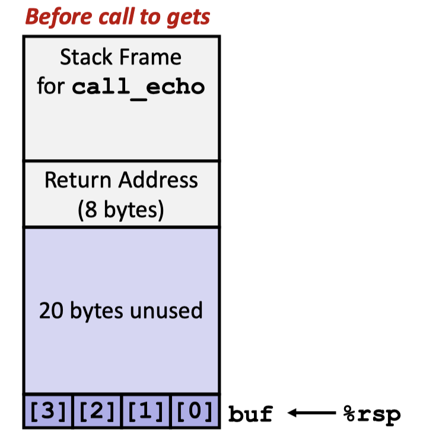{.mx-auto}

</div>
</div>

---

# ROP 攻击

return-oriented programming attack

<div grid="~ cols-2 gap-12">
<div>

输入：

```c
01234567890123456789012\0 // 24 个字符
```

此时，发生了缓冲区溢出，但是没造成严重后果。

尤其注意，`gets` 函数会在缓冲区末尾自动添加一个空字符 `\0`{.text-sky-5}。

绿色框圈出的预期的安全输入缓冲区范围。

</div>

<div>

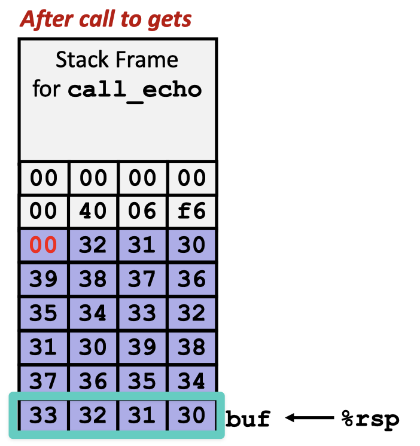{.h-80.mx-auto}

</div>
</div>

---

# ROP 攻击

return-oriented programming attack

<div grid="~ cols-2 gap-12">
<div>

输入：

```c
012345678901234567890123\0 // 25 个字符
```

此时，不仅发生了缓冲区溢出，还造成了严重后果：

<div text-sky-5>

因为溢出到了存放返回后下一条指令的（调用者的栈帧内）区域，导致程序 `ret` 后，会跳转到错误的位置执行。

</div>

按照这个思路，继续溢出直至恰好将整个返回地址覆盖，就可以跳转到我们想要执行的代码位置。

</div>

<div>

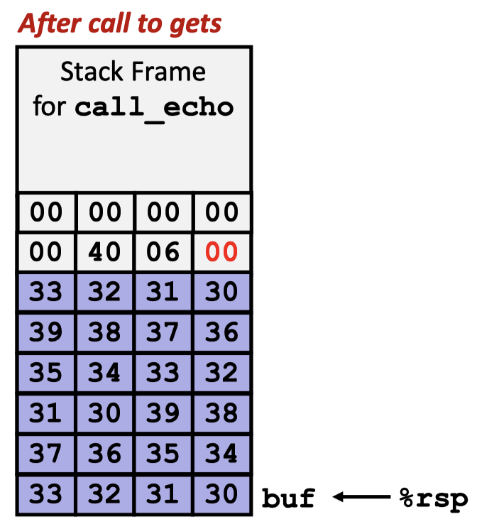{.h-80.mx-auto}

</div>
</div>

---

# ROP 攻击

return-oriented programming attack

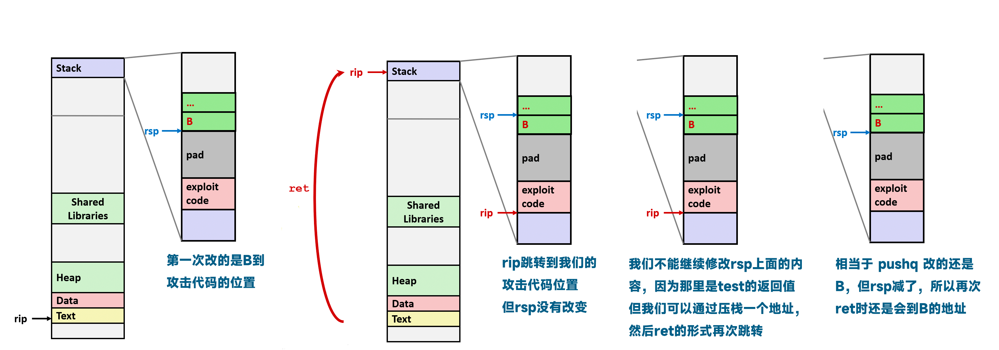

---

# 避免缓冲区溢出攻击

avoid buffer overflow attack

- **使用安全的函数编写程序**：`fgets` `strncpy` `snprintf`，指定每次读取的字节数
- **地址随机化（Address Space Layout Randomization，ASLR）**：随机化程序的内存布局，使得攻击者无法事先确定数据地址
- **限制可执行代码区域**：将可执行代码区域限制在特定的内存区域，使用页表进行限制
- **设置金丝雀值（canary）进行栈破坏检测**：在栈帧中复制一处不可修改的地方的值过来，当程序试图覆盖返回地址时，必然会破坏金丝雀值，从而在返回时可以检测到栈溢出

---

# 地址随机化

address space layout randomization

<div grid="~ cols-2 gap-12">
<div>

1. **随机化栈偏移**：在程序启动时，系统会在栈上分配一个随机大小的空间。从而每次程序执行时，栈的布局都会有所不同。
2. **栈地址的偏移**：由于栈的随机分配，整个程序的栈地址都会发生变化。这种变化使得攻击者难以预测插入代码的起始位置。从而即使插入了恶意代码，也无法准确执行。

</div>

<div>

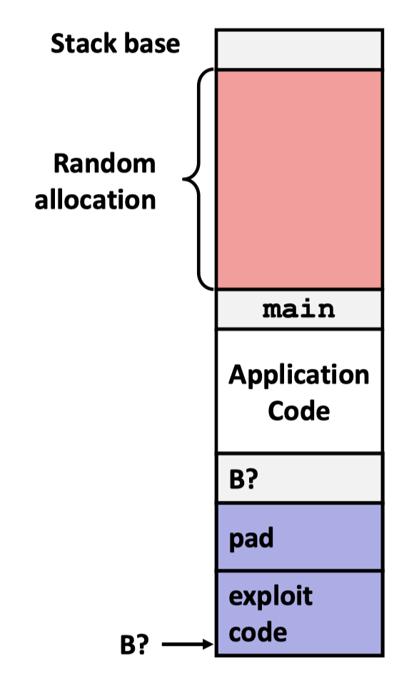{.h-90.mx-auto}

</div>
</div>

<!-- main 函数也是函数，会有对应的帧栈 -->

---

# 限制可执行代码区域

restrict the executable code region

给予内存区域一个 **标记**，来标志其内的字节是否可以作为代码执行。

后续章节中会学到，这会通过页表的权限位来实现。

类似的，还会有 **只读** 权限位。

---

# 金丝雀值

canary value


<div grid="~ cols-2 gap-12">
<div>

在栈帧中，除了返回地址外，还会在栈帧的末尾添加一个金丝雀值。

当程序试图覆盖返回地址时，必然会破坏金丝雀值，从而在返回时可以检测到栈溢出。

</div>

<div>

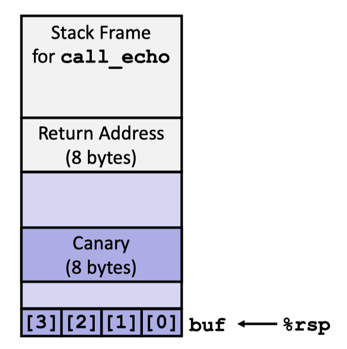{.h-80.mx-auto}

</div>
</div>

---

# 金丝雀值

canary value

<div grid="~ cols-2 gap-12">
<div>

```asm{3-5,11}
echo:
    sub $0x18,%rsp
    mov %fs:0x28,%rax
    mov %rax,0x8(%rsp)
    xor %eax,%eax
    mov %rsp,%rdi
    callq 4006e0 <gets>
    mov %rsp,%rdi
    callq 400570 <puts@plt>
    mov 0x8(%rsp),%rax
    xor %fs:0x28,%rax
    je 400768 <echo+0x39>
    callq 400580 <__stack_chk_fail@plt>
    add $0x18,%rsp
    retq
```

</div>

<div>

- 从特定的段寄存器 `%fs` 的偏移地址 `0x28` 加载金丝雀，并将金丝雀值存储到栈中分配的空间中，然后清除中间用过的寄存器。
- 在函数返回前，检查金丝雀值是否被破坏，如果被破坏，则调用 `__stack_chk_fail` 函数终止程序。

</div>
</div>


---
layout: image-right
image: ./res/image/slides.assets/isa.png
---

# 什么是 ISA？

Instruction Set Architecture

直译：指令集体系结构

如果非要强行解释... [^1]

- “汇编语言”转换到“机器码”（相当于一个翻译过程）
- CPU 执行机器码的晶体管和逻辑电路的集合

Y86-64：一种精简的 ISA

[^1]: [CPU 指令集（Instruction Set Architecture, ISA） / Zhihu](https://zhuanlan.zhihu.com/p/599864602)

---

# 程序员可见状态

programmer visible state


| 缩写 | 全称            | 描述       | 包括                                                                                     |
| ---- | --------------- | ---------- | ---------------------------------------------------------------------------------------- |
| RF   | Register File   | 程序寄存器 | `%rax` ~ `%r14`                                                                          |
| CC   | Condition Code  | 条件码     | ZF<span follow>zero</span>, OF<span follow>overflow</span>, SF<span follow>symbol</span> |
| Stat | Status          | 程序状态   | -                                                                                        |
| PC   | Program Counter | 程序计数器 | -                                                                                        |
| DMEM | Data Memory     | 内存       | -                                                                                        |


<style>
span[follow] {
  @apply text-[0.6rem];
}
</style>

---
layout: image-right
image: ./res/image/slides.assets/Y86-Instruction.png
---

# Y86-64 ISA

一个 X86-64 的子集

```md {all|1|2|3|4|5|6|7|8|9|10|11|12|13|all}
* halt # 停机
* nop # 空操作，可以用于对齐字节
* cmovXX rA, rB # 如果条件码满足，则将寄存器 A 的值移动到寄存器 B
* rrmovq rA, rB # 将寄存器 A 的值移动到寄存器 B
* irmovq V, rB # 将立即数 V 移动到寄存器 B
* rmmovq rA, D(rB) # 将寄存器 A 的值移动到内存地址 rB + D
* mrmovq D(rB), rA # 将内存地址 rB + D 的值移动到寄存器 A
* OPq rA, rB # 将寄存器 A 和寄存器 B 的值进行运算，结果存入寄存器 B
* jXX Dest # 如果条件码满足，跳转到 Dest
* call Dest # 跳转到 Dest，同时将下一条指令的地址压入栈
* ret # 从栈中弹出地址，跳转到该地址
* pushq rA # 将寄存器A的值压入栈
* popq rA # 从栈中弹出值，存入寄存器A
```

<div text-sm>

* 第一个字节为 **代码** ，其高 4 位为操作类型，低 4 位为操作类型（fn）的具体操作（或 0）
* F：0xF，为 Y86-64 中“不存在的寄存器”
* 所有数值（立即数、内存地址）均以 hex 表示，为 8 字节

</div>

---
layout: image-right
image: ./res/image/slides.assets/Y86-Instruction.png
---

# Y86-64 ISA

一个 X86-64 的子集

```md
* halt # 停机
* nop # 空操作，可以用于对齐字节
* cmovXX rA, rB # 如果条件码满足，则将寄存器 A 的值移动到寄存器 B
* rrmovq rA, rB # 将寄存器 A 的值移动到寄存器 B
* irmovq V, rB # 将立即数 V 移动到寄存器 B
* rmmovq rA, D(rB) # 将寄存器 A 的值移动到内存地址 rB + D
* mrmovq D(rB), rA # 将内存地址 rB + D 的值移动到寄存器 A
* OPq rA, rB # 将寄存器 A 和寄存器 B 的值进行运算，结果存入寄存器 B
* jXX Dest # 如果条件码满足，跳转到 Dest
* call Dest # 跳转到 Dest，同时将下一条指令的地址压入栈
* ret # 从栈中弹出地址，跳转到该地址
* pushq rA # 将寄存器A的值压入栈
* popq rA # 从栈中弹出值，存入寄存器A
```

<div class="text-[0.8rem]" grid="~ cols-2 gap-4">

<div>

* i(immediate)：立即数
* r(register)：寄存器
* m(memory)：内存地址{.text-sky-4}
  

</div>
<div>

* d(displacement)：偏移量
* dest(destination)：目标地址
* v(value)：数值
  

</div>
</div>


---

# Fn

<div grid="~ cols-3 gap-12">
<div>

### Jmp Fn
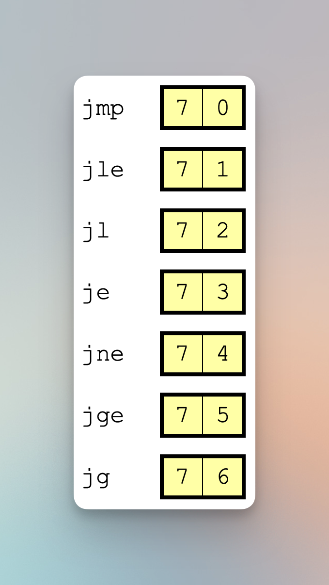{.h-90}

</div>

<div>

### Mov Fn
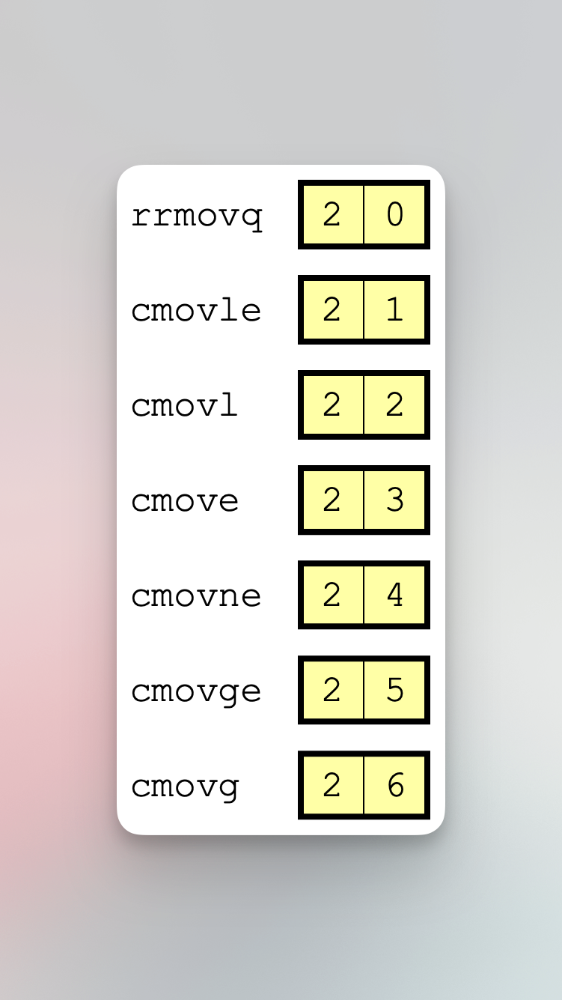{.h-90}

</div>
<div>

### OP Fn
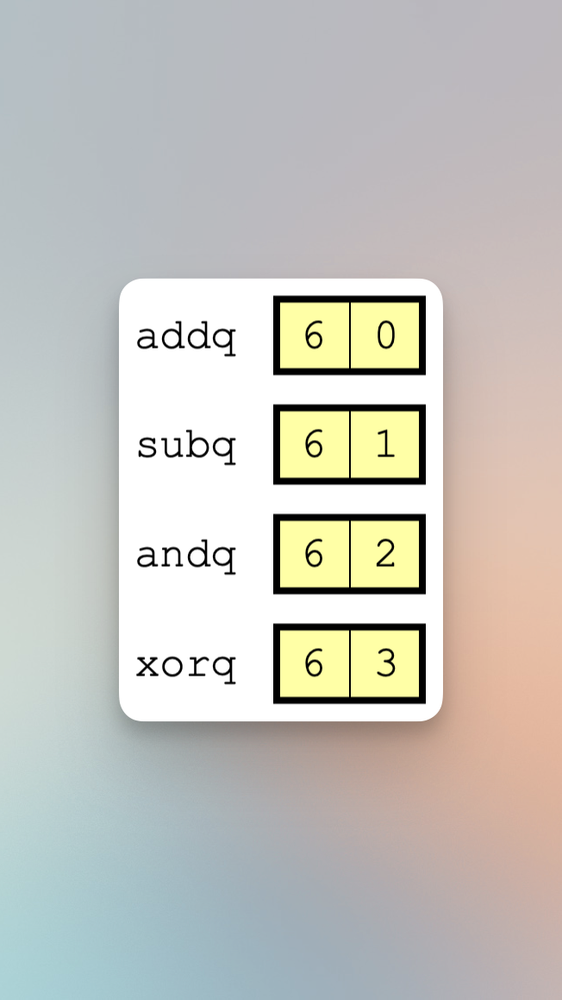{.h-90}

</div>
</div>


---
layout: image-right
image: ./res/image/slides.assets/register.png
---

# 寄存器

Register

```markdown{all|1-4|5-6|7-8|9-15|16|all|8,7,3,2|all|4,6,13-16}
* 0x0 %rax 
* 0x1 %rcx
* 0x2 %rdx
* 0x3 %rbx
* 0x4 %rsp
* 0x5 %rbp
* 0x6 %rsi
* 0x7 %rdi
* 0x8 %r8
* 0x9 %r9
* 0xA %r10
* 0xB %r11
* 0xC %r12
* 0xD %r13
* 0xE %r14
* 0xF F / No Register
```

<div class="text-[0.7rem]" flex="~ gap-4">
<div shrink-0>

* a,c,d,b + x <span text-gray-400># AcFun 倒（D）了，然后 Bilibili 兴起了</span>
* 栈指针（包括栈顶%rsp和栈底%rbp）
* 前两个参数指针
* 按序的 %r8 ~ %r14

</div>

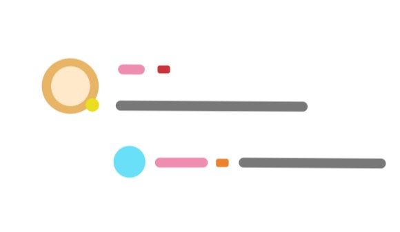

</div>


---

# 汇编代码翻译

translate assembly code to machine code

以下习题节选自书 P248，练习题 4.1 / 4.2

<div v-click-hide>

### Quiz

|       |                                                                      |
| ----- | -------------------------------------------------------------------- |
| 0x200 | a0 6f 80 0c 02 00 00 00 00 00 00 00 30 f3 0a 00 00 00 00 00 00 00 90 |
| loop  | rmmovq %rcx, -3(%rbx)                                                |

对于第一条翻译为汇编代码，第二条翻译为机器码

<br/>

</div>

<div v-after>

### Step 1
|       |                                                                                                                                                                                                |
| ----- | ---------------------------------------------------------------------------------------------------------------------------------------------------------------------------------------------- |
| 0x200 | <kbd>a0</kbd> <kbd>6f</kbd> \| <kbd>80</kbd> <kbd>0c 02 00 00 00 00 00 00</kbd> \| <kbd>00</kbd> \| <kbd>30</kbd> <kbd>f</kbd><kbd>3</kbd> <kbd>0a 00 00 00 00 00 00 00</kbd> \| <kbd>90</kbd> |
| loop  | rmmovq, rcx, rbx, -3                                                                                                                                                                           |


</div>

<br>

<div v-click>

### Step 2

<div  grid="~ cols-2 gap-4">
<div>

```bash
0x200:
  pushq %rbp
  call 0x20c
  halt
0x20c:
  irmovq $10 %rbx
  ret
```

</div>
<div>

<kbd>40</kbd> <kbd>1</kbd><kbd>3</kbd> <kbd>ff ff ff fd</kbd>

</div>
</div>
</div>

<style>
.slidev-vclick-hidden {
  @apply hidden;
}
</style>


<!--
地址、立即数都是小端法
-->

---

# Y86-64 vs x86-64, CISC vs RISC

Complex Instruction Set Computer & Reduced Instruction Set Computer


<div grid="~ cols-2 gap-4">
  <div>

* Y86-64 是 X86-64 的子集
* X86-64 更复杂，但是更强大
* Y86-64 更简单，复杂指令由简单指令组合而成
  

如 Y86-64 的算数指令（`OPq`）只能操作寄存器，而 X86-64 可以操作内存

> 所以 Y86-64 需要额外的指令（`mrmovq`、`rmmovq`）来先加载内存中的值到寄存器，再进行运算

  </div>
<div>

* CISC：复杂指令集计算机
* RISC：精简指令集计算机
* 设计趋势是融合的
  

{.w-70}

</div>
</div>

---

# Y86-64 状态

status

| 值  | 名字  | 含义                             | 全称                |
| --- | ----- | -------------------------------- | ------------------- |
| 1   | `AOK` | 正常操作                         | All OK              |
| 2   | `HLT` | 遇到器执行`halt`指令遇到非法地址 | Halt                |
| 3   | `ADR` | 遇到非法地址，如向非法地址读/写  | Address Error       |
| 4   | `INS` | 遇到非法指令，如遇到一个 `ff`    | Invalid Instruction |

除非状态值是 `AOK`，否则程序会停止执行。


---
layout: image-right
image: ./res/image/slides.assets/Y86_stack.png
---

# Y86-64 栈

stack

`Pushq rA F / 0xA0 rA F`

压栈指令
- 将 `%rsp` 减去8
- 将字从 `rA` 存储到 `%rsp` 的内存中

<br>

***

`Popq rA F / 0xB0 rA F`

弹栈指令
- 将字从 `%rsp` 的内存中取出
- 将 `%rsp` 加上8
- 将字存储到 `rA` 中

<!-- 


<div text-sm>

根据书 P334 4.7、4.8，如果压栈 / 弹栈的时候的寄存器恰为 `%rsp`，则不会改变 `%rsp` 的值。

</div>

 -->


---

# Y86-64 程序调用

`call` & `ret`

`Call Dest / 0x80 Dest`

调用指令
- 将下一条指令的地址 `pushq` 到栈上（`%rsp` 减 8、地址存入栈中）
- 从目标处开始执行指令

<br/>

***

`Ret / 0x90`

返回指令
- 从栈上 `popq` 出地址，用作下一条指令的地址（`%rsp` 加 8、地址从栈中取出，存入 `%rip`）


---

# Y86-64 终止与对齐

`Halt / 0x00`

终止指令
- 停止执行
- 停止模拟器
- 在遇到初始化为 0 的内存地址时，也会终止
- 记忆：没有事情做了 ➡️ 停止

<br/>

`Nop / 0x10`

空操作
- 什么都不做（但是 PC <span text-sm> Program Counter </span> + 1），可以用于对齐字节
- 记忆：扣 1 真的没有用

---

# 逻辑设计和硬件控制语言 HCL

hardware control language

* 计算机底层是 0（低电压） 和 1（高电压）的世界
* HCL（硬件 **控制** 语言）是一种硬件 **描述** 语言（HDL），用于描述硬件的逻辑电路
* HCL 是 HDL 的子集

<br>

<div grid="~ cols-3 gap-4"  mt-2>

<div>

#### 与门 And

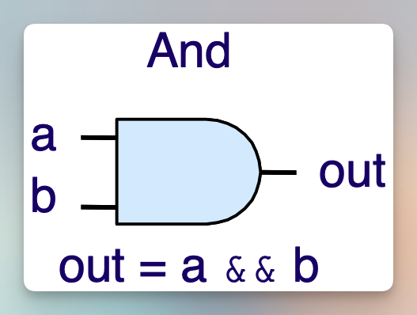{.h-30}

```c
out = a&&b
```

</div>

<div>

#### 或门 Or

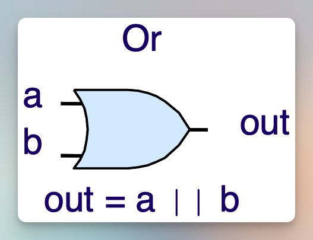{.h-30}

```c
out = a||b
```

</div>

<div>

#### 非门 Not

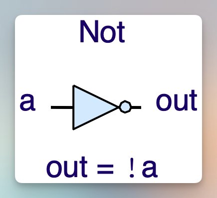{.h-30}

```c
out = !a
```

</div>

</div>

记忆：方形的更严格→与；圆形的更宽松→或


---

# 组合电路 / 高级逻辑设计

中杯：bit level / bool

<div grid="~ cols-2 gap-12"  mt-2>

<div>

```c
bool eq = (a && b) || (!a && !b);
```

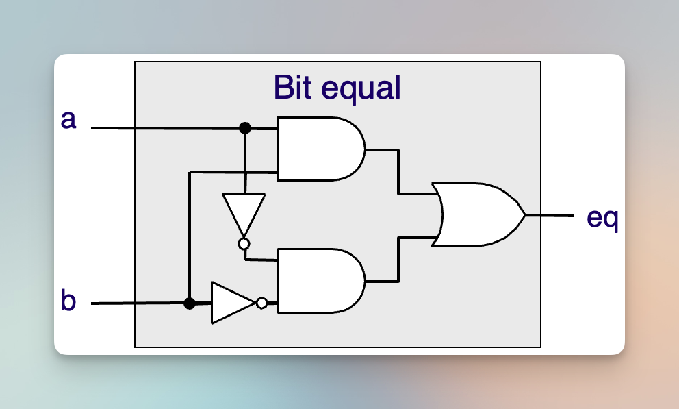{.h-50.mx-auto}

- 组合电路是 `响应式` 的：在输入改变时，输出经过一个很短的时间会立即改变
- 没有短路求值特性：`a && b` 不会在 `a` 为 `false` 时就不计算 `b`

</div>

<div>

```c
bool out = (s && a) || (!s && b);
```

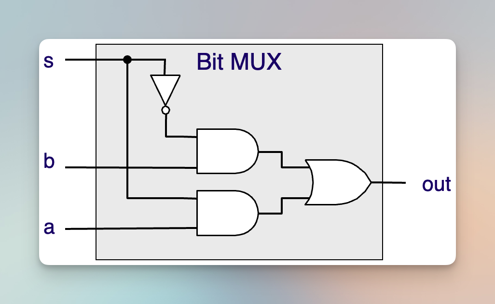{.h-50.mx-auto}

- Mux：Multiplexer / 多路复用器，用一个 `s` 信号来选择 `a` 或 `b`

</div>

</div>


---

# 组合电路 / 高级逻辑设计

大杯：word level / word

<div grid="~ cols-2 gap-12">
<div>


```c
bool Eq = (A == B)

```

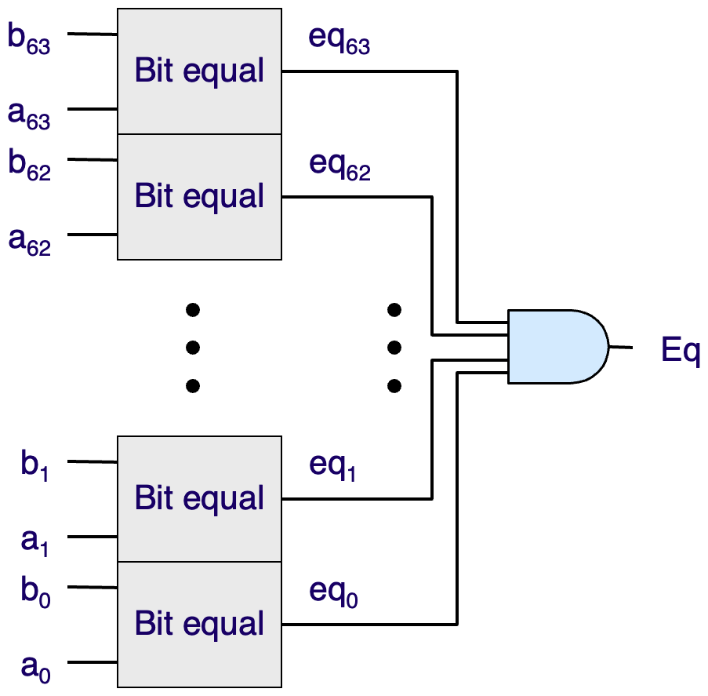{.h-60}

</div>

<div>

```c
int Out = [
  s : A; # select: expr
  1 : B;
];

```

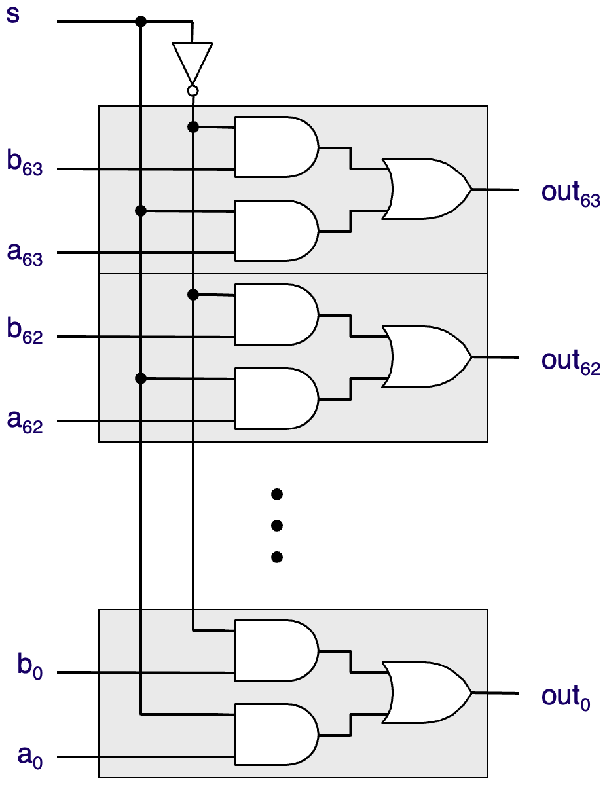{.h-60}

</div>
</div>


---

# 组合电路 / 高级逻辑设计

超大杯：相信你已经学会了基本的 ~~红石~~ 逻辑门电路，那就试试 ~~纯红石~~ 神经网络 [^1] 吧！

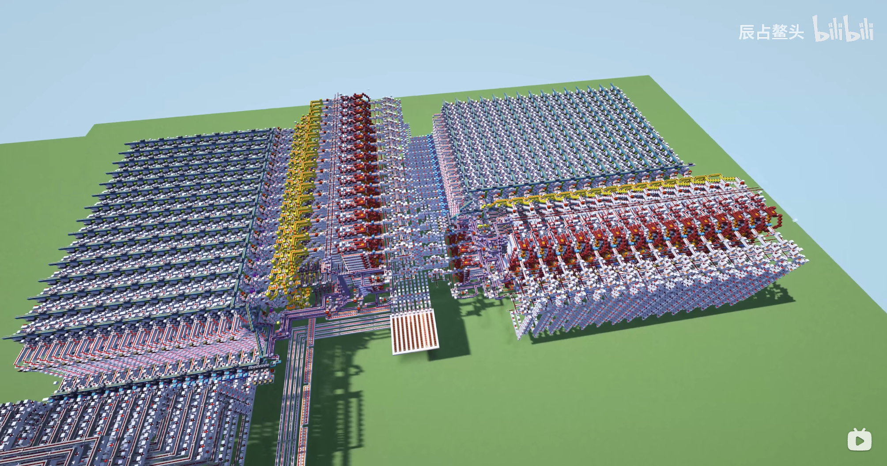{.h-80}

[^1]: [【Minecraft】世界首个纯红石神经网络！真正的红石人工智能(中文/English)(4K)/ Bilibili](https://www.bilibili.com/video/BV1yv4y1u7ZX/)


---

# 组合电路 / 集合关系

是的，我们居然还能在这里温习《离散数学基础》

```c
int Out4 = [
  bool s1 = code in {2, 3}; # 10, 11
  bool s2 = code in {1, 3}; # 01, 11
];

```

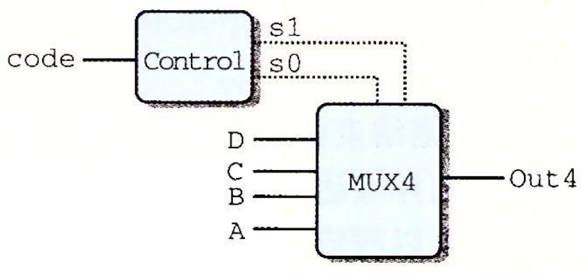{.h-40}

<!-- 我们可以用集合关系来表示电路的逻辑 -->


---

# 组合电路 / 算数逻辑单元 ALU
Arithmetic Logic Unit

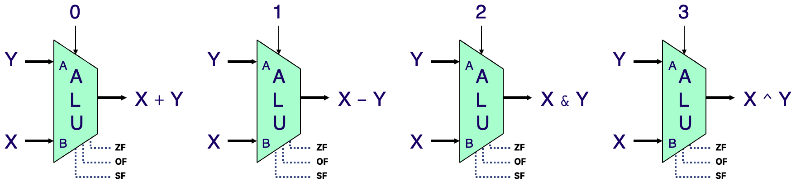

<div grid="~ cols-2 gap-4"  mt-2>

<div>

- 组合逻辑
- 持续响应输入
- 控制信号选择计算的功能
</div>
<div>

- 对应于 Y86-64 中的 4 个算术 / 逻辑操作
- 计算条件码的值
- 注意 `Sub` 是被减的数在后面，即输入 B 减去输入 A，等于 `subq A, B`
</div>
</div>


---

# 存储器和时钟

响了十二秒的电话我没有接，只想要在烟花下闭着眼~

组合电路：不存储任何信息，只是一个 `输入` 到 `输出` 的映射（有一定的延迟）

时序电路：有 **状态** ，并基于此进行计算


---

# 时钟寄存器 / 寄存器 / 硬件寄存器

register

存储单个位或者字

- 以时钟信号控制寄存器加载输入值
- 直接将它的输入和输出线连接到电路的其他部分


<div grid="~ cols-2 gap-12" mt-8>
<div>

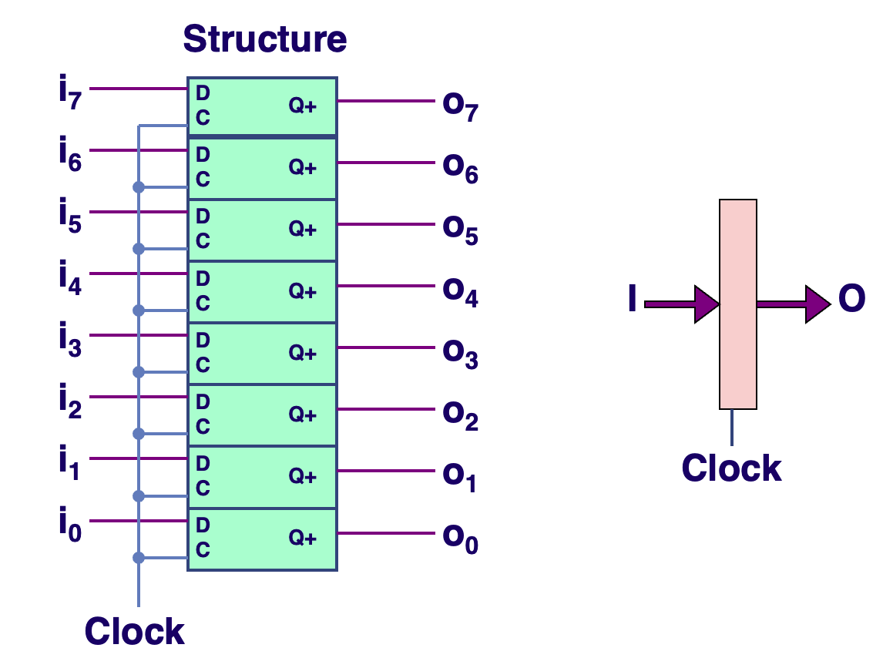{.h-45.mx-auto}

</div>

<div>

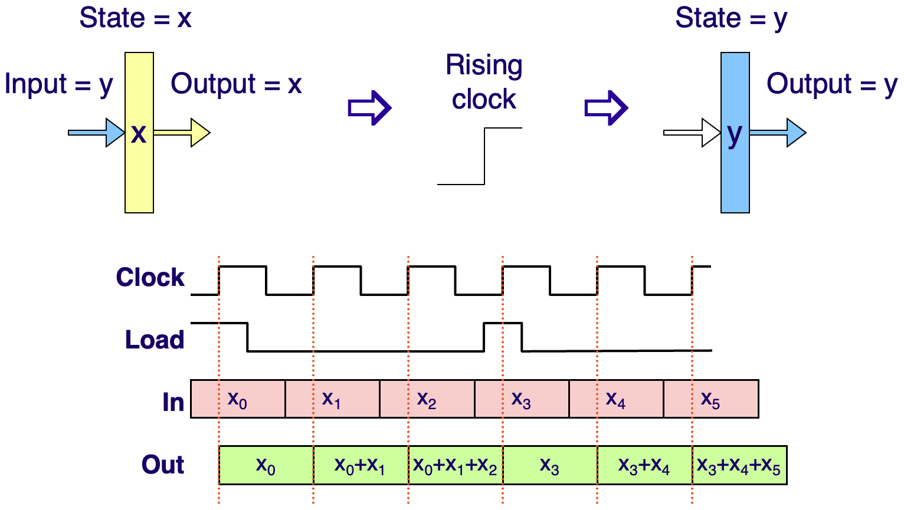{.h-45.mx-auto}

</div>
</div>

在 Clock 信号的上升沿，寄存器将输入的值采样并加载到输出端，其他时间输出端保持不变

---

# 随机访问存储器 / 内存

memory

<div grid="~ cols-2 gap-12">
<div>

以 **地址** 选择读写

包括：

- 虚拟内存系统，寻址范围很大
- 寄存器文件 / 程序寄存器，个数有限，在 Y86-64 中为 15 个程序寄存器（`%rax` ~ `%r14`）

可以在一个周期内读取和 / 或写入多个字词

</div>

<div>

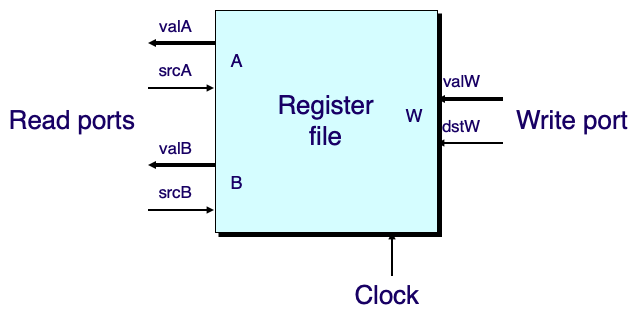{.h-50.mx-auto}

</div>
</div>

---
layout: center
---

<div>
  <text class="text-17 font-bold gradient-text">Emphasis
</text>
</div>

<style>
  .gradient-text {
    background-image: linear-gradient(45deg, #4ec5d4 10%, #146b8c 20%);
    -webkit-background-clip: text;
    color: transparent;
  }
</style>

---

# RISC与CISC

<div grid="~ cols-2 gap-2">

<div>

- CISC：IA32, AMD64(x86-64)
  
- RISC：ARM64, RISC-V, MIPS


</div>

<div>


</div>
</div>


---

# 程序员可见状态


---

# Y86-64 ISA

{.w-150}

---

# Y86-64 ISA


---

# Y86-64 ISA

<div grid="~ cols-2 gap-12">

<div>


</div>

<div>


- IOPL改为**IOPQ**
- RESP改为**RRSP**

</div>
</div>


---
layout: image-right

image: ./res/image/slides.assets/push_pop2.png

backgroundSize: 40em 30%
---


# push&pop指令

- push：先将 %rsp 减 8，再压栈
- pop：先弹栈，再将 %rsp 加 8
- 先这么理解，原理会在第四章学习（与表象并不完全一致）
- call：push + jmp，可进行间接跳转
- ret：pop + jmp

{.w-100}

<!--  -->


---

# HCL

## 逻辑门

{.w-150}

## 算术/逻辑单元ALU

{.w-150}

---

# Y86-64硬件结构

<div grid="~ cols-2 gap-2">

<div>

## 阶段

<br/>

- 取址：Fetch
- 译码：Decode
- 执行：Execute
- 访存：Memory
- 写回：Write back
- 更新 PC：PC Update

<br/><br/><br/>


W：只能写入valE，valM（`rrmovq`,`irmovq`,`cmovXX`需要**+0**做ALU计算）

</div>

<div>

## 指令处理


</div>
</div>

---

# 指令处理

{.h-110}

---

# 指令处理

{.h-110}

---

# 指令处理

{.h-50}

  {.h-50}


---

# 指令处理

{.h-110}

---
layout: center
---

<div>
  <text class="text-17 font-bold gradient-text">Overview
</text>
</div>

<style>
  .gradient-text {
    background-image: linear-gradient(45deg, #4ec5d4 10%, #146b8c 20%);
    -webkit-background-clip: text;
    color: transparent;
  }
</style>

---


<div grid="~ cols-2 gap-12">

<div>

{.w-85}

</div>

<div>


{.w-90}


</div>
</div>

---


<div grid="~ cols-2 gap-12">

<div>

{.w-95}

</div>

<div>


{.w-85}


</div>
</div>

---
layout: center
---

<div>
  <text class="text-17 font-bold gradient-text">Details
</text>
</div>

<style>
  .gradient-text {
    background-image: linear-gradient(45deg, #4ec5d4 10%, #146b8c 20%);
    -webkit-background-clip: text;
    color: transparent;
  }
</style>

SEQ、PIPE的具体实现图、HCL代码都需要详细掌握

此处不再说明，详见 【补充资料】部分

---

# SEQ->SEQ+

## 前置PC

- 电路重定时：改变状态表示而不改变逻辑

- 目的：平衡一个流水线各个阶段之间的延迟

- 在 SEQ+ 的实现里，PC update 的时期从周期的最后被提到了最前，更加接近流水线的形态

---

# SEQ+ ->PIPE-

## 阶段划分

在 Y86-64 的实现中：

- 正常指令指令默认预测 PC 为下一条指令的地址；
- call 指令和 jxx 指令默认预测 PC 为跳转后地址；
- ret 指令不进行任何预测，直到其对应的写回完成

插入流水线寄存器：分别插入了5个流水线寄存器用来保存后续阶段所需的信号，编号为`F`、`D`、`E`、`M`和`W`

- **Fetch**： Select current PC；Read instruction；Compute incremented PC
- **Decode**：Read program registers
- **Execute**：Operate ALU
- **Memory**：Read or write data memory
- **Write** **Back**：Update register file

<div class="text-red-5"> 寄存器顺序：F—f—D—d—E—e—M—m—W</div>

---

# PIPE->PIPE

## 处理冒险
<br/>

- **硬件：暂停和气泡**
  - **stall** 能将指令阻塞在某个阶段
  - **bubble** 能使得流水线继续运行，但是不会改变当前阶段的寄存器、内存、条件码或程序状态

- **结构冒险**

  - **计算的多时钟周期**：采用独立于主流水线的特殊硬件功能单元来处理较为复杂的操作（一个功能单元执行整数乘法和除法，一个功能单元执行浮点操作）
  - **访存的多时钟周期**：
    - 翻译后备缓冲器（**TLB**）+高速缓存（**Cache**）：实现一个时钟周期内读指令并读或写数据
    - 缺页（**page fault**）异常信号：指令暂停+磁盘到主存传送+指令重新执行

---

# PIPE->PIPE

## 处理冒险
<br/>

- **数据冒险**
  - **前后使用数据冒险**：在处理器中，`valA`和`valB`一共有5个转发源：
      - `e_valE`：在执行阶段，ALU中计算得到的结果`valE`，通过`E_dstE`与`d_srcA`和`d_src_B`进行比较决定是否转发。
      - `M_valE`：将ALU计算的结果`valE`保存到流水线寄存器M中，通过`M_dstE`与`d_srcA`和`d_src_B`进行比较决定是否转发。
      - `m_valM`：在访存阶段，从内存中读取的值`valM`，通过`M_dstM`与`d_srcA`和`d_src_B`进行比较决定是否转发。
      - `W_valM`：将内存中的值`valM`保存到流水线寄存器W中，通过`W_dstM`与`d_srcA`和`d_src_B`进行比较决定是否转发。
      - `W_valE` ：将ALU计算的结果`valE`保存到流水线寄存器W中，通过`W_dstE`与`d_srcA`和`d_src_B`进行比较决定是否转发。

---

# PIPE->PIPE

## 处理冒险
<br/>

- **数据冒险**
  - **用暂停来避免数据冒险**
    - 插入一段自动产生的`nop`指令
    - 该方法指令要停顿最少一个最多三个时钟周期，严重降低整体的吞吐量
    {.w-180}

---

# PIPE->PIPE

## 处理冒险
<br/>

- **数据冒险**
  -  **加载/使用数据冒险**
    {.w-150}
    {.w-150}

---

# PIPE->PIPE

## 处理冒险
<br/>

- **控制冒险**
  - ret指令（不预测）：删除后续操作——插入3个bubble
  {.w-110}
  - 跳转指令（预测）： 删除后续操作——插入2个bubble
  {.w-110}


---

# PIPE->PIPE

## 处理冒险
<br/>

- **检验自洽**
  - 控制条件组合——有限性组合：**Combination A + B**
    - Conbination A：**ret位于不选择分支 ** ——简单叠加
    - Conbination B：**加载/使用+ret ** ——取”**stall**”
      - 加载互锁核心思想：通过暂停+转发组合实现
      - 合理性：Install后，下一条指令无法进入寄存器，当前指令因为bubble并未成功下传
      - 有效性：Install后，当前指令ret依然存在于流水线中，加载/使用语句后可进一步执行
      {.w-120}

---

# PIPE->PIPE

## 处理冒险
<br/>

- **检验自洽**


{.w-150}

{.w-150}


---

# PIPE->PIPE


## 处理冒险
<br/>

- **异常处理**
  - 内部异常：
    - **HLT**：执行halt指令
    - **ADR**：从非法内存地址读或向非法内存地址写
    - **INS**：非法指令
  - 外部异常
    - 系统重启
    - I/O设备请求
    - 硬件故障
 - **要求：** 异常指令之前的所有指令已经完成，后续的指令都不能修改条件码寄存器和内存。

---

# PIPE->PIPE


## 处理冒险
<br/>

- **异常处理**

1. 当同时多条指令引起异常时，处理器应该向操作系统报告哪个异常？

   **基本原则：** 由流水线中最深的指令引起的异常，表示该指令越早执行，优先级最高。

2. 在分支预测中，当预测分支中出现了异常，而后由于预测错误而取消该指令时，需要取消异常。

3. 如何处理不同阶段更新系统状态不同部分的问题？

   - 异常发生时，记录指令状态，继续取指、译码、执行
   - 异常到达 **访存阶段**：
     1. 执行阶段，禁止设置条件码（set_cc $\leftarrow$ m_stat, W_stat）
     2. 访存阶段，插入气泡，禁止写入内存
     3. 写回阶段，暂停写回，即暂停流水线

---
layout: center
---

<div>
  <text class="text-17 font-bold gradient-text">Homework Review</text>
</div>

<style>
  .gradient-text {
    background-image: linear-gradient(45deg, #4ec5d4 10%, #146b8c 20%);
    -webkit-background-clip: text;
    color: transparent;
  }
</style>


---
layout: center
---

<div>
  <text class="text-17 font-bold gradient-text">Exercises</text>
</div>

<style>
  .gradient-text {
    background-image: linear-gradient(45deg, #4ec5d4 10%, #146b8c 20%);
    -webkit-background-clip: text;
    color: transparent;
  }
</style>


---
layout: center
---

<div>
  <text class="text-13 font-bold gradient-text">Processor Arch: ISA & Logic</text>
</div>

<style>
  .gradient-text {
    background-image: linear-gradient(45deg, #4ec5d4 10%, #146b8c 20%);
    -webkit-background-clip: text;
    color: transparent;
  }
</style>


---

# E1


<!--  -->

---

# E1


---

# E2


<!--  -->

---

# E2


---

# E3


<!-- {.w-50} -->
---

# E3


{.w-50}

---

# E4


<!-- {.w-50} -->

---

# E4


{.w-50}

---

# E5


<!--  -->

---

# E5


---

# E6


<!-- {.w-150} -->

---

# E6


{.w-150}


---

# E7


<!--  -->

---

# E7


---

# E8


<!-- {.w-150} -->

---

# E8


{.w-150}
---

# E9

{.w-120}

---

# E9

{.w-150}
---

# E10

{.w-150}

<!-- {.w-50} -->

---

# E10

{.w-150}

{.w-50}

---

# E11

{.w-130}

<!-- {.w-30} -->

---

# E11

{.w-130}

{.w-30}

---

# E12


---

# E12


---

# E13

<div grid="~ cols-2 gap-2">

<div>

{.w-80}

</div>

<div>


<!-- {.w-80}

{.w-70} -->


</div>
</div>


---

# E13

<div grid="~ cols-2 gap-2">

<div>

{.w-80}

</div>

<div>


{.w-80}

{.w-70}


</div>
</div>


---

# E14

<div grid="~ cols-2 gap-12">

<div>

{.w-80}

</div>

<div>

{.w-75}

</div>

</div>

---

# E14


{.w-180}


---

# E15

<div grid="~ cols-2 gap-12">

<div>

{.w-75}

</div>

<div>

{.w-75}

</div>

</div>


---

# E15

<div grid="~ cols-2 gap-12">

<div>

{.w-75}

</div>

<div>

{.w-75}

</div>

</div>


---
layout: center
---

<div>
  <text class="text-13 font-bold gradient-text">Processor Arch: SEQ/PIPE</text>
</div>

<style>
  .gradient-text {
    background-image: linear-gradient(45deg, #4ec5d4 10%, #146b8c 20%);
    -webkit-background-clip: text;
    color: transparent;
  }
</style>

---

# E1

{.w-180}

---

# E1

{.w-180}

---

# E2


<!-- {.w-40} -->

---

# E2


{.w-40}

---

# E3

{.w-140}

<!-- {.w-20} -->

---

# E3

{.w-140}

{.w-20}

---

# E4


<!-- {.w-30} -->

---

# E4


{.w-30}

---

# E5


<!--  -->


---

# E5


---

# E6


<!--  -->

---

# E6


---

# E7

{.w-150}

<!-- {.w-30} -->

---

# E7

{.w-150}

{.w-30}

---

# E8

<div grid="~ cols-2 gap-2">

<div>

{.w-80}

</div>

<div>


<!-- {.w-80} -->

</div>
</div>


---

# E8

<div grid="~ cols-2 gap-2">

<div>

{.w-80}

</div>

<div>


{.w-80}

</div>
</div>


---

# E9


<!-- {.w-100} -->

---

# E9


{.w-100}

---

# E10


<!--  -->

---

# E10


---

# E11


<!--  -->

---

# E11


---

# E12

{.w-160}

---

# E12


---

# E13

<div grid="~ cols-3 gap-2">

<div>


</div>

<div>


</div>


<div>


</div>


</div>


---

# E13


<div grid="~ cols-2 gap-0">

<div>

{.w-80}


</div>

<div>


{.w-100}

</div>
</div>


---
layout: center
---

<div>
  <text class="text-17 font-bold gradient-text">Notices</text>
</div>

<style>
  .gradient-text {
    background-image: linear-gradient(45deg, #4ec5d4 10%, #146b8c 20%);
    -webkit-background-clip: text;
    color: transparent;
  }
</style>

---


# bomblab

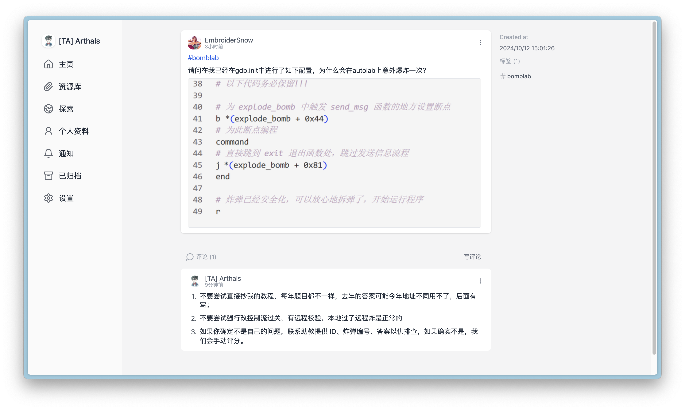{.w-180}

---


# 时间轴


---


# 补充资料

- HCL语言：[HCL Descriptions of Y86-64 Processors.pdf](https://github.com/Yaenday/WalkerCH-ICS-Slides/blob/main/res/document/HCL%20Descriptions%20of%20Y86-64%20Processors.pdf)

{.w-160}

- 我的Y86-64学习笔记：[Y86-64 Note.html](https://github.com/Yaenday/WalkerCH-ICS-Slides/blob/main/res/document/Y86-64%20Note.html)

{.w-160}


---
layout: center
---

<div flex="~ gap-20"  mt-2 justify-center items-center>

<div  w-fit h-fit mb-2>

# THANKS

Made by WalkerCH 

changxinhai@stu.pku.edu.cn

<p class="text-gray-40">
  <font size = '3'>
    Reference: [Weicheng Lin]'s presentation.<br>
    Reference: [Arthals]'s templates and content.
  </font>
</p>

</div>

{.w-50.rounded-md}

</div>
