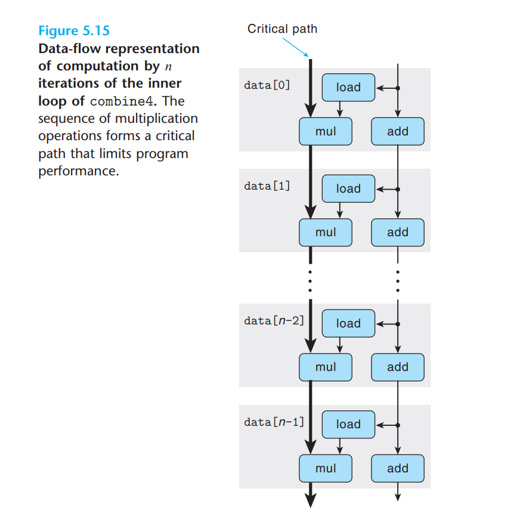

---
# You can also start simply with 'default'
theme: academic
# random image from a curated Unsplash collection by Anthony
# like them? see https://unsplash.com/collections/94734566/slidev
# background: https://cover.sli.dev
highlighter: shiki
# some information about your slides (markdown enabled)
title: 08-Cache
info: |
  ICS 2024 Fall Slides
  Presented by WalkerCH
titleTemplate: '%s'
# apply unocss classes to the current slide
class: text-center
# https://sli.dev/features/drawing
drawings:
  persist: false
# slide transition: https://sli.dev/guide/animations.html#slide-transitions
transition: fade-out
# enable MDC Syntax: https://sli.dev/features/mdc
mdc: true
layout: cover
coverBackgroundUrl: /res/image/cover/cover_08.jpg

---

# Processor Arch {.font-bold}

  13 元培数科 常欣海

  
    Here we go! <carbon:arrow-right class="inline"/>
  

  <button @click="$slidev.nav.openInEditor()" title="Open in Editor" class="text-xl slidev-icon-btn opacity-50 !border-none !hover:text-white">
    <carbon:edit />
  </button>
  <a href="https://github.com/Yaenday/WalkerCH-ICS-Slides
  " target="_blank" alt="GitHub" title="Open in GitHub"
    class="text-xl slidev-icon-btn opacity-50 !border-none !hover:text-white">
    <carbon-logo-github />
  </a>

---

# 随机访问存储器

Random Access Memory, RAM

- 速度非常快
- **断电后数据不可恢复**
- 常用于运行时产生数据的存储

### 随机访问{.mb-4.mt-6}

- 指在存储设备中，可以以任意顺序访问存储的数据，而不需要按照特定的顺序逐个读取。
- 这种访问方式使得数据的读取和写入速度更快，尤其是在需要频繁访问不同位置的数据时。

---

# 随机访问存储器

Random Access Memory, RAM

### SRAM

Static RAM，静态随机访问存储器

- 速度最快（仅次于寄存器文件）
- 抗噪音干扰能力强，采用 **双稳态结构**{.text-sky-5}
- 价格最高（晶体管更多，造价更高）
- 常用于高速缓存

{.h-40.mx-auto}

### DRAM

Dynamic RAM，动态随机访问存储器

- 对干扰非常敏感
- **需要不断地刷新以保持稳定性**{.text-sky-5}
- 速度慢于 SRAM，价格更低
- 多用于主存（内存）

---

# DRAM 的读取

DRAM read

- 通过 address 引脚传入地址
- 在 DRAM 单元阵列中访存后通过 data 引脚输出数据
- 通常会重复利用 address 引脚进行二维访存

{.h-100px.mx-auto}

DRAM 芯片{.text-center}

- 由 $r$ 行，$c$ 列个 DRAM 超单元组成（组织成二维阵列）
- 总共有 $d = r \times c$ 个超单元
- 总容量：$d \times w$ 位数据

{.h-100px.mx-auto}

DRAM 超单元（SuperCell）{.text-center}

- 由 $w$ 个 DRAM 单元组成，携带 $w$ 位数据

{.h-100px.mx-auto}

DRAM 单元（Unit）{.text-center}

- 每个 DRAM 单元携带 $1$ 位数据

---

# DRAM 的读取

DRAM read

1. 行缓冲区在传入行访问信号（RAS，Row Address Strobe，行地址选通）时复制一行内容，实现缓存
2. 传入列地址选通信号（CAS，Column Address Strobe，列地址选通），从行缓冲区中选出指定列的数据

二维访存：可以将原先需要 $m$ 位引脚的地址，拆分为两次 $m/2$ 位引脚的地址，即分别传入行地址和列地址

{.mx-auto.h-60}

---

# DRAM 的读取

DRAM read

“8 个 8M x 8 的 64 MB 内存模块”

- 8 个 DRAM 芯片
- 每个芯片由 8M 个超单元组成
- 每个超单元携带 8 位（bit）数据
- 总容量：$8 \times 8M \times 8 \text{bit} = 64 \text{MB}$

可以利用相同的地址引脚，快速取出 64 位（bit）数据

（回忆：地址是超单元的地址）

---

# 增强的 DRAM

Enhanced DRAM

重要！经常考选择题辨析。

#### 快页存取DRAM

- Fast Page Mode DRAM（FPM DRAM）
- FPM DRAM 允许对同一行连续地址访问可以直接从行缓冲区得到服务{.text-sky-5}（从而减少 `RAS` 请求）。

#### 扩展数据输出DRAM

- Extended Data Out DRAM（EDO DRAM）
- FPM DRAM 的增强版
- 它允许 `CAS` 信号在时间上靠得更紧密一点

#### 同步DRAM

- Synchronous DRAM（SDRAM）{.text-sky-5}
- 使用同步控制信号（时钟上升沿），能更快速输出超单元内容。
- FPM 和 EDO DRAM 是异步控制。

{.w-70.mx-auto}

#### 双倍数据速率同步DRAM

- Double Data-Rate Synchronous DRAM（DDR SDRAM）
- SDRAM 的增强版本，通过使用两个时钟沿（同时使用上升沿和下降沿）作为控制信号
- 使得 DRAM 速度翻倍

{.w-70.mx-auto}

省流：全都是 DRAM 的增强版，和 SRAM 没有关系。

---

# ROM

Read-Only Memory

只读存储器（非易失性存储器）

- 断电后仍然能保存数据
- 常用于数据的持久性存储
- 常见：闪存
- SSD 基于闪存

---

# 磁盘存储

Disk Storage

- 非易失性存储器，断电后数据不丢失
- 容量数量级：GB~TB
- 访问时间：ms 级别

---

# 磁盘结构

Disk Structure

{.mx-auto.h-60}

- 磁盘：由多个盘片构成，每个盘片有 2 个可读写面
- 磁道：盘片表面同一半径的圆周，每个盘面有多个磁道
- 扇区：磁道被划分成一段段数据块
- 柱面：**所有盘片** 的同一半径磁道集合

---

# 磁盘容量

Disk Capacity

容量公式：

$$
\text{磁盘容量} = \text{每个扇区字节数} \times \text{每个磁道平均扇区数} \times \text{每个表面磁道数} \times \text{每个盘片表面数(2)} \times \text{盘片数}
$$

衍生概念：

- 记录密度：磁道一英寸能放的位数
- 磁道密度：从圆心出发半径一英寸能有多少条磁道
- 面密度：记录密度 × 磁道密度

---

# 多区记录

Multi-Zone Recording

### 传统方法

每个磁道都划分为相同数量的扇区，则：

- 扇区数目是由最内磁道决定的
- 外周磁道会有很多空隙

### 多区记录方法

- 将柱面划分为若干组
- 每组内部采用相同的扇区数，不同组间扇区数可不同
- 能有效利用空间

{.mx-auto.h-40}

{.mx-auto.h-40}

---

# 计量单位

Unit of measurement

DRAM 和 SRAM 容量相关计量单位：

- K = $2^{10}$
- M = $2^{20}$
- G = $2^{30}$
- T = $2^{40}$

磁盘和网络等 I/O 设备容量计量单位：

- K = $10^3$
- M = $10^6$
- G = $10^9$
- T = $10^{12}$

省流版本：

- 内存（含）及以上（更快），使用 2 的幂次作为单位{.text-sky-5}
- 磁盘及以下（更慢），使用 10 的幂次作为单位{.text-sky-5}

---

# 磁盘读写

Disk Read/Write

传动臂末端具有读写头，通过以下步骤进行读写：

1. **寻道**：通过旋转将读写头移动到对应磁道上（$T_{\text{seek}}$）
2. **旋转**：等待对应扇区开头旋转到读写头位置（$T_{\text{rotate}}$），最差情况为 $\frac{1}{\text{RPM}} \times 60 \text{s/min}$，接近于寻道时间
3. **传送**：开始读写，每个扇区的平均传送速率（$T_{\text{transfer}}$），一般可忽略

{.h-40.mx-auto}

寻道时间：$T_{\text{seek}}$

{.h-40.mx-auto}

 

旋转时间：$T_{\text{rotate}}$

---

# SSD 固态硬盘

Solid State Disk

固态硬盘（Solid State Disk，SSD）是一种基于闪存的存储技术，是传统旋转磁盘的替代产品。

SSD 价格贵于旋转磁盘。

#### SSD 层级结构{.my-4}

- SSD，闪存由多个闪存块组成
- 闪存块（Block），$0 \sim B-1$，每个块包含多个闪存页
- 闪存页（Page），$0 \sim P-1$，每个页包含 512B～4KB 数据

---

# SSD 读写特性

SSD Read/Write Characteristics 

- 速度：读 > 写，顺序访问 > 随机访问
- 数据以页为单位读写，页所在块必须先擦除再写入（全部置为 1）{.text-sky-5}
- 写操作前需复制 **页内容** 到 **新块** 并 **擦除旧块**
- 一旦一个块被擦除了，块中每一个页都可以不需要再进行擦除就写一次
- 每个块在反复擦除后会磨损乃至损坏（约 100,000 次），需要通过闪存翻译层管理，以最小化擦除次数

{.h-60.mx-auto}
---

# 局部性

Locality

**局部性**：程序倾向于引用最近引用过的数据项的邻近的数据项，或者最近引用过的数据项本身。

- **空间局部性**：相邻位置的变量被集中访问（最近引用过的数据项及其邻近数据项）
- **时间局部性**：同一变量在短时间内被重复访问（最近引用过的数据项本身）

注意，指令也是数据的一种，因此指令也有局部性。

---

# 步长与引用模式

stride and reference pattern

- **步长为 $k$ 的引用模式**：每隔 $k$ 个元素访问一次，**步长越短，空间局部性越强。**{.text-sky-5}（行优先访问好于列优先访问）
- **指令的局部性**：指令按顺序执行，例如 `for` 循环，具有良好的时间（循环体、循环变量复用）和空间局部性（循环体内指令连续）。

循环次数越多越好，循环体越小越好

---

# 存储器层次结构

Memory Hierarchy

- 越靠近 CPU 的存储器，速度越快，单位比特成本越高，容量越小
- 越远离 CPU 的存储器，速度越慢，单位比特成本越低，容量越大

通常，我们使用 $L_k$ 层作为 $L_{k+1}$ 层的缓存

如果我们要在 $L_{k+1}$ 中寻找数据块 $a$，我们首先应该在 $L_k$ 中查找。

- **缓存命中**：如果能找到，我们就不必访问 $L_{k+1}$
- **缓存不命中**：如果找不到，我们才去访问 $L_{k+1}$（那就要花较长时间来复制了）

---

# 缓存替换策略

Cache Replacement Policy

如果缓存已满，我们需要决定替换 / 驱逐哪个现有块（要腾地方）。

### 最近最少使用

- LRU（Least Recently Used）
- 替换最后一次访问时间最久远的行

### 最不常使用

- LFU（Least Frequently Used）
- 替换过去某个时间窗口内引用次数最少的行

### 随机替换

- 随机选择一个块进行替换

LRU 不一定比随机替换好。具体哪个策略好，还取决于数据分布。{.text-sky-5}

---

# 缓存不命中的类型

Cache Miss Types

- **冷不命中 / 强制性不命中**：数据块从未进入缓存，短暂性，在 **暖身** 后不会出现
- **冲突不命中**：由于冲突性放置策略的存在，缓存块的预期位置被其他数据块占据（但是实际上放得下，工作集小于缓存容量）
- **容量不命中**：与冲突性放置策略无关，工作集大于缓存容量，怎么摆都放不下

---

# 抖动

Thrashing

**抖动**：当多个数据频繁被访问，但它们无法同时全部放入缓存时，系统不断地在缓存和主存之间进行的频繁数据替换。

{.mx-auto.h-60}

一共只有 4 个位置，但是要放 5 个数据，还都要用，只能不断替换。{.text-center}

---

# 缓存组织结构

Cache Organization

一个计算机系统，其中每个存储器地址有 $m$ （memory）位，从而形成 $M=2^m$ 个不同的地址。

- 高速缓存被组织成一个有 $S=2^s$（set）个高速缓存组的数据组。
- 每个组包含 $E$（line）个高速缓存行。
- 每行包含一个 $B=2^b$ （block）字节的数据块。

每个行有：

- 有效位（valid bit）：1 位，标明该行是否包含有意义的信息
- 标记位（tag bit）：$t=m-(b+s)$ 位，用于标识存储在该高速缓存行中的地址
- 数据块：$B=2^b$ 字节，存储实际数据

总容量（Capacity）：$C=B \times E \times S$ 字节，不包括标记位和有效位 
<button @click="$nav.go(39)">🔙</button>

---

# 缓存地址划分

Cache Address Division

1 个地址，总共有 $m$ 位，从 **高位到低位** 划分如下：

- 标记位：$t$
- 组索引：$s$
- 块偏移：$b$

> - 小写符号是位数
> - 大写符号是位数对应的 2 的幂次，代表一个总数。

---

# 缓存寻址过程

Cache Addressing Process

当一条加载指令 $A$ 访问存储地址 $A$ 时：

1. **组选择**：根据地址 $A$ 的 **组索引位**，找到对应的组。
2. **行匹配**：检查该组内是否有 **有效位有效** 且 **标记位匹配** 的缓存行。
3. **字抽取**：若存在匹配行，则命中缓存，返回该行数据；
4. **行替换**：否则，发生缓存不命中，选择一个现有的行/块驱逐，从低一级存储器中读取新数据放入缓存。

---

# 缓存地址划分

Cache Address Division

为什么划分设计成这样？

1. 块偏移：我们肯定希望 **两个相连的字节在同一个块内**（块是数据交换的最小单位），这样空间局部性更好。从而我们将最低的 $b$ 位作为块偏移。
2. 组索引：我们希望 **相邻的块可以放在不同的组内**，从而减少冲突不命中。从而我们将接下来的 $s$ 位作为组索引。
3. 标记：利用地址的唯一性，我们将剩下的 $t$ 位作为标记，用以区分分在同一组的各个块。

此图中，除外了地址的最低 $b$ 位。

---

# 不同的缓存组织结构

Different Cache Organization

#### 直接映射高速缓存

- $E=1$
- 每个组仅有一行
- 不止 1 个组
- 最容易发生冲突不命中
- 硬件最简单（只需匹配 1 次 Tag）

#### 组相联高速缓存

- $1 < E < C/B$
- 每个组有多行
- 不止 1 个组
-  $E$ 称为路数（$E$ 路组相联） 

#### 全相联高速缓存

-  $E=C/B$ 
- 1 个组拥有所有行
- 只有 1 个组，$s=0$
- 所有行可以任意放置，最灵活，最不易发生冲突不命中
- 硬件最复杂（需要匹配 Tag 数最多）

{.w-60}

{.w-60}

{.w-60}

---

# 高速缓存读写策略

Cache Read / Write Policy

## 写命中

写命中：当数据在缓存中时，写操作的策略。

- 写回（Write Back）：写在缓存，直到被替换的时候再写到下层存储器 （需要额外的 1 位 dirty bit 来标识缓存中数据是否被修改）
- 直写（Write Through）：写缓存的同时直接写到下层存储器

## 写不命中

写不命中：当数据不在缓存中时，写操作的策略。

- 写分配（Write Allocate）：写下层存储器的同时加载到缓存
- 非写分配（Not Write Allocate）：只写到下层存储器，不改变缓存

高速缓存层次结构中，下层一般采用写回。

常见搭配：写回+写分配（效率高，因为试图利用局部性，可以减少访存次数），直写+非写分配

<!-- 内存是个不准确的概念，实际上是下层存储器 -->

---

# 高速缓存参数的性能影响

Cache Parameter Performance Impact

高速缓存大小（$C$）：
- 高速缓存越大，命中率越高
- 高速缓存越大，命中时间也越高，运行相对更慢

块大小（$B$）：
- 块大小越大，空间局部性越好
- 块大小越大，时间局部性可能会变差，因为容量不变时，块越大，高速缓存行数（$E$）可能就会越少，损失时间局部性带来的命中率，不命中处罚大

---

# 高速缓存参数的性能影响

Cache Parameter Performance Impact

相联度（$E$）：
- $E$ 较高，降低冲突不命中导致抖动的可能性，因为下层存储器的不命中处罚很高，所以下层存储器的相联度往往更高，因为此时降低冲突不命中带来的收益很高
- $E$ 越高，复杂性越高、成本越高
- $E$ 越高，不命中处罚越高。因为高相联度缓存的替换策略（如 LRU）更复杂，导致在缓存未命中时，找到一个合适的缓存行来替换会花费更多时间
- $E$ 增高，可能需要更多标记位（$t \geq \log_2 E$）、LRU 状态位
- 原则是命中时间和不命中处罚的折中{.text-sky-5}

---

# 高速缓存参数的性能影响

Cache Parameter Performance Impact

写策略：
- 直写高速缓存容易实现
- 写回高速缓存引起的传送较少
- 一般而言，高速缓存越往下层，就越可能使用写回（因为直写无论如何都需要写到下层存储器，这是相对较慢（昂贵）的操作）

---

# 存储器山

Memory Hill

{.h-100.mx-auto}

---

# 存储器山：空间局部性

Memory Hill: Spatial Locality

**步长（stride）对性能的影响**：

- 小步长访问数据时，空间局部性好，缓存命中率高，带宽利用率高。
- 步长增加时，访问数据的空间局部性下降，缓存命中率降低，带宽利用率下降，吞吐量降低。

---

# 存储器山：时间局部性

Memory Hill: Temporal Locality

**工作集大小对性能的影响**：

- 小工作集大小时，数据可以更容易地装入上级存储器缓存，缓存命中率高，时间局部性好。
- 工作集大小增加时，如果工作集超过某一级缓存容量，导致更多的数据需要从更低层次的存储中读取，传输速率下降，吞吐量降低，缓存命中率低，时间局部性差。

---

# 存储器山：预取

Memory Hill: Prefetch

**预取（prefetching）**：指在数据块被实际访问之前，提前将其加载到高速缓存中。

- 自动识别顺序的、步长为 1 的引用模式
- 提前将数据块取到高速缓存中，减少访问延迟
- 提高读吞吐量，特别是在步长较小的情况下效果最佳

---
layout: center
---

  <text class="text-17 font-bold gradient-text">Emphasis
</text>

---

# Outline

- **Memory hierarchy**
  - Memory hierarchy、局部性、缓存
  - 各种概念
    - RAM：SRAM、DRAM，FPM DRAM、EDO DRAM、SDRAM、DDR SDRAM、VRAM
    - ROM：PROM、EPROM、EEPROM、SSD
  - Disk：磁盘容量，磁盘操作（$\text{Capacity},T_{xxx}$）
    - $K,M,G,T$ 的大小问题
    - DMA传送
  - SSD：以页为单位读写，以块为单位擦除

---

# Outline

- **Cache**
  - general organization：$(S,E,B,m)$，读取方式（图解），读取公式
    - 直接映射 $E=1$
    - 组相联 $E\le C/B$
    - 全相联 $E=C/B$
  - Cache分析：缓存命中、缓存不命中、缓存替换策略；写命中、写不命中、搭配
  - 示例Intel Core i7：2023年题目
  - 局部性 Locality

---

# Memory hierarchy

{.w-180}

---

# Disk

 
$$
\textbf{Capacity} = \frac{\# \text{ bytes}}{\text{sector}} \times \frac{\text{average } \# \text{ sectors}}{\text{track}} \times \frac{\# \text{ tracks}}{\text{surface}} \times \frac{\# \text{ surfaces}}{\text{platter}} \times \frac{\# \text{ platters}}{\text{disk}}
$$

$$
T_{\text{access}} = T_{\text{avg seek}} + T_{\text{avg rotation}} + T_{\text{avg transfer}}
$$

$$
T_{\text{avg transfer}} = \frac{1}{\text{RPM}} \times \left( \frac{1}{\text{average } \# \text{ sectors/track}} \right) \times \left( \frac{60 \text{ secs}}{1 \text{ min}} \right)
$$

$$
T_{\text{max rotation}} = \frac{1}{\text{RPM}} \times \left( \frac{60 \text{ secs}}{1 \text{ min}} \right)
$$

$$
T_{\text{avg rotation}} = \frac{1}{2} \times T_{\text{max rotation}}
$$

$$
\textbf{DRAM \& SRAM:} \quad K = 2^{10}, \quad M = 2^{20}, \quad G = 2^{30}, \quad T = 2^{40}
$$

$$
\textbf{Disk \& network:} \quad K = 10^{3}, \quad M = 10^{6}, \quad G = 10^{9}, \quad T = 10^{12}
$$

---

# Cache

{.w-165}

---

# Cache

{.w-190}

---

# Optimize

## CPE

- cycles per element
- 延迟、吞吐量
- 延迟界限、吞吐量界限
- 吞吐量界限是程序性能的最终限制

{.w-150}

---

# Optimize

## 数据流图+关键路径

{.w-90}

---

# Optimize

## 提高并行度

- 循环展开：`acc = (acc OP data[i]) OP data[i+1]`
- 多个累计变量：`acc0 = acc0 OP data[i], acc1 = acc1 OP data[i+1]`
  - $CPE$ 为满，需要执行该操作的所有功能单元的流水线都是满的——**吞吐量界限**
  - $k\times k$ 循环展开：$k\ge C\cdot L$，延迟$C$，容量$L$
- 重新结合变换：`acc = acc OP (data[i] OP data[i+1])`

 

## 局限性

- 寄存器溢出
- 分支预测处罚
- 不可重排的运算

---
layout: center
---

  <text class="text-17 font-bold gradient-text">Homework Review</text>

---

# HW5

$$
1.\ T_{avg\_transfer} \text{ 的问题，具有模糊性，只要其他没算错，怎么都算对}\\
2. \text{ 规范一下，本次作业为HW5，从下次开始HW6，我们的序号以次数为准}
$$

{.w-110}

---

# HW5

{.w-90}

{.w-70}

---
layout: center
---

  <text class="text-17 font-bold gradient-text">Exercises</text>

---

# E1

Questions

某磁盘的旋转速率为 7200RPM，每条磁道平均有 400 扇区，则一个扇区的平均传送时间为

- A. 0.02 ms
- B. 0.01 ms
- C. 0.03 ms
- D. 0.04ms

答案：A

$$
\text{平均传送时间} = \frac{60 \, \text{秒}}{\text{每分钟的旋转次数}}(\text{多少秒转一次}) \times \frac{1}{\text{每条磁道上的扇区数}}(\text{每个扇区平分}) \times 1000 \, \text{毫秒/秒}
$$

解析：

$$
\frac{60 \, \text{秒}}{7200 \, \text{RPM}} \times \frac{1}{400 \, \text{sectors/track}} \times 1000 \, \text{ms/sec} \approx 0.02 \, \text{ms}
$$

---

# E2

Questions

以下关于存储的描述中，正确的是？

- A. 由于基于 SRAM 的内存性能与 CPU 的性能有很大差距，因此现代计算机使用更快的基于 DRAM 的高速缓存，试图弥补 CPU 和内存间性能的差距。
- B. SSD 相对于旋转磁盘而言具有更好的读性能，但是 SSD 写的速度通常比读的速度慢得多，而且 SSD 比旋转磁盘单位容量的价格更贵，此外 SSD 底层基于 EEPROM 的闪存会磨损。
- C. 一个有 2 个盘片、10000 个柱面、每条磁道平均有 400 个扇区，每个扇区有 512 个字节的双面磁盘的容量为 8GB。
- D. 访问一个磁盘扇区的平均时间主要取决于寻道时间和旋转延迟，因此一个旋转速率为 6000RPM、平均寻道时间为 9ms 的磁盘的平均访问时间大约为 19ms。
- E. SDRAM 兼具 SRAM 和 DRAM 的特点。

答案：B

- A. 选项中 SRAM 和 DRAM 位置反了
- C. 选项中，硬盘容量 1GB=$10^9$ Byte，因此容量应该为 8.192GB（回忆：内存及以上存储器使用 2 的幂次，硬盘使用 10 的幂次）
- D. 选项中，平均旋转延迟为 $0.5\times(60\text{s}/6000\text{RPM})=5\text{ms}$，平均访问时间为 $9\text{ms} + 5\text{ms} = 14\text{ms}$
- E. SDRAM 和 SRAM 无关，其 S 是 Synchronous 的缩写，表示同步的意思

---

# E3

Questions

如果我们希望将原来 4MB 的 cache 调整为 6MB，可以采取的做法是？

- A. 将 $S$ 从 4096 调整为 6144
- B. 将 $E$ 从 16 调整为 24
- C. 将 $B$ 从 64 调整为 96
- D. 以上答案都不对

答案：B

$S$ 和 $B$ 需要是 2 的 n 次方（因为他们参与地址划分，要得到 $s = \log_2 S$ 和 $b = \log_2 B$），但 $E$ 不需要（行匹配是直接对组里的所有行进行标记（tag）位的匹配）。

{.w-80.mx-auto}

<!-- 但是感觉有点不对，硬件结构变了吗 -->

---

# E4

Questions

现在考虑另外一个计算机系统。在该系统中，存储器地址为 32 位，并采用如下的 cache：

| Cache datasize | Cache block size | Cache mode |
| -------------- | ---------------- | ---------- |
| 32 KiB         | 8 Bytes          | 直接映射   |

此 cache 至少要占用多少字节？ (提示：datasize + (valid bit size + tag size) * blocks)

答案：

1. 块大小 $B$ 为 $8 \text{Bytes}$，所以 $b=\log_2 8 = 3$
2. 缓存块总共有 $C/B=32\text{KiB} / 8\text{Byte} = 4096$ 个
3. 因为是直接映射，所以行数 $E=1$，组数 $S=\frac{C}{B\times E}=4096$，且 $s=\log_2 4096 = 12$
4. 因为是 32 位地址，所以 $m=32$，标记位 $t = m - s - b = 32 - 12 - 3 = 17$
5. 所以：
<button @click="$nav.go(23)">💡</button>

$$
\text{总大小} = \text{数据大小} + (\text{有效位大小} + \text{标记位大小}) \times \text{块数} = 32 \times 1024 + (1 + 17) \times 4096 / 8 = 41984 \text{bytes}
$$

---
layout: center
---

  <text class="text-17 font-bold gradient-text">Notices</text>

---

# 2023-Midterm

> - 我的相关知识点梳理（参考）：[ICS-2023-Midterm](https://github.com/Yaenday/WalkerCH-ICS-Slides/blob/main/res/document/ICS-2023-Midterm.html)

{.w-170}

---
layout: center
---

# THANKS

Made by WalkerCH 

changxinhai@stu.pku.edu.cn

  
    Reference: [Weicheng Lin]'s presentation. 
    Reference: [Arthals]'s templates and content.
  

{.w-50.rounded-md}

