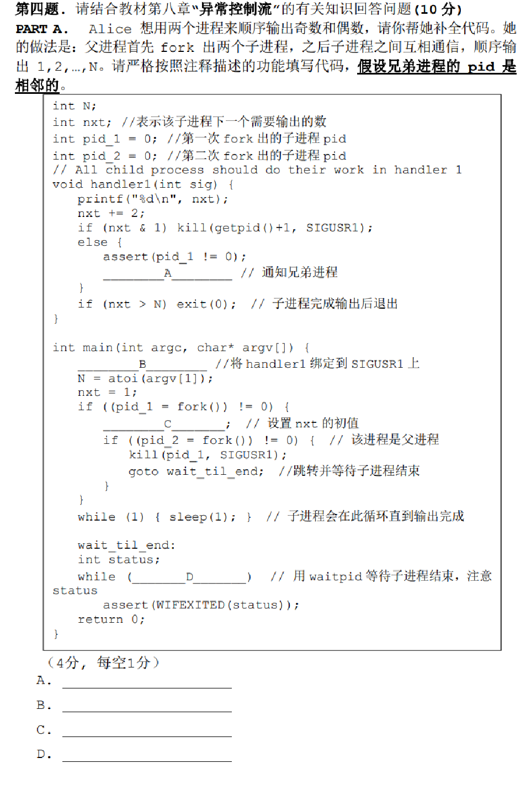

---
# You can also start simply with 'default'
theme: academic
# random image from a curated Unsplash collection by Anthony
# like them? see https://unsplash.com/collections/94734566/slidev
# background: https://cover.sli.dev
highlighter: shiki
# some information about your slides (markdown enabled)
title: 11-ECF
info: |
  ICS 2024 Fall Slides
  Presented by WalkerCH
titleTemplate: '%s'
# apply unocss classes to the current slide
class: text-center
# https://sli.dev/features/drawing
drawings:
  persist: false
# slide transition: https://sli.dev/guide/animations.html#slide-transitions
transition: fade-out
# enable MDC Syntax: https://sli.dev/features/mdc
mdc: true
layout: cover
coverBackgroundUrl: /res/image/cover/cover_11.jpg

---

# ECF {.font-bold}

  13 元培数科 常欣海

  
    Here we go! <carbon:arrow-right class="inline"/>
  

  <button @click="$slidev.nav.openInEditor()" title="Open in Editor" class="text-xl slidev-icon-btn opacity-50 !border-none !hover:text-white">
    <carbon:edit />
  </button>
  <a href="https://github.com/Yaenday/WalkerCH-ICS-Slides
  " target="_blank" alt="GitHub" title="Open in GitHub"
    class="text-xl slidev-icon-btn opacity-50 !border-none !hover:text-white">
    <carbon-logo-github />
  </a>

<!-- ---

# 目录

<Toc columns="4" minDepth="1"></Toc> -->

---
layout: center
---

  <text class="text-17 font-bold gradient-text">Knowledge Review</text>
   
  <text class="text-5 font-bold">This part is cited from Arthals</text>

---

# Example {.text-2xl}

  This slide is cited from Arthals.

---
layout: center
---

  <text class="text-17 font-bold gradient-text">Emphasis
</text>

---

# Notes

- [Note Link]()

{.w-180}

---
layout: center
---

  <text class="text-17 font-bold gradient-text">Homework Review</text>

---
layout: center
---

  <text class="text-17 font-bold gradient-text">Exercises</text>

---

# E1

<!--  -->

---

# E1

---

# E2

<!--  -->

---

# E2

---

# E3

<!--  -->

---

# E3

---

# E4

<!--  -->

---

# E4

---

# E5

{.w-180}

<!-- {.w-120} -->

---

# E5

{.w-180}

{.w-120}

---

# E6

{.w-180}

<!-- {.w-180} -->

---

# E6

{.w-180}

{.w-180}

---

# E7

<!-- {.w-120} -->

---

# E7

{.w-120}

---

# E8

<!--  -->

---

# E8

---

# E9

{.w-70}

{.w-75}

---

# E9

{.w-100}

---

# E10

{.w-80}

<!--  -->

---

# E10

{.w-80}

---
layout: center
---

  <text class="text-17 font-bold gradient-text">Notices</text>

<!-- ---

# col2

 -->

---
layout: center
---

# THANKS

Made by WalkerCH 

changxinhai@stu.pku.edu.cn

  
    Reference: [Weicheng Lin]'s presentation. 
    Reference: [Arthals]'s templates and content.
  

{.w-50.rounded-md}

