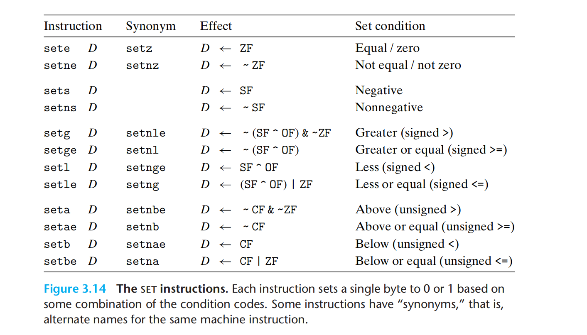
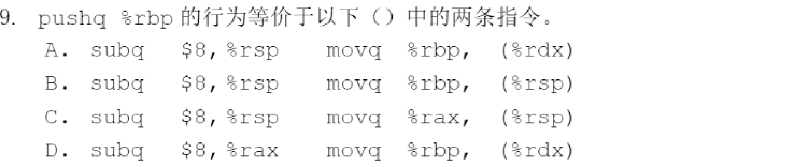
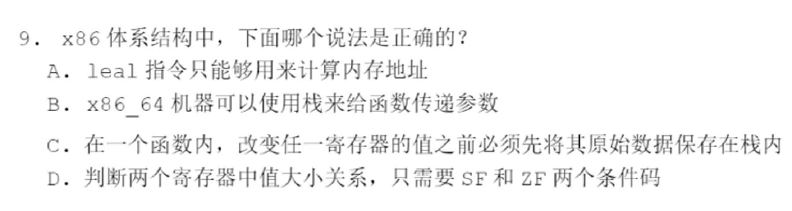

---
# You can also start simply with 'default'
theme: academic
# random image from a curated Unsplash collection by Anthony
# like them? see https://unsplash.com/collections/94734566/slidev
# background: https://cover.sli.dev
highlighter: shiki
# some information about your slides (markdown enabled)
title: 03-Machine Programming
info: |
  ICS 2024 Fall Slides
  Presented by WalkerCH
titleTemplate: '%s'
# apply unocss classes to the current slide
class: text-center
# https://sli.dev/features/drawing
drawings:
  persist: false
# slide transition: https://sli.dev/guide/animations.html#slide-transitions
transition: fade-out
# enable MDC Syntax: https://sli.dev/features/mdc
mdc: true
# download: true
layout: cover
coverBackgroundUrl: /res/image/cover/cover_03.jpg

---

# Machine Programming {.font-bold}

<p class="text-gray-100">
<font size = '5'>
  13 元培数科 常欣海
</font>
</p>

<div class="pt-12  text-gray-1">
  <span @click="$slidev.nav.next" class="px-2 py-1 rounded cursor-pointer" hover="bg-white bg-opacity-10">
    Here we go! <carbon:arrow-right class="inline"/>
  </span>
</div>


<div class="abs-br m-6 flex gap-2">
  <button @click="$slidev.nav.openInEditor()" title="Open in Editor" class="text-xl slidev-icon-btn opacity-50 !border-none !hover:text-white">
    <carbon:edit />
  </button>
  <a href="https://github.com/Yaenday/WalkerCH-ICS-Slides
  " target="_blank" alt="GitHub" title="Open in GitHub"
    class="text-xl slidev-icon-btn opacity-50 !border-none !hover:text-white">
    <carbon-logo-github />
  </a>
</div>

<style>
  div{
   @apply text-gray-2;
  }
</style>

---

# 目录

<Toc columns="3" minDepth="1"></Toc>

---
layout: center
---

<div>
  <text class="text-17 font-bold gradient-text">Machine Basics</text>
</div>

<style>
  .gradient-text {
    background-image: linear-gradient(45deg, #4ec5d4 10%, #146b8c 20%);
    -webkit-background-clip: text;
    color: transparent;
  }
</style>

---


# 数据格式

- 基本的数据格式，`b,w,l,q`，对应的 `size` 和 `C declaration`

<br/>

<div style="text-align: center;">
  
</div>


---
layout: image-right

image: ./res/image/slides.assets/integer_registers.png

backgroundSize: 25em 80%
---


# 寄存器

- %rax: accumulator
- %rbx: base
- %rcx: count
- %rdx: data
- %rsi: source index
- %rdi: destination index
- %rsp: stack pointer
- %rbp: base pointer
- %rip(PC): instruction pointer
- 注意名称由长到短变化规律

<!--  -->

---

# 寻址模式


$$
Imm(r_b,r_i,s)\Rightarrow Imm+\mathrm{R[r_b]+R[r_i]}*s
$$

- 注意基址和变址寄存器必须是 64 位寄存器，比例因子必须是 1,2,4,8
  - (%eax) 不合法
  - (,%rax,3)不合法

<div style="text-align: center;">
  
</div>


---
layout: image-right

image: ./res/image/slides.assets/image-20231027162029200.png

backgroundSize: 25em 80%
---

# mov指令

- 具有指令后缀 b/w/l/q
- 两个操作数不能都是内存，寄存器大小必须和指令后缀匹配
- 扩展数据传送指令 movz/movs，z 表示零扩展，s 表示符号扩展
- movl 指令以寄存器为目的时，会将高位 4 字节清零，因此没有 movzlq
- 特殊指令 **movabsq** 和 **cltq**
  - movabsq将64位立即数传送至寄存器
  - cltq将%eax有符号扩展到%rax


---

# mov指令

- **Legal instruction**

{.w-150}

- Not `(%esp)` but `(%rsp)`

- **illegal instruction**

{.w-150}

---
layout: image-right

image: ./res/image/slides.assets/push_pop2.png

backgroundSize: 40em 30%
---


# push&pop指令

- push：先将 %rsp 减 8，再压栈
- pop：先弹栈，再将 %rsp 加 8
- 先这么理解，原理会在第四章学习（与表象并不完全一致）
- call：push + jmp，可进行间接跳转
- ret：pop + jmp

{.w-100}

<!--  -->

---
layout: image-right

image: ./res/image/slides.assets/image-20231027163419097.png

backgroundSize: 33em 80%
---


# 常见算术操作

#### 

- leaq 进行优化运算
- sub 指令是后减前

<!--  -->

- 移位操作的第二个操作数必须是**立即数或 %cl**

---


# 特殊算术操作

- 乘法：高位 %rdx，低位 %rax
- 除法：模 %rdx，商 %rax
- 带 i 为有符号


---
layout: center
---

<div>
  <text class="text-17 font-bold gradient-text">Machine Control</text>
</div>

<style>
  .gradient-text {
    background-image: linear-gradient(45deg, #4ec5d4 10%, #146b8c 20%);
    -webkit-background-clip: text;
    color: transparent;
  }
</style>

---

# 条件码 CC

- 进位标志 **CF**（carry flag）：无符号溢出（无论上溢还是下溢）
- 零标志 **ZF**（zero flag）：零
- 符号标志 **SF**（sign flag）：负数
- 溢出标志 **OF**（overflow flag）：有符号溢出


- leaq 不会设置任何条件码
- **逻辑操作**会置零 CF 和 OF（**无溢出**）
- **移位操作**会置零 OF，根据最后一个移出的位改变 CF（无论左移还是右移）
- INC 和 DEC 会改变 ZF 和 OF，但是**不会改变 CF**


{.w-150}

---


# 设置条件码

## 直接设置条件码


---

## 间接设置条件码

- cmp/test 用于设置 CC，后缀 b/w/l/q，行为等同 sub/and
  - `testq %rax %rax`（零测试） 
  - `testq %rax $MASK`（掩码测试）

{.w-200}

---

# 访问条件码

- 任意后缀对应的条件码要求熟练掌握
- 不用背但要能快速写出【理解】

{.w-150}

---
layout: image-right

image: ./res/image/slides.assets/image-20231027165129820.png

backgroundSize: 35em 80%
---

# 条件跳转-jmp
- 直接跳转 jmp .L1
- 间接跳转 jmp *%rax 或 jmp *(%rax)
- 条件跳转只能是直接跳转
- jmp 的二进制编码为相对寻址
  - 如右图，jmp 8 的 8 对应的编码为 03，因为第二行结束时 PC 为 05，与 08 相差 03，jg 5 的 5 对应的编码为 f8，因为在第五行结束时 PC 为 0d，与 05 相差 f8（-8 的十六进制编码）
- 绝对寻址（只在大程序中使用，如 > 2M）

<!--  -->

---
layout: image-right

image: ./res/image/slides.assets/image-20231027170120009.png

backgroundSize: 35em 70%
---

# 条件传送-cmov

- 不能传送至内存，不支持单字节传送
- 会自动推断传送数据大小
- 无需预测判断结果，更高效
- 条件跳转可能被优化为条件传送，但以下情形不适用：
  - 表达式求值需要大量运算
  - 表达式求值可能导致错误，如 val = p ? *p : 0
  - 表达式求值可能导致副作用，如 val = x > 0 ? (x *= 7) : (x += 3)

<!--  -->

---
layout: image-right

image: ./res/image/slides.assets/image-20231027191412708.png

backgroundSize: 20em 90%
---
# 条件分支-switch

- 当 switch 分支数量较多且值的跨度范围较小时会启用跳转表，存放于 .rodata（只读数据区）中，使用间接跳转
- 不是简单的 if-else，而是空间换时间的策略
- switch 源代码与汇编代码的对应
  - 没有 break 的 case 对应无 jmp 的 label
  - default 有另设 label
  - 多 case 同处理对应同 label 段

<!--  -->

---

# 循环语句

**do-while/while/for**

- 本质都是 goto 的应用

- for 大致等价于初始化 + while（需要仔细处理 continue）

- while 的两种转化，左边称为 jump to the middle，右边称为 **guarded-do**

  - 二者在语义上等价，不过后者可以优化初始的判断（少一次 jmp）


---
layout: center
---

<div>
  <text class="text-17 font-bold gradient-text">作业讲评</text>
</div>

<style>
  .gradient-text {
    background-image: linear-gradient(45deg, #4ec5d4 10%, #146b8c 20%);
    -webkit-background-clip: text;
    color: transparent;
  }
</style>
---

# 作业讲评

{.w-130}


---

# 作业讲评

1. 代码本身有问题
2. 运行结果不正确
3. 编译结果不正确

{.w-100}


---
layout: center
---

<div>
  <text class="text-17 font-bold gradient-text">习题试炼</text>
</div>

<style>
  .gradient-text {
    background-image: linear-gradient(45deg, #4ec5d4 10%, #146b8c 20%);
    -webkit-background-clip: text;
    color: transparent;
  }
</style>

---

# 习题试炼1

{.w-150}

<!--  -->

---

# 习题试炼1

{.w-150}


---

# 习题试炼2


<!-- {.w-150} -->

---


# 习题试炼2


{.w-150}

---

# 习题试炼3

{.w-150}

<!-- {.w-150} -->


---

# 习题试炼3

{.w-150}

{.w-150}

---

# 习题试炼4

{.w-150}

<!-- {.w-150} -->

---

# 习题试炼4

{.w-150}

{.w-150}

---

# 习题试炼5

- 加法指令：ADD、ADC、INC、XADD除了INC不影响CF标志位外，都影响条件标志位。
           CF、ZF、SF、OF
           CF最高位是否有进位
           DF若两个操作数符号相同而结果符号与之相反OF=1，否则OF=0.
- 减法指令：SUB、SBB、DEC、NEG、CMP、CMPXCHG、CMPXCHG8B
           前六种除了DEC不影响CF标志外都影响标志位。CMPXHG8B只影响ZF。
           CF说明无符号数相减的溢出，同时又确实是被减数最高有效位向高位的借位。
           OF位则说明带符号数的溢出
           无符号运算时，若减数>被减数，有借位CF=1，否则CF=0.
           OF若两个数符号相反，而结果的符号与减数相同则OF=1.否则OF=0.
- 乘法指令：MUL、IMUL
           MUL：如果乘积高一半为0，则CF和OF位均为0，否则CF和OF均为1.
           IMUL：如果高一半是低一半符号的扩展，则CF位和OF位均为0，否则就均为1.
- 除法指令：DIV、IDIV  对所有条件位均无定义。
- 逻辑指令：AND、OR、NOT、XOR、TEST
            NOT不允许使用立即数，其它4条指令除非源操作数是立即数，至少要有一个操作数必须存放在寄存器中。另一个操作数则可以使用任意寻址方式。
            NOT不影响标志位，其余4种CF、OF、置0，AF无定义，SF、ZF、PF位看情况而定。


---

# 习题试炼6


<!--  -->

---

# 习题试炼6


---

# 习题试炼7


<!--  -->

---

# 习题试炼7


---

# 习题试炼8


<!-- {.w-170} -->

---

# 习题试炼8


{.w-170}

---

# 习题试炼9


<!--  -->

---

# 习题试炼9


---

# 习题试炼10

{.w-130}

<!--  -->

---

# 习题试炼10

{.w-130}


---

# 习题试炼11



<!--  -->

---

# 习题试炼11


---

# 习题试炼12


<!--  -->

---

# 习题试炼12


---

# 习题试炼13



<!--  -->

---

# 习题试炼13


---

# 习题试炼14

{.w-150}

<!-- {.w-150} -->

---

# 习题试炼14

{.w-130}

- **x86-64**在线系统 Compiler Explorer：**https://godbolt.org/**


---
layout: center
---

<div>
  <text class="text-17 font-bold gradient-text">其他说明</text>
</div>

<style>
  .gradient-text {
    background-image: linear-gradient(45deg, #4ec5d4 10%, #146b8c 20%);
    -webkit-background-clip: text;
    color: transparent;
  }
</style>

---

# 从 C 源代码到汇编代码

> - [Linux环境下GCC基本使用详解（含实例）_linux gcc-CSDN博客](https://blog.csdn.net/qq_39872252/article/details/133309120)
> - [objdump(Linux)反汇编命令使用指南_怎么用objdump反汇编-CSDN博客](https://blog.csdn.net/wwchao2012/article/details/79980514#:~:text=在Linux中，可以#:~:text=在Linux中，可以)

- -S 生成汇编代码文件，-c 生成不可执行的二进制文件（未经过链接）
- gcc x.c –S x.s
- gcc –c x.s –o x.o
- 使用 objdump 可以将二进制汇编文件通过反汇编得到它的汇编代码
- **objdump –d x.o > x.s**
- 右图是 objdump 可能的输出，左侧是汇编代码的二进制编码和对应的存储地址，右侧是汇编代码

```bash
ubuntu@yaen:~/ICS/HW/02$ gcc -S exam.c -Og
ubuntu@yaen:~/ICS/HW/02$ gcc -c exam.c -Og
ubuntu@yaen:~/ICS/HW/02$ gcc exam.c -o exam -Og
ubuntu@yaen:~/ICS/HW/02$ objdump -s -d exam.o > exam_obj.o.s
ubuntu@yaen:~/ICS/HW/02$ objdump -s -d exam > exam.out.s
```

---

# 从 C 源代码到汇编代码

{.w-170}


---

# 作业要求

- 小班分数占比15%，其中作业占比40%左右，课上表现占比60%左右
- 作业从本周开始的评分要求如下：
  - **基本分：60%**，只要按时提交即可得到
    - 提交时间要求：
      - 请于**周二晚18：00**，按照格式提交至邮箱中（我会批改，答案有申诉权利）
        - 课上会给出作业的答案，以及**根据学号**查看的分数和问题，有问题请在**当天课后提出**
      - 最晚**周三午12：00**，最后DDL（我可能没时间看了，所以会之后直接给出分数）
      - 如果你还想要补交，请于**周三晚23：59**之前提交，会扣除部分分数，再后无需提交。
  - **正确率：40%**，这一部分你可以根据网上答案自行修正，但需明确给出最后你认可的答案
    - 推荐用其他颜色的笔更正，属于你自己写的作业范畴，不会扣分


---
layout: center
---

<div flex="~ gap-20"  mt-2 justify-center items-center>

<div  w-fit h-fit mb-2>

# THANKS

Made by WalkerCH 

changxinhai@stu.pku.edu.cn

<p class="text-gray-40">
  <font size = '3'>
    Reference: [Weicheng Lin]'s presentation.<br>
    Reference: [Arthals]'s template.
  </font>
</p>

</div>

{.w-50.rounded-md}

</div>
