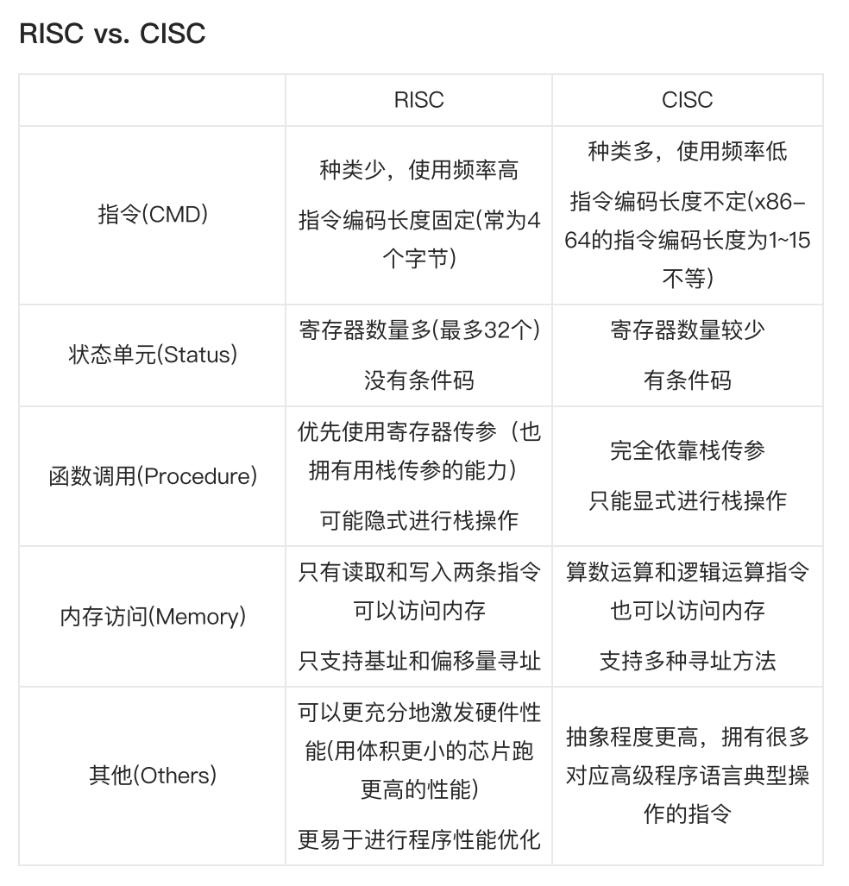
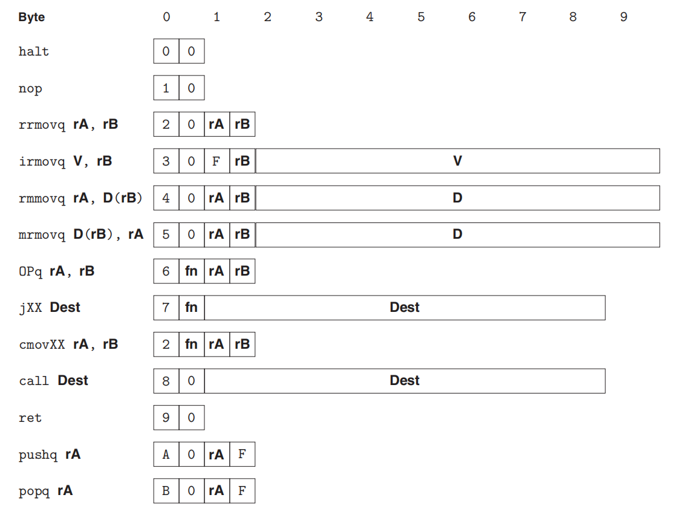
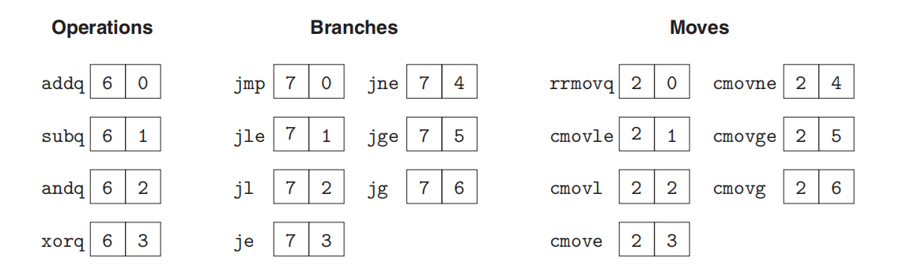
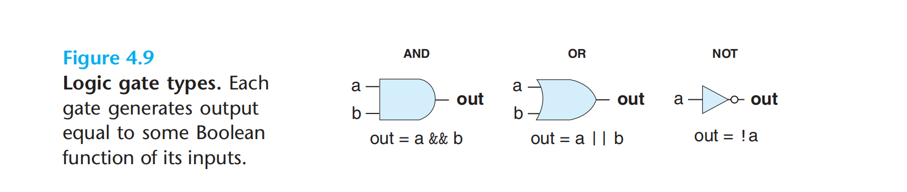
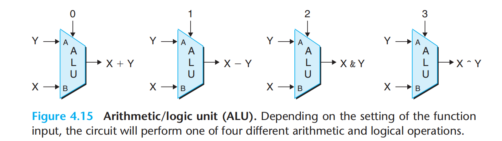

---
# You can also start simply with 'default'
theme: academic
# random image from a curated Unsplash collection by Anthony
# like them? see https://unsplash.com/collections/94734566/slidev
# background: https://cover.sli.dev
highlighter: shiki
# some information about your slides (markdown enabled)
title: 06-Processor Arch
info: |
  ICS 2024 Fall Slides
  Presented by WalkerCH
titleTemplate: '%s'
# apply unocss classes to the current slide
class: text-center
# https://sli.dev/features/drawing
drawings:
  persist: false
# slide transition: https://sli.dev/guide/animations.html#slide-transitions
transition: fade-out
# enable MDC Syntax: https://sli.dev/features/mdc
mdc: true
layout: cover
coverBackgroundUrl: /res/image/cover/cover_05.jpg

---

# Processor Arch {.font-bold}

  13 元培数科 常欣海

  
    Here we go! <carbon:arrow-right class="inline"/>
  

  <button @click="$slidev.nav.openInEditor()" title="Open in Editor" class="text-xl slidev-icon-btn opacity-50 !border-none !hover:text-white">
    <carbon:edit />
  </button>
  <a href="https://github.com/Yaenday/WalkerCH-ICS-Slides
  " target="_blank" alt="GitHub" title="Open in GitHub"
    class="text-xl slidev-icon-btn opacity-50 !border-none !hover:text-white">
    <carbon-logo-github />
  </a>

---
layout: center
---

  <text class="text-17 font-bold gradient-text">ISA & Logic
</text>

---

# RISC与CISC

- CISC：IA32, AMD64(x86-64)
  
- RISC：ARM64, RISC-V, MIPS

---

# 程序员可见状态

---

# Y86-64 ISA

{.w-150}

---

# Y86-64 ISA

---

# Y86-64 ISA

---

# Y86-64 ISA

---

# HCL

## 逻辑门

{.w-150}

## 算术/逻辑单元ALU

{.w-150}

---
layout: center
---

  <text class="text-17 font-bold gradient-text">Sequential
</text>

---
layout: center
---

  <text class="text-17 font-bold gradient-text">Pipelined
</text>

---
layout: center
---

  <text class="text-17 font-bold gradient-text">Homework Review</text>

---
layout: center
---

  <text class="text-17 font-bold gradient-text">Exercises</text>

---
layout: center
---

  <text class="text-17 font-bold gradient-text">Notices</text>

---

# 补充资料

- HCL语言：[HCL Descriptions of Y86-64 Processors.pdf](https://github.com/Yaenday/WalkerCH-ICS-Slides/res/document/HCL%20Descriptions%20of%20Y86-64%20Processors.pdf)

- 我的Y86-64学习笔记：[Y86-64 Note.html]( https://github.com/Yaenday/WalkerCH-ICS-Slides/res/document/Y86-64%20Note.html)

---
layout: center
---

# THANKS

Made by WalkerCH 

changxinhai@stu.pku.edu.cn

  
    Reference: [Weicheng Lin]'s presentation.
  

{.w-50.rounded-md}

