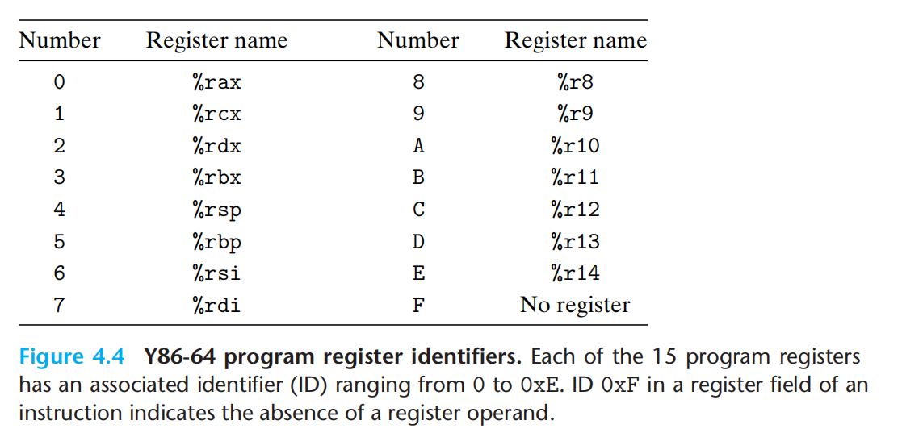

---
# You can also start simply with 'default'
theme: academic
# random image from a curated Unsplash collection by Anthony
# like them? see https://unsplash.com/collections/94734566/slidev
# background: https://cover.sli.dev
highlighter: shiki
# some information about your slides (markdown enabled)
title: 07-Processor Arch
info: |
  ICS 2024 Fall Slides
  Presented by WalkerCH
titleTemplate: '%s'
# apply unocss classes to the current slide
class: text-center
# https://sli.dev/features/drawing
drawings:
  persist: false
# slide transition: https://sli.dev/guide/animations.html#slide-transitions
transition: fade-out
# enable MDC Syntax: https://sli.dev/features/mdc
mdc: true
layout: cover
coverBackgroundUrl: /res/image/cover/cover_07.jpg

---

# Processor Arch {.font-bold}

  13 元培数科 常欣海

  
    Here we go! <carbon:arrow-right class="inline"/>
  

  <button @click="$slidev.nav.openInEditor()" title="Open in Editor" class="text-xl slidev-icon-btn opacity-50 !border-none !hover:text-white">
    <carbon:edit />
  </button>
  <a href="https://github.com/Yaenday/WalkerCH-ICS-Slides
  " target="_blank" alt="GitHub" title="Open in GitHub"
    class="text-xl slidev-icon-btn opacity-50 !border-none !hover:text-white">
    <carbon-logo-github />
  </a>

---
layout: center
---

  <text class="text-17 font-bold gradient-text">Knowledge Review</text>

---
layout: center
---

  <text class="text-17 font-bold gradient-text">Emphasis
</text>

---

# RISC与CISC

- CISC：IA32, AMD64(x86-64)
  
- RISC：ARM64, RISC-V, MIPS

---

# 程序员可见状态

---

# Y86-64 ISA

{.w-150}

---

# Y86-64 ISA

---

# Y86-64 ISA

- IOPL改为**IOPQ**
- RESP改为**RRSP**

---
layout: image-right

image: ./res/image/slides.assets/push_pop2.png

backgroundSize: 40em 30%
---

# push&pop指令

- push：先将 %rsp 减 8，再压栈
- pop：先弹栈，再将 %rsp 加 8
- 先这么理解，原理会在第四章学习（与表象并不完全一致）
- call：push + jmp，可进行间接跳转
- ret：pop + jmp

{.w-100}

<!--  -->

---

# HCL

## 逻辑门

{.w-150}

## 算术/逻辑单元ALU

{.w-150}

---

# Y86-64硬件结构

## 阶段

 

- 取址：Fetch
- 译码：Decode
- 执行：Execute
- 访存：Memory
- 写回：Write back
- 更新 PC：PC Update

   

W：只能写入valE，valM（`rrmovq`,`irmovq`,`cmovXX`需要**+0**做ALU计算）

## 指令处理

---

# 指令处理

{.h-110}

---

# 指令处理

{.h-110}

---

# 指令处理

{.h-50}

  {.h-50}

---

# 指令处理

{.h-110}

---
layout: center
---

  <text class="text-17 font-bold gradient-text">Overview
</text>

---

# 基本概念

{.w-180}

---

{.w-85}

{.w-90}

---

{.w-95}

{.w-85}

---
layout: center
---

  <text class="text-17 font-bold gradient-text">Details
</text>

SEQ、PIPE的具体实现图、HCL代码都需要详细掌握

此处不再说明，详见 【补充资料】部分

---

# SEQ->SEQ+

## 前置PC

- 电路重定时：改变状态表示而不改变逻辑

- 目的：平衡一个流水线各个阶段之间的延迟

- 在 SEQ+ 的实现里，PC update 的时期从周期的最后被提到了最前，更加接近流水线的形态

---

# SEQ+ ->PIPE-

## 阶段划分

在 Y86-64 的实现中：

- 正常指令指令默认预测 PC 为下一条指令的地址；
- call 指令和 jxx 指令默认预测 PC 为跳转后地址；
- ret 指令不进行任何预测，直到其对应的写回完成

插入流水线寄存器：分别插入了5个流水线寄存器用来保存后续阶段所需的信号，编号为`F`、`D`、`E`、`M`和`W`

- **Fetch**： Select current PC；Read instruction；Compute incremented PC
- **Decode**：Read program registers
- **Execute**：Operate ALU
- **Memory**：Read or write data memory
- **Write** **Back**：Update register file

 寄存器顺序：F—f—D—d—E—e—M—m—W

---

# PIPE->PIPE

## 处理冒险
 

- **硬件：暂停和气泡**
  - **stall** 能将指令阻塞在某个阶段
  - **bubble** 能使得流水线继续运行，但是不会改变当前阶段的寄存器、内存、条件码或程序状态

- **结构冒险**

  - **计算的多时钟周期**：采用独立于主流水线的特殊硬件功能单元来处理较为复杂的操作（一个功能单元执行整数乘法和除法，一个功能单元执行浮点操作）
  - **访存的多时钟周期**：
    - 翻译后备缓冲器（**TLB**）+高速缓存（**Cache**）：实现一个时钟周期内读指令并读或写数据
    - 缺页（**page fault**）异常信号：指令暂停+磁盘到主存传送+指令重新执行

---

# PIPE->PIPE

## 处理冒险
 

- **数据冒险**
  - **前后使用数据冒险**：在处理器中，`valA`和`valB`一共有5个转发源：
      - `e_valE`：在执行阶段，ALU中计算得到的结果`valE`，通过`E_dstE`与`d_srcA`和`d_src_B`进行比较决定是否转发。
      - `M_valE`：将ALU计算的结果`valE`保存到流水线寄存器M中，通过`M_dstE`与`d_srcA`和`d_src_B`进行比较决定是否转发。
      - `m_valM`：在访存阶段，从内存中读取的值`valM`，通过`M_dstM`与`d_srcA`和`d_src_B`进行比较决定是否转发。
      - `W_valM`：将内存中的值`valM`保存到流水线寄存器W中，通过`W_dstM`与`d_srcA`和`d_src_B`进行比较决定是否转发。
      - `W_valE` ：将ALU计算的结果`valE`保存到流水线寄存器W中，通过`W_dstE`与`d_srcA`和`d_src_B`进行比较决定是否转发。

---

# PIPE->PIPE

## 处理冒险
 

- **数据冒险**
  - **用暂停来避免数据冒险**
    - 插入一段自动产生的`nop`指令
    - 该方法指令要停顿最少一个最多三个时钟周期，严重降低整体的吞吐量
    {.w-180}

---

# PIPE->PIPE

## 处理冒险
 

- **数据冒险**
  -  **加载/使用数据冒险**
    {.w-150}
    {.w-150}

---

# PIPE->PIPE

## 处理冒险
 

- **控制冒险**
  - ret指令（不预测）：删除后续操作——插入3个bubble
  {.w-110}
  - 跳转指令（预测）： 删除后续操作——插入2个bubble
  {.w-110}

---

# PIPE->PIPE

## 处理冒险
 

- **检验自洽**
  - 控制条件组合——有限性组合：**Combination A + B**
    - Conbination A：**ret位于不选择分支 ** ——简单叠加
    - Conbination B：**加载/使用+ret ** ——取”**stall**”
      - 加载互锁核心思想：通过暂停+转发组合实现
      - 合理性：Install后，下一条指令无法进入寄存器，当前指令因为bubble并未成功下传
      - 有效性：Install后，当前指令ret依然存在于流水线中，加载/使用语句后可进一步执行
      {.w-120}

---

# PIPE->PIPE

## 处理冒险
 

- **检验自洽**

{.w-150}

{.w-150}

---

# PIPE->PIPE

## 处理冒险
 

- **异常处理**
  - 内部异常：
    - **HLT**：执行halt指令
    - **ADR**：从非法内存地址读或向非法内存地址写
    - **INS**：非法指令
  - 外部异常
    - 系统重启
    - I/O设备请求
    - 硬件故障
 - **要求：** 异常指令之前的所有指令已经完成，后续的指令都不能修改条件码寄存器和内存。

---

# PIPE- ->PIPE

## 处理冒险
 

- **异常处理**

1. 当同时多条指令引起异常时，处理器应该向操作系统报告哪个异常？

   **基本原则：** 由流水线中最深的指令引起的异常，表示该指令越早执行，优先级最高。

2. 在分支预测中，当预测分支中出现了异常，而后由于预测错误而取消该指令时，需要取消异常。

3. 如何处理不同阶段更新系统状态不同部分的问题？

   - 异常发生时，记录指令状态，继续取指、译码、执行
   - 异常到达 **访存阶段**：
     1. 执行阶段，禁止设置条件码（set_cc $\leftarrow$ m_stat, W_stat）
     2. 访存阶段，插入气泡，禁止写入内存
     3. 写回阶段，暂停写回，即暂停流水线

---
layout: center
---

  <text class="text-17 font-bold gradient-text">Homework Review</text>

---

# HW4

- 可能确实不存在很好的办法验证Y86-64的正确性
- 暂不存在 C 到 Y86-64 的转换工具
- 但可以通过手动模拟的方式，通过Y86-64模拟器验证正确性（如果你真的想这么干）

---
layout: center
---

  <text class="text-17 font-bold gradient-text">Exercises</text>

---
layout: center
---

  <text class="text-13 font-bold gradient-text">Processor Arch: ISA & Logic</text>

---

# E1

<!--  -->

---

# E1

---

# E2

<!--  -->

---

# E2

---

# E3

<!-- {.w-50} -->
---

# E3

{.w-50}

---

# E4

<!-- {.w-50} -->

---

# E4

{.w-50}

---

# E5

<!--  -->

---

# E5

---

# E6

<!-- {.w-150} -->

---

# E6

{.w-150}

---

# E7

<!--  -->

---

# E7

---

# E8

<!-- {.w-150} -->

---

# E8

{.w-150}
---

# E9

{.w-120}

---

# E9

{.w-150}
---

# E10

{.w-150}

<!-- {.w-50} -->

---

# E10

{.w-150}

{.w-50}

---

# E11

{.w-130}

<!-- {.w-30} -->

---

# E11

{.w-130}

{.w-30}

---

# E12

---

# E12

---

# E13

{.w-80}

<!-- {.w-80}

{.w-70} -->

---

# E13

{.w-80}

{.w-80}

{.w-70}

---

# E14

{.w-80}

{.w-75}

---

# E14

{.w-180}

---

# E15

{.w-75}

{.w-75}

---

# E15

{.w-65}

{.w-65}

---
layout: center
---

  <text class="text-13 font-bold gradient-text">Processor Arch: SEQ/PIPE</text>

---

# E1

{.w-180}

---

# E1

{.w-180}

---

# E2

<!-- {.w-40} -->

---

# E2

{.w-40}

---

# E3

{.w-140}

<!-- {.w-20} -->

---

# E3

{.w-140}

{.w-20}

---

# E4

<!-- {.w-30} -->

---

# E4

{.w-30}

---

# E5

<!--  -->

---

# E5

---

# E6

<!--  -->

---

# E6

---

# E7

{.w-150}

<!-- {.w-30} -->

---

# E7

{.w-150}

{.w-30}

---

# E8

{.w-80}

<!-- {.w-80} -->

---

# E8

{.w-80}

{.w-80}

---

# E9

<!-- {.w-100} -->

---

# E9

{.w-100}

---

# E10

<!--  -->

---

# E10

---

# E11

<!--  -->

---

# E11

---

# E12

{.w-160}

---

# E12

---

# E13

---

# E13

{.w-80}

{.w-100}

---

# E14

{.w-63}

{.w-65}

{.w-65}

---

# E14

{.w-70}

{.w-65}

---

# E15

---

# E15

{.w-80}

---

# E16

---

# E16

{.w-85}

---
layout: center
---

  <text class="text-17 font-bold gradient-text">Notices</text>

---

# 记忆

ICS 去年小班同学默写盛况

{.w-180}

---

# 时间轴

 

{.w-200}

---

# 补充资料

- HCL语言：[HCL Descriptions of Y86-64 Processors.pdf](https://github.com/Yaenday/WalkerCH-ICS-Slides/blob/main/res/document/HCL%20Descriptions%20of%20Y86-64%20Processors.pdf)

{.w-130}

- 我的Y86-64学习笔记：[Y86-64 Note.html](https://github.com/Yaenday/WalkerCH-ICS-Slides/blob/main/res/document/Y86-64%20Note.html)

{.w-130}

- 我的回课：[Pipelined Review.pdf](https://github.com/Yaenday/WalkerCH-ICS-Slides/blob/main/res/document/Pipelined%20Review.pdf)   \ \   往年补充资料： [pipelined res.pdf](https://github.com/Yaenday/WalkerCH-ICS-Slides/blob/main/res/document/pipelined%20res.pdf) 

---
layout: center
---

# THANKS

Made by WalkerCH 

changxinhai@stu.pku.edu.cn

  
    Reference: [Weicheng Lin]'s presentation. 
    <!-- Reference: [Arthals]'s templates and content. -->
  

{.w-50.rounded-md}

