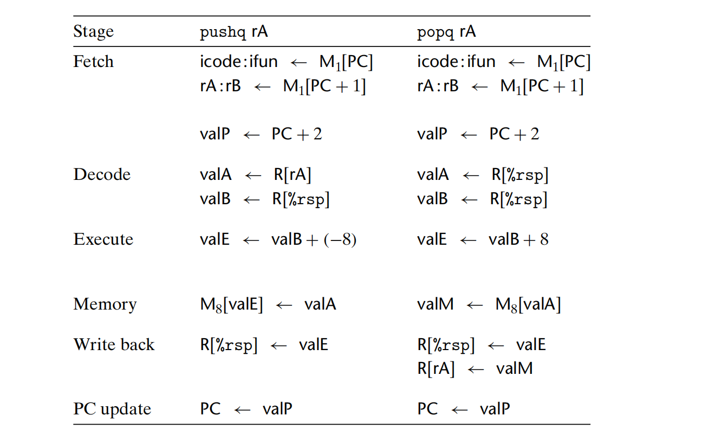
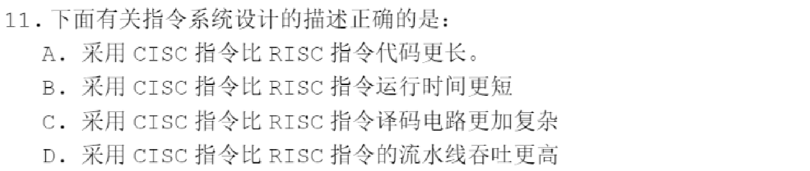
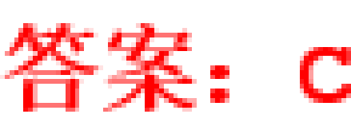
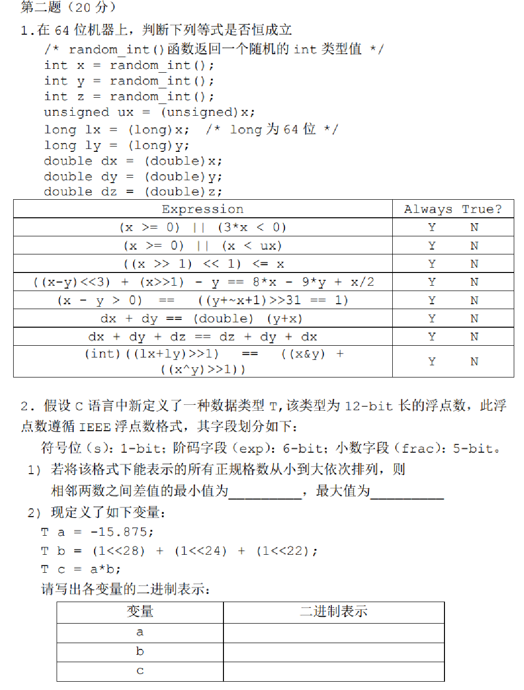

---
# You can also start simply with 'default'
theme: academic
# random image from a curated Unsplash collection by Anthony
# like them? see https://unsplash.com/collections/94734566/slidev
# background: https://cover.sli.dev
highlighter: shiki
# some information about your slides (markdown enabled)
title: 07-Processor Arch
info: |
  ICS 2024 Fall Slides
  Presented by WalkerCH
titleTemplate: '%s'
# apply unocss classes to the current slide
class: text-center
# https://sli.dev/features/drawing
drawings:
  persist: false
# slide transition: https://sli.dev/guide/animations.html#slide-transitions
transition: fade-out
# enable MDC Syntax: https://sli.dev/features/mdc
mdc: true
layout: cover
coverBackgroundUrl: /res/image/cover/cover_07.jpg

---

# Processor Arch {.font-bold}

<p class="text-gray-100">
<font size = '5'>
  13 元培数科 常欣海
</font>
</p>

<div class="pt-12  text-gray-1">
  <span @click="$slidev.nav.next" class="px-2 py-1 rounded cursor-pointer" hover="bg-white bg-opacity-10">
    Here we go! <carbon:arrow-right class="inline"/>
  </span>
</div>


<div class="abs-br m-6 flex gap-2">
  <button @click="$slidev.nav.openInEditor()" title="Open in Editor" class="text-xl slidev-icon-btn opacity-50 !border-none !hover:text-white">
    <carbon:edit />
  </button>
  <a href="https://github.com/Yaenday/WalkerCH-ICS-Slides
  " target="_blank" alt="GitHub" title="Open in GitHub"
    class="text-xl slidev-icon-btn opacity-50 !border-none !hover:text-white">
    <carbon-logo-github />
  </a>
</div>

<style>
  div{
   @apply text-gray-2;
  }
</style>

---
layout: center
---

<div>
  <text class="text-17 font-bold gradient-text">Knowledge Review</text>
</div>

<style>
  .gradient-text {
    background-image: linear-gradient(45deg, #4ec5d4 10%, #146b8c 20%);
    -webkit-background-clip: text;
    color: transparent;
  }
</style>

---

# 前言

before we start

- 本章内容极多，需要至少仔细阅读 CS:APP 两遍
- 对于 SEQ、PIPE 的实现、线是怎么连接的，信号是怎么产生、在什么时候产生的，都需要完全理解、背诵
- 对于冲突的解决，也需要完全理解、背诵
- 参考资料： [CMU / HCL Descriptions of Y86-64 Processors](https://csapp.cs.cmu.edu/3e/waside/waside-hcl.pdf)，Y86-64 指令集，HCL 完整版，第四章 Arch 复习必备
- 建议大家多开一个 https://slide.huh.moe/05/ 方便听课时回翻。
- ~~建议变身医学牲，全背就完了。~~ 符号很多，推荐理解性记忆。
- 本次备课花了我大量时间，希望大家好好听讲。
- 看书！看书！看书！

---

# 小班回课给分相关

score

考虑到某些同学会想要内卷（虽然我不太鼓励大家卷这个，卷考试会更香，但确实小班给分会有优秀率限制），所以明确一下我的评分标准：

1. 我不太会给同学们太低的分，除非你写的实在过于草率
2. 我希望回课的同学至少能够认真掌握自己回课的部分
3. 为了大家的理解，以及我的身心健康，我希望大家不要大片 copy 大班 PPT 或者书（这部分内容可以有，但必然和我本来就要有的内容会相同很多），更多的给出一些像我一样的便于理解的 tips、一两句话说明一个精髓的点、某些看完书不容易关注的犄角旮旯的考试知识点啥的这些对大伙更实用的东西，具体可以参考我已经公布的我制作的 Slide

---

# Y86-64 的顺序实现

sequential implementation

处理一条指令通常包含以下几个阶段：

1. 取指（Fetch）
2. 译码（Decode）
3. 执行（Execute）
4. 访存（Memory）
5. 写回（Write Back）
6. 更新PC（PC Update）

---

# Y86-64 的顺序实现

sequential implementation

<div grid="~ cols-2 gap-12">
<div>

### 1. 取指（Fetch）

**操作**：取指阶段从内存中读取指令字节，地址由程序计数器 (PC) 的值决定。


<div text-sm>

读出的指令由如下几个部分组成：

- `icode`：指令代码，指示指令类型，是指令字节的低 4 位
- `ifun`：指令功能，指示指令的子操作类型，是指令字节的高 4 位（不指定时为 0）
- `rA`：第一个源操作数寄存器（可选）
- `rB`：第二个源操作数寄存器（可选）
- `valC`：常数，Constant（可选）

</div>

<div text-sm text-gray-5 mt-4>

各个不同名称的指令一般具有不同的 `icode`，但是也有可能共享相同的 `icode`，然后通过 `ifun` 区分。

</div>
</div>

<div>


</div>
</div>

---

# Y86-64 的顺序实现

sequential implementation

<div grid="~ cols-2 gap-12">
<div>

### 1. 取指（Fetch）

**操作**：取指阶段从内存中读取指令字节，地址由程序计数器 (PC) 的值决定。

<div text-sm>

- `ifun` 在除指令为 `OPq`，`jXX` 或 `cmovXX` 其中之一时都为 0
- `rA`，`rB` 为寄存器的编码，取值为 0 到 F，每个编码对应着一个寄存器。注意当编码为 F 时代表无寄存器。
- `rA`，`rB` 并不是每条指令都有的，`jXX`，`call` 和 `ret` 就没有 `rA` 和 `rB`，这在 HCL 中通过 `need_regids` 来控制
- `valC` 为 8 字节常数，可能代表立即数（`irmovq`），偏移量（`rmmovq` `mrmovq`）或地址（`call` `jmp`）。`valC` 也不是每条指令都有的，这在 HCL 中通过 `need_valC` 来控制


</div>
</div>

<div>


</div>
</div>

---

# Y86-64 的顺序实现

sequential implementation

### 2. 译码（Decode）

**操作**：译码阶段从寄存器文件读取操作数，得到 `valA` 和 / 或 `valB`。

一般根据上一阶段得到的 `rA` 和 `rB` 来确定需要读取的寄存器。

也有部分指令会读取 `rsp` 寄存器（`popq` `pushq` `ret` `call`）。

---

# Y86-64 的顺序实现

sequential implementation

### 3. 执行（Execute）

**操作**：执行阶段，算术/逻辑单元（ALU）进行运算，包括如下情况：

- 执行指令指明的操作（`opq`）
- 计算内存引用的地址（`rmmovq` `mrmovq`）
- 增加/减少栈指针（`pushq` `popq`）<span text-sm text-gray-5>其中加数可以是 +8 或 -8</span>

最终，我们把此阶段得到的值称为 `valE`（Execute stage value）。

一般来讲，这里使用的运算为加法运算，除非是在 `OPq` 指令中通过 `ifun` 指定为其他运算。这个阶段还会：

<div grid="~ cols-2 gap-12">
<div>

设置条件码（`OPq`）：

```hcl
set CC
```

</div>

<div>

检查条件码和和传送条件（`jXX` `cmovXX`）：

```hcl
Cnd <- Cond(CC, ifun)
```

</div>
</div>

---

# Y86-64 的顺序实现

sequential implementation

### 4. 访存（Memory）

**操作**：访存阶段可以将数据写入内存（`rmmovq` `pushq` `call`），或从内存读取数据（`mrmovq` `popq` `ret`）

- 若是向内存写，则：
  - 写入的地址为 `valE`（需要计算得到，`rmmovq` `pushq` `call`）
  - 数据为 `valA`（`rmmovq` `pushq`） 或 `valP`（`call`）
- 若是从内存读，则：
  - 地址为 `valA`（`popq` `ret`，此时 `valB` 用于计算更新后的 `%rsp`） 或者 `valE`（需要计算得到，`mrmovq`）
  - 读出的值为 `valM`（Memory stage value）

---

# Y86-64 的顺序实现

sequential implementation

### 5. 写回（Write Back）

**操作**：写回阶段最多可以写 **两个**{.text-sky-5} 结果到寄存器文件（即更新寄存器）。

---

# Y86-64 的顺序实现

sequential implementation

### 6. 更新PC（PC Update）

**操作**：将 PC 更新成下一条指令的地址 `new_pc`。

- 对于 `call` 指令，`new_pc` 是 `valC`
- 对于 `jxx` 指令，`new_pc` 是 `valC` 或 `valP`，取决于条件码
- 对于 `ret` 指令，`new_pc` 是 `valM`
- 其他情况，`new_pc` 是 `valP`

---

# Y86-64 的顺序实现

sequential implementation

<div text-sm>

的确有直接传 `valA` 到 `M` 的，但那一般是 `valE` 算别的去了（`rmmovq` `pushq` `popq`）。也可以理解为想要 `rrmovq` 和 `irmovq` 更统一一些所以这么设计。

这里的表中没有写出 `cmovXX`，因为其与 `rrmovq` 共用同一个 `icode`，然后通过 `ifun` 区分。注意 `OPq` 的顺序，是 `valB OP valA`。

</div>

{.h-75.mx-auto}

---

# Y86-64 的顺序实现

sequential implementation

<div grid="~ cols-3 gap-8">
<div>

`valC` 被当做偏移量使用，与 `valB` 相加得到 `valE`，然后 `valE` 被当做地址使用。

</div>

<div col-span-2>

{.h-90.mx-auto}

</div>
</div>

---

# Y86-64 的顺序实现

sequential implementation

<div grid="~ cols-3 gap-8">
<div>

`popq` 中，会将 `valA` 和 `valB` 的值都设置为 `R[%rsp]`，因为一个要用于去当内存，读出旧 `M[%rsp]` 处的值，一个要用于计算，更新 `R[%rsp]`。

为了统一，在 `popq` 中，用于计算的依旧是 `valB`。

<div text-sm>

- `pushq %rsp` 的行为：`pushq` 压入的是旧的 `%rsp`，然后 `%rsp` 减 8
- `popq %rsp` 的行为：`popq` 读出的是旧的 `M[%rsp]`，然后 `%rsp` 加 8

↑ 其他情况：

`pushq` 先 -8 再压栈；`popq` 先读出再 +8

</div>

</div>

<div col-span-2>

{.h-90.mx-auto}

</div>
</div>

---

# Y86-64 的顺序实现

sequential implementation

<div text-sm>

`ret` 指令和 `popq` 指令类似，`call` 指令和 `pushq` 指令类似，区别只有 PC 更新的部分。

所以，同样注意他们用于计算的依旧是 `valB`。

</div>

{.h-75.mx-auto}

---

# HCL 代码

hardware description/control language

HCL 语法包括两种表达式类型：**布尔表达式**（单个位的信息）和**整数表达式**（多个位的信息），分别用 `bool-expr` 和 `int-expr` 表示。

<div grid="~ cols-2 gap-12">
<div>

#### 布尔表达式

逻辑操作

`a && b`，`a || b`，`!a`（与、或、非）

字符比较

`A == B`，`A != B`，`A < B`，`A <= B`，`A >= B`，`A > B`

集合成员资格

`A in { B, C, D }`

等同于 `A == B || A == C || A == D`

</div>

<div>

#### 字符表达式

case 表达式

```hcl
[
  bool-expr1 : int-expr1
  bool-expr2 : int-expr2
  ...
  bool-exprk : int-exprk
]
```

- `bool-expr_i` 决定是否选择该 case。
- `int-expr_i` 为该 case 的值。

<div text-sky-5>

依次评估测试表达式，返回第一个成功测试的字符表达式 `A`，`B`，`C`

</div>

</div>
</div>


---

# 顺序实现 - 取指阶段

sequential implementation: fetch stage

<div grid="~ cols-2 gap-12">
<div>

```hcl {*}{maxHeight:'380px'}
# 指令代码
word icode = [
  imem_error: INOP; # 读取出了问题，返回空指令
  1: imem_icode; # 读取成功，返回指令代码
];

# 指令功能
word ifun = [
  imem_error: FNONE; # 读取出了问题，返回空操作
  1: imem_ifun; # 读取成功，返回指令功能
];

# 指令是否有效
bool instr_valid = icode in {
  INOP, IHALT, IRRMOVQ, IIRMOVQ, IRMMOVQ, IMRMOVQ,
  IOPQ, IJXX, ICALL, IRET, IPUSHQ, IPOPQ
};

# 是否需要寄存器
bool need_regids = icode in {
  IRRMOVQ, IOPQ, IPUSHQ, IPOPQ,
  IIRMOVQ, IRMMOVQ, IMRMOVQ
};

# 是否需要常量字
bool need_valC = icode in {
  IIRMOVQ, IRMMOVQ, IMRMOVQ, IJXX, ICALL
};
```

</div>

<div>


</div>
</div>

---

# 顺序实现 - 译码阶段

sequential implementation: decode stage

<div grid="~ cols-2 gap-12">
<div>

```hcl
# 源寄存器 A 的选择
word srcA = [
  icode in { IRRMOVQ, IRMMOVQ, IOPQ, IPUSHQ } : rA;
  icode in { IPOPQ, IRET } : RRSP;
  1 : RNONE; # 不需要寄存器
];
# 源寄存器 B 的选择
word srcB = [
  icode in { IOPQ, IRMMOVQ, IMRMOVQ } : rB;
  icode in { IPUSHQ, IPOPQ, ICALL, IRET } : RRSP;
  1 : RNONE; # 不需要寄存器
];
```

</div>

<div>

```hcl
# 目标寄存器 E 的选择
word dstE = [
  icode in { IRRMOVQ } && Cnd : rB; # 支持 cmovXX
  icode in { IIRMOVQ, IOPQ } : rB; # 注意这里！
  icode in { IPUSHQ, IPOPQ, ICALL, IRET } : RRSP;
  1 : RNONE; # 不写入任何寄存器
];
# 目标寄存器 M 的选择
word dstM = [
  icode in { IMRMOVQ, IPOPQ } : rA;
  1 : RNONE; # 不写入任何寄存器
];
```


</div>
</div>

寄存器 ID `srcA` 表明应该读哪个寄存器以产生 `valA`（注意不是 `aluA`），`srcB` 同理。

寄存器 ID `dstE` 表明写端口 E 的目的寄存器，计算出来的 `valE` 将放在那里，`dstM` 同理。

在 SEQ 实现中，回写和译码放到了一起。

---

# 顺序实现 - 执行阶段

sequential implementation: execute stage


```hcl
# 选择 ALU 的输入 A
word aluA = [
  icode in { IRRMOVQ, IOPQ } : valA;  # 指令码为 IRRMOVQ 时，执行 valA + 0
  icode in { IIRMOVQ, IRMMOVQ, IMRMOVQ } : valC;  # 立即数相关，都送入的是 aluA
  icode in { ICALL, IPUSHQ } : -8;  # 减少栈指针
  icode in { IRET, IPOPQ } : 8;  # 增加栈指针
  # 其他指令不需要 ALU
];
# 选择 ALU 的输入 B，再次强调 OPq 指令中，是 `valB OP valA`
word aluB = [
  icode in { IRMMOVQ, IMRMOVQ, IOPQ, ICALL, IPUSHQ, IRET, IPOPQ } : valB;  # 大部分都用 valB
  icode in { IRRMOVQ, IIRMOVQ } : 0;  # 指令码为 IRRMOVQ 或 IIRMOVQ 时，选择 0
  # 其他指令不需要 ALU
];
# 设置 ALU 功能
word alufun = [
  icode == IOPQ : ifun;  # 如果指令码为 IOPQ，则使用 ifun 指定的功能
  1 : ALUADD;  # 默认使用 ALUADD 功能
];
# 是否更新条件码
bool set_cc = icode in { IOPQ };  # 仅在指令码为 IOPQ 时更新条件码
```

---

# 顺序实现 - 访存阶段

sequential implementation: memory stage

<div grid="~ cols-2 gap-12">
<div>


```hcl
# 设置读取控制信号
bool mem_read = icode in { IMRMOVQ, IPOPQ, IRET };
# 设置写入控制信号
bool mem_write = icode in { IRMMOVQ, IPUSHQ, ICALL };
# 选择内存地址
word mem_addr = [
  icode in { IRMMOVQ, IPUSHQ, ICALL, IMRMOVQ } : valE;
  icode in { IPOPQ, IRET } : valA; # valE 算栈指针去了
  # 其它指令不需要使用地址
];
```


</div>

<div>


```hcl
# 选择内存输入数据
word mem_data = [
  # 从寄存器取值
  icode in { IRMMOVQ, IPUSHQ } : valA; # valB 算地址去了
  # 返回 PC
  icode == ICALL : valP;
  # 默认：不写入任何数据
];
# 确定指令状态
word Stat = [
  imem_error || dmem_error : SADR;
  !instr_valid : SINS;
  icode == IHALT : SHLT;
  1 : SAOK;
];
```

</div>
</div>

---

# 顺序实现 - 更新 PC 阶段

sequential implementation: update pc stage


<div grid="~ cols-2 gap-12">
<div>

```hcl
# 设置新 PC 值
word new_pc = [
  # 调用指令，使用指令常量
  icode == ICALL : valC;
  # 条件跳转且条件满足，使用指令常量
  icode == IJXX && Cnd : valC;
  # RET 指令完成，使用栈中的值
  icode == IRET : valM;
  # 默认：使用递增的 PC 值
  # 等于上一条指令地址 + 上一条指令长度 1,2,9,10
  1 : valP;
];
```

</div>

<div v-click>


</div>
</div>

<button @click="$nav.go(25)">🔙</button>

---

<div grid="~ cols-2 gap-12">
<div>

# 顺序实现 - 总结

sequential implementation: summary

重点关注：

- `valA` 和 `valB` 怎么连的
- 什么时候 `valP` 可以直传内存
- 什么时候 `valA` 可以直传内存

<div v-click mt-4>

### 答案：

1. `call`
2. `rmmovq` `pushq` `popq` `retq` （`mrmovq` 需要吗？不！）

</div>

</div>

<div>


{.h-120.mx-auto}

</div>
</div>

---

# 流水线实现

pipelined implementation

什么是流水线？答：通过同一时间上的并行，来提高效率。

<div grid="~ cols-2 gap-12">
<div>


</div>

<div>


</div>
</div>

---

# 流水线实现

pipelined implementation

<div class="text-sm">


吞吐量：单位时间内完成的指令数量。

单位：每秒千兆指令（GIPS，$10^9$ instructions per second，等于 1 ns（$10^{-9}$ s） 执行多少条指令再加个 G）。


<div grid="~ cols-2 gap-8">
<div>

$$
\text{吞吐量} = \frac{1}{(300 + 20) \text{ps}} \cdot \frac{1000 \text{ps}}{1 \text{ns}}  = 3.125 \text{GIPS}
$$

{.h-60.mx-auto}

</div>

<div>

$$
\text{吞吐量} = \frac{1}{(100 + 20) \text{ps}} \cdot \frac{1000 \text{ps}}{1 \text{ns}}  = 8.33 \text{GIPS}
$$

{.h-60.mx-auto}

</div>
</div>


</div>

---

# 流水线实现的局限性

pipelined implementation: limitations

- **运行时钟的速率是由最慢的阶段的延迟限制的**。每个时钟周期的最后，只有最慢的阶段会一直处于活动状态
- **流水线过深**：不能无限增加流水线的阶段数，**因为此时流水线寄存器的延迟占比加大**。
- **数据冒险**

<div grid="~ cols-2 gap-12">
<div>

{.mx-auto}

</div>

<div>

{.mx-auto}

</div>
</div>

```asm
irmovq $50, %rax   ; 将立即数50移动到寄存器rax中
addq %rax, %rbx    ; 将寄存器rax中的值与rbx中的值相加
mrmovq 100(%rbx), %rdx  ; 从内存地址rbx+100读取值到寄存器rdx中
```


---

# SEQ 与 SEQ+

SEQ vs SEQ+

- 在 SEQ 中，PC 计算发生在时钟周期结束的时候，根据当前时钟周期内计算出的信号值来计算 PC 寄存器的新值。<button @click="$nav.go(20)">💡</button>
- 在 SEQ+ 中，我们需要在每个时钟周期都可以取出下一条指令的地址，所以更新 PC 阶段在一个时钟周期开始时执行，而不是结束时才执行。
- **SEQ+ 没有硬件寄存器来存放程序计数器**。而是根据从前一条指令保存下来的一些状态信息动态地计算 PC。

{.mx-auto.h-40}

此处，小写的 `p` 前缀表示它们保存的是前一个周期中产生的控制信号。

---

# SEQ vs SEQ+

<div grid="~ cols-2 gap-12">
<div>

{.h-90.mx-auto}

</div>

<div>

{.h-90.mx-auto}

</div>
</div>

<button @click="$nav.go(43)">🔙</button> 

---

<div grid="~ cols-2 gap-12">
<div>

# 弱化一些的 PIPE 结构

PIPE-

各个信号的命名：

- 在命名系统中，大写的前缀 “D”、“E”、“M” 和 “W” 指的是 **流水线寄存器**，所以 `M_stat` 指的是流水线寄存器 `M` 的状态码字段。

    可以理解为，对应阶段开始时就已经是正确的值了（且由于不回写的原则，所以该时钟周期内不会再改变，直到下一个时钟上升沿的到来）
- 小写的前缀 `f`、`d`、`e`、`m` 和 `w` 指的是 **流水线阶段**，所以 `m_stat` 指的是在访存阶段 **中** 由控制逻辑块产生出的状态信号。

    可以理解为，对应阶段中，完成相应运算时才会是正确的值


</div>

<div>

{.h-120.mx-auto}

</div>
</div>

---

# SEQ+ vs PIPE-

<div grid="~ cols-2 gap-12">
<div>

{.h-90.mx-auto}

</div>

<div>

{.h-90.mx-auto}

</div>
</div>

<button @click="$nav.go(43)">🔙</button> 

---

<div grid="~ cols-2 gap-12">
<div>

# 弱化一些的 PIPE 结构

PIPE-


- 等价于在 SEQ+ 中插入了流水线寄存器 **（他们都是即将由对应阶段进行处理）**{.text-sky-5}
  - F：Fetch，取指阶段
  - D：Decode，译码阶段
  - E：Execute，执行阶段
  - M：Memory，访存阶段
  - W：Write back，写回阶段
- 同时，有个新模块 `selectA` 来选择 `valA` 的来源
  - `valP`：`call` `jXX`（后面讲，可以想想为啥，提示：控制冒险）
  - `d_valA`：其他未转发的情况（后面讲）<button @click="$nav.go(41)">🔙</button>

</div>

<div>

{.h-120.mx-auto}

</div>
</div>

---

# PIPE- 分支预测

PIPE- branch prediction

**分支预测**：猜测分支方向并根据猜测开始取指的技术。

对于 `jXX` 指令，有两种情况：

- 分支不执行：下一条 PC 是 `valP`
- 分支执行：下一条 PC 是 `valC`

由于我们现在是流水线，我们需要每个时钟周期都能给出一个指令地址用于取址，所以我们采用分支预测：

最简单的策略：总是预测选择了条件分支，因而预测 PC 的新值为 `valC`。

对于 `ret` 指令，我们等待它通过写回 `W` 阶段（从而可以从 `M` 中得到之前压栈的返回值并更新 `PC`）。

> 同条件转移不同，`ret` 可能的返回值几乎是无限的，因为返回地址是位于栈顶的字，其内容可以是任意的。

---

# 流水线冒险

hazards

冒险分为两类：

1. **数据冒险 (Data Hazard)**：下一条指令需要使用当前指令计算的结果。
2. **控制冒险 (Control Hazard)**：指令需要确定下一条指令的位置，例如跳转、调用或返回指令。

<!-- 提醒大家仔细听 -->

---

# 数据冒险

data hazard

<div grid="~ cols-2 gap-8">
<div>

数据冒险是相对容易理解的。

在右图代码中，`%rax` 的值需要在第 6 个周期结束时才能完成写回，但是在 第 6 个周期内，正处于译码阶段的 `addq` 指令就需要使用 `%rax` 的值了。这就产生了数据冒险。

类似可推得，如果一条指令的操作数被它前面 3 条指令中的任意一条改变的话，都会出现数据冒险。

我们需要满足：当后来的需要某一寄存器的指令处于译码 D 阶段时，该寄存器的值必须已经更新完毕（即已经 **完成** 写回 W 阶段）。

<div class="text-sm">

$$
5(完成 W) - 1(开始 D，即完成 F) - 1(错开一条指令) = 3
$$

</div>


</div>

<div>


{.mx-auto}

</div>
</div>

---

# 数据冒险的解决：暂停

data hazard resolution: stall


<div grid="~ cols-2 gap-4">
<div>


**暂停**：暂停时，处理器会停止流水线中一条或多条指令，直到冒险条件不再满足。

<div class="text-sm">

> 让一条指令停顿在译码阶段，直到产生它的源操作数的指令通过了写回阶段，这样我们的处理器就能避免数据冒险。（即，下一个时钟周期开始时，此指令开始真正译码，此时源操作数已经更新完毕）

暂停技术就是让一组指令阻塞在它们所处的阶段，而允许其他指令继续通过流水线（如右图 `irmovq` 指令）。

每次要把一条指令阻塞在 **译码阶段**，就在 **执行阶段**（下一个阶段）插入一个气泡。

气泡就像一个自动产生的 `nop` 指令，**它不会改变寄存器、内存、条件码或程序状态。**{.text-sky-5}

</div>


</div>

<div>

{.mx-auto}

</div>
</div>

---

# 暂停 vs 气泡

stall vs bubble

<div grid="~ cols-2 gap-12">
<div>

- 正常：寄存器的状态和输出被设置成输入的值
- 暂停：状态保持为先前的值不变
- 气泡：会用 `nop` 操作的状态覆盖当前状态

所以，在上页图中，我们说：
- 给执行阶段插入了气泡
- 对译码阶段执行了暂停

<button @click="$nav.go(45)">🔙</button>

</div>

<div>

{.mx-auto}

</div>
</div>


---

# 数据冒险的解决：转发

data hazard resolution: forwarding

{.mx-auto.h-80}

<div class="text-sm">


实际上，在这里，所需要的真实  `%rax` 值，早在 4E 快结束时就已经计算出来了。而我们需要用到它的是 5E 的开始。

回忆：大写的寄存器是在对应阶段开始时就已经是正确的值。

</div>

---

# 数据冒险的解决：转发

data hazard resolution: forwarding

**转发**：将结果值直接从一个流水线阶段传到较早阶段的技术。

这个过程可以发生在许多阶段（下图中，要到 6E 寄存器才定下来，所以只要在时钟上升沿来之前，都来得及）。

<div grid="~ cols-2 gap-12">
<div>

{.mx-auto.h-80}

</div>

<div>

{.mx-auto.h-80}

</div>
</div>

---

# 特殊的数据冒险：加载 / 使用冒险

data hazard: load / use hazard

- 如果在先前指令的 E 执行阶段（其内靠后时）就已经可以得到正确值，那么由于后面的指令至少落后 1 个阶段，我们总可以在后面指令的 E 寄存器最终确定之前，将正确值转发解决问题。
- 如果在先前指令的 M 访存阶段（其内靠后时）才能得到正确值，且后面指令紧跟其后，那么当我们实际得到正确值时，必然赶不上后面指令的 E 寄存器最终确定，所以我们必须暂停流水线。
- 所以，加载 / 使用冒险只发生在 `mrmovq` 后立即使用对应寄存器的情况。

<div class="text-sm text-gray-5">

书上老说什么把值送回过去，我觉得第一次读真难明白吧。

</div>

---

# 特殊的数据冒险：加载 / 使用冒险

data hazard: load / use hazard

{.mx-auto.h-100}

---

# 加载 / 使用冒险解决方案：暂停 + 转发

load / use hazard solution

<div grid="~ cols-3 gap-12">
<div>

依旧是：

- 译码阶段中的指令暂停 1 个周期
- 执行阶段中插入 1 个气泡

此时，`m_valM` 的值已经更新完毕，所以可以转发到 `d_valA`。

`m_valM`：在 M 阶段内，取出的内存值

`d_valA`：在 D 阶段内，计算得到的即将设置为 `E_valA` 的值

</div>

<div col-span-2>

{.mx-auto.h-100}

</div>
</div>

---

<div grid="~ cols-2 gap-12">
<div>

# PIPE 最终结构

PIPE final structure

把各个转发逻辑都画出来，就得到了最终的结构。

注意：

- `Sel + Fwd A`：是 PIPE- 中标号为 `Select A` 的块的功能与转发逻辑的结合。<button @click="$nav.go(30)">💡</button>
- `Fwd B`

<button @click="$nav.go(44)">🔙</button>

</div>

<div>

{.mx-auto.h-120}

</div>
</div>

---

# PIPE- vs PIPE

<div grid="~ cols-2 gap-12">
<div>

{.h-90.mx-auto}

</div>

<div>

{.h-90.mx-auto}

</div>
</div>

<button @click="$nav.go(43)">🔙</button> 

---

# 结构之间的差异

differences between structures

<div grid="~ cols-2 gap-4" text-sm>
<div>

### SEQ

- 完全的分阶段，且顺序执行
- 没有流水线寄存器
- 没有转发逻辑

</div>

<div>

### SEQ+

- 把计算新 PC 计算放到了最开始
- 目的：为了能够划分流水线做准备，当前指令到 D 阶段时，应当能开始下一条指令的 F 阶段
- 依旧是没有转发逻辑、且顺序执行

<button @click="$nav.go(27)">💡 结构差异图</button> 

</div>

<div>

### PIPE-

- 在 SEQ+ 的基础上，增加了流水线寄存器
- 增加了一些转发逻辑（但不是所有）
- 新的转发源：`M_valA` `W_valW` `W_valE`（流水线寄存器们）
- 转发目的地：`d_valA` `d_valB`

<button @click="$nav.go(29)">💡 结构差异图</button> 

</div>

<div>

### PIPE

- 在 PIPE- 的基础上，完善了转发逻辑，可以转发更多的计算结果（小写开头的，而不是只有大写开头的流水线寄存器）
- 新的转发源：`e_valE` `m_valM`（中间计算结果们）

<button @click="$nav.go(42)">💡 结构差异图</button> 

</div>

</div>

---

# 控制冒险

control hazard

**控制冒险**：当处理器无法根据处于取指阶段的当前指令来确定下一条指令的地址时，就会产生控制冒险。

<div grid="~ cols-2 gap-12">
<div>


发生条件：`RET` `JXX`

`RET` 指令需要弹栈（访存）才能得到下一条指令的地址。

`JXX` 指令需要根据条件码来确定下一条指令的地址。

- `Cnd ← Cond(CC, ifun)`
- `Cnd ? valC : valP`


</div>

<div>

```hcl
# 指令应从哪个地址获取
word f_pc = [
  # 分支预测错误时，从增量的 PC 取指令
  # 传递路径：D_valP -> E_valA -> M_valA
  # 条件跳转指令且条件不满足时
  M_icode == IJXX && !M_Cnd : M_valA;
  # RET 指令终于执行到回写阶段时（即过了访存阶段）
  W_icode == IRET : W_valM;
  # 默认情况下，使用预测的 PC 值
  1 : F_predPC;
];
```

<button @click="$nav.go(41)">💡PIPELINE 电路图</button>

注意，这里用到的都是流水线寄存器，而没有中间计算结果（小写前缀）。

</div>
</div>


---

# 控制冒险：RET

control hazard: RET

{.mx-auto.h-45}

涉及取指 F 阶段的不能转发中间结果 `m_valM`，必须等到流水线寄存器 `W_valM` 更新完毕！

为什么：取址阶段没有相关的硬件电路处理中间结果的转发！必须是流水线寄存器同步。

所以需要插入 3 个气泡：

$$
4(\text{RET } 完成 M) - 0(开始 F) - 1(错开一条指令) = 3
$$

为什么是气泡：<button @click="$nav.go(35)">💡暂停 vs 气泡</button> 暂停保留状态，气泡清空状态。

---

# 控制冒险：JXX

control hazard: JXX

<div grid="~ cols-2 gap-12">
<div>

- 分支逻辑发现不应该选择分支之前（到达执行 E 阶段），已经取出了两条指令，它们不应该继续执行下去了。
- 这两条指令都没有导致程序员可见的状态发生改变（没到到执行 E 阶段）。

</div>

<div>


{.mx-auto.h-40}

</div>
</div>
<div grid="~ cols-2 gap-12" text-sm>
<div>


```hcl
# 是否需要注入气泡至流水线寄存器 D
bool D_bubble =
  # 错误预测的分支 
  (E_icode == IJXX && !e_Cnd) || 
  # 在取指阶段暂停，同时 ret 指令通过流水线
  # 但不存在加载/使用冒险的条件（此时使用暂停）
  !(E_icode in { IMRMOVQ, IPOPQ } &&
   E_dstM in { d_srcA, d_srcB }) &&
  # IRET 指令在 D、E、M 任何一个阶段
  IRET in { D_icode, E_icode, M_icode };
```

</div>

<div>

```hcl
# 是否需要注入气泡至流水线寄存器 E
bool E_bubble =
  # 错误预测的分支
  (E_icode == IJXX && !e_Cnd) ||
  # 加载/使用冒险的条件
  E_icode in { IMRMOVQ, IPOPQ } && 
  E_dstM in { d_srcA, d_srcB };
```

</div>
</div>

---

# PIPELINE 的各阶段实现：取指阶段

pipeline hcl: fetch stage

<div grid="~ cols-2 gap-4">
<div>

```hcl
# 指令应从哪个地址获取
word f_pc = [
  # 分支预测错误时，从增量的 PC 取指令
  # 传递路径：D_valP -> E_valA -> M_valA
  # 条件跳转指令且条件不满足时
  M_icode == IJXX && !M_Cnd : M_valA;
  # RET 指令终于执行到回写阶段时（即过了访存阶段）
  W_icode == IRET : W_valM;
  # 默认情况下，使用预测的 PC 值
  1 : F_predPC;
];
# 取指令的 icode
word f_icode = [
  imem_error : INOP;  # 指令内存错误，取 NOP
  1 : imem_icode;     # 否则，取内存中的 icode
];
# 取指令的 ifun
word f_ifun = [
  imem_error : FNONE; # 指令内存错误，取 NONE
  1 : imem_ifun;      # 否则，取内存中的 ifun
];
```
</div>

<div>

{.mx-auto}

</div>
</div>

---

# PIPELINE 的各阶段实现：取指阶段

pipeline hcl: fetch stage

<div grid="~ cols-2 gap-4">
<div>

```hcl
# 指令是否有效
bool instr_valid = f_icode in {
  INOP, IHALT, IRRMOVQ, IIRMOVQ, IRMMOVQ, IMRMOVQ,
  IOPQ, IJXX, ICALL, IRET, IPUSHQ, IPOPQ
};
# 获取指令的状态码
word f_stat = [
  imem_error : SADR;   # 内存错误
  !instr_valid : SINS; # 无效指令
  f_icode == IHALT : SHLT; # HALT 指令
  1 : SAOK;            # 默认情况，状态正常
];
```

</div>

<div>

{.mx-auto}

</div>
</div>

---

# PIPELINE 的各阶段实现：取指阶段

pipeline hcl: fetch stage

<div grid="~ cols-2 gap-4">
<div>

```hcl
# 指令是否需要寄存器 ID 字节
# 单字节指令 `HALT` `NOP` `RET`；不需要寄存器 `JXX` `CALL`
bool need_regids = f_icode in {
  IRRMOVQ, IOPQ, IPUSHQ, IPOPQ,
  IIRMOVQ, IRMMOVQ, IMRMOVQ
};
# 指令是否需要常量值
# 作为值；作为 rB 偏移；作为地址
bool need_valC = f_icode in {
  IIRMOVQ, IRMMOVQ, IMRMOVQ, IJXX, ICALL
};
# 预测下一个 PC 值
word f_predPC = [
  # 跳转或调用指令，取 f_valC
  f_icode in { IJXX, ICALL } : f_valC;
  # 否则，取 f_valP
  1 : f_valP;
];
```
</div>

<div>

{.mx-auto}

</div>
</div>

---

# PIPELINE 的各阶段实现：译码阶段

pipeline hcl: decode stage

<div grid="~ cols-2 gap-4">
<div>

```hcl
# 决定 d_valA 的来源
word d_srcA = [
  # 一般情况，使用 rA
  D_icode in { IRRMOVQ, IRMMOVQ, IOPQ, IPUSHQ } : D_rA;
  # 此时，valB 也是栈指针
  # 但是同时需要计算新值（valB 执行阶段计算）、使用旧值访存（valA）
  D_icode in { IPOPQ, IRET } : RRSP;
  1 : RNONE; # 不需要 valA
];
# 决定 d_valB 的来源
word d_srcB = [
  # 一般情况，使用 rB
  D_icode in { IOPQ, IRMMOVQ, IMRMOVQ } : D_rB;
  # 涉及栈指针，需要计算新的栈指针值
  D_icode in { IPUSHQ, IPOPQ, ICALL, IRET } : RRSP;
  1 : RNONE; # 不需要 valB
];
```

</div>

<div>

{.mx-auto}

</div>
</div>

---

# PIPELINE 的各阶段实现：译码阶段

pipeline hcl: decode stage

<div grid="~ cols-2 gap-4">
<div>

```hcl
# 决定 E 执行阶段计算结果的写入寄存器
word d_dstE = [
  # 一般情况，写入 rB，注意 OPQ 指令的 rB 是目的寄存器
  D_icode in { IRRMOVQ, IIRMOVQ, IOPQ} : D_rB;
  # 涉及栈指针，更新 +8/-8 后的栈指针
  D_icode in { IPUSHQ, IPOPQ, ICALL, IRET } : RRSP;
  1 : RNONE; # 不写入 valE 到任何寄存器
];
# 决定 M 访存阶段读出结果的写入寄存器
word d_dstM = [
  # 这两个情况需要更新 valM 到 rA
  D_icode in { IMRMOVQ, IPOPQ } : D_rA;
  1 : RNONE; # 不写入 valM 到任何寄存器
];
```

</div>

<div>

{.mx-auto}

</div>
</div>

---

# PIPELINE 的各阶段实现：译码阶段

pipeline hcl: decode stage

<div grid="~ cols-2 gap-4">
<div>

```hcl
# 决定 d 译码阶段的 valA 的最终结果，即将存入 E_valA
word d_valA = [
  # 保存递增的 PC
  # 对于 CALL，d_valA -> E_valA -> M_valA -> 写入内存
  # 对于 JXX，d_valA -> E_valA -> M_valA
  # 跳转条件不满足（预测失败）时，同步到 f_pc
  D_icode in { ICALL, IJXX } : D_valP; # 保存递增的 PC
  d_srcA == e_dstE : e_valE; # 前递 E 阶段计算结果
  d_srcA == M_dstM : m_valM; # 前递 M 阶段读出结果
  d_srcA == M_dstE : M_valE; # 前递 M 流水线寄存器最新值
  d_srcA == W_dstM : W_valM; # 前递 W 流水线寄存器最新值
  d_srcA == W_dstE : W_valE; # 前递 W 流水线寄存器最新值
  1 : d_rvalA; # 使用从寄存器文件读取的值，r 代表 read
];
```

</div>

<div>

{.mx-auto}

</div>
</div>

---

# PIPELINE 的各阶段实现：译码阶段

pipeline hcl: decode stage

<div grid="~ cols-2 gap-4">
<div>

```hcl
# 决定 d 译码阶段的 valB 的最终结果，即将存入 E_valB
word d_valB = [
  d_srcB == e_dstE : e_valE; # 前递 E 阶段计算结果
  d_srcB == M_dstM : m_valM; # 前递 M 阶段读出结果
  d_srcB == M_dstE : M_valE; # 前递 M 流水线寄存器最新值
  d_srcB == W_dstM : W_valM; # 前递 W 流水线寄存器最新值
  d_srcB == W_dstE : W_valE; # 前递 W 流水线寄存器最新值
  1 : d_rvalB; # 使用从寄存器文件读取的值，r 代表 read
];
```

</div>

<div>

{.mx-auto}

</div>
</div>

---

# PIPELINE 的各阶段实现：执行阶段

pipeline hcl: execute stage

<div grid="~ cols-2 gap-4">
<div>

```hcl
# 选择 ALU 的输入 A
word aluA = [
  # RRMOVQ：valA + 0; OPQ：valB OP valA
  E_icode in { IRRMOVQ, IOPQ } : E_valA;
  # IRMOVQ：valC + 0; RMMOVQ/MRMOVQ：valC + valB
  E_icode in { IIRMOVQ, IRMMOVQ, IMRMOVQ } : E_valC;
  # CALL/PUSH：-8; RET/POP：8
  E_icode in { ICALL, IPUSHQ } : -8;
  E_icode in { IRET, IPOPQ } : 8;
  # 其他指令不需要 ALU 的输入 A
];
# 选择 ALU 的输入 B
word aluB = [
  # 涉及栈时，有 E_valB = RRSP，用于计算新值
  E_icode in { IRMMOVQ, IMRMOVQ, IOPQ, ICALL,
    IPUSHQ, IRET, IPOPQ } : E_valB;
  # 注意 IRMOVQ 的寄存器字节是 rA=F，即存到 rB
  E_icode in { IRRMOVQ, IIRMOVQ } : 0;
  # 其他指令不需要 ALU 的输入 B
];
```

</div>

<div>

{.mx-auto}

</div>
</div>

---

# PIPELINE 的各阶段实现：执行阶段

pipeline hcl: execute stage

<div grid="~ cols-2 gap-4">
<div>

```hcl
# 设置 ALU 功能
word alufun = [
  # 如果指令是 IOPQ，则选择 E_ifun
  E_icode == IOPQ : E_ifun;
  # 默认选择 ALUADD
  1 : ALUADD;
];
# 是否更新条件码
# 仅在指令为 IOPQ 时更新条件码
# 且只在正常操作期间状态改变
bool set_cc = E_icode == IOPQ &&
  !m_stat in { SADR, SINS, SHLT } &&
  !W_stat in { SADR, SINS, SHLT };
```

</div>

<div>

{.mx-auto}

</div>
</div>

---

# PIPELINE 的各阶段实现：执行阶段

pipeline hcl: execute stage

<div grid="~ cols-2 gap-4">
<div>


```hcl
# 在执行阶段仅传递 valA 的去向
# E_valA -> e_valA -> M_valA
word e_valA = E_valA;
# CMOVQ 指令，与 RRMOVQ 共用 icode
# 当条件不满足时，不写入计算值到任何寄存器
word e_dstE = [
  E_icode == IRRMOVQ && !e_Cnd : RNONE
  1 : E_dstE;    # 否则选择 E_dstE
];
```

</div>

<div>

{.mx-auto}

</div>
</div>

---

# PIPELINE 的各阶段实现：访存阶段

pipeline hcl: memory stage

<div grid="~ cols-2 gap-4">
<div>

```hcl
# 选择访存地址
word mem_addr = [
  # 需要计算阶段计算的值
  # RMMOVQ/MRMOVQ：valE = valC + valB，这里 valA/C “统一”
  # CALL/PUSH：valE = valB(RRSP) + 8
  M_icode in { IRMMOVQ, IPUSHQ, ICALL, IMRMOVQ } : M_valE;
  # 需要计算阶段不修改传递过来的值，即栈指针旧值
  # d_valA(RRSP) -> E_valA -> M_valA
  M_icode in { IPOPQ, IRET } : M_valA;
  # 其他指令不需要访存
];
# 是否读取内存
bool mem_read = M_icode in { IMRMOVQ, IPOPQ, IRET };
# 是否写入内存
bool mem_write = M_icode in { IRMMOVQ, IPUSHQ, ICALL };
```

</div>

<div>

{.mx-auto}

</div>
</div>

---

# PIPELINE 的各阶段实现：访存阶段

pipeline hcl: memory stage

<div grid="~ cols-2 gap-4">
<div>

```hcl
# 更新状态
word m_stat = [
  dmem_error : SADR; # 数据内存错误
  1 : M_stat; # 默认状态
];
```


</div>

<div>

{.mx-auto}

</div>
</div>

---

# PIPELINE 的各阶段实现：写回阶段

pipeline hcl: writeback stage

<div grid="~ cols-2 gap-4">
<div>


```hcl
# W 阶段几乎啥都不干，单纯传递
# 设置 E 端口寄存器 ID
word w_dstE = W_dstE; # E 端口寄存器 ID
# 设置 E 端口值
word w_valE = W_valE; # E 端口值
# 设置 M 端口寄存器 ID
word w_dstM = W_dstM; # M 端口寄存器 ID
# 设置 M 端口值
word w_valM = W_valM; # M 端口值
# 更新处理器状态
word Stat = [
  # SBUB 全称 State Bubble，即气泡状态
  W_stat == SBUB : SAOK;
  1 : W_stat; # 默认状态
];
```


</div>

<div>

{.mx-auto}

</div>
</div>

---

# 异常处理（气泡 / 暂停）：取指阶段

bubble / stall in fetch stage

注意：bubble 和 stall 不能同时为真。

```hcl
# 是否向流水线寄存器 F 注入气泡？
bool F_bubble = 0; # 恒为假
# 是否暂停流水线寄存器 F？
bool F_stall = 
  # 加载/使用数据冒险时，要暂停 1 个周期的译码，进而也需要暂停 1 个周期的取指
  E_icode in { IMRMOVQ, IPOPQ } && E_dstM in { d_srcA, d_srcB } ||
  # 当 ret 指令通过流水线时暂停取指，一直等到 ret 指令得到 W_valM
  IRET in { D_icode, E_icode, M_icode };
```

<div grid="~ cols-2 gap-12" relative>
<div>

{.mx-auto}

</div>

<div>

{.mx-auto}

</div>
</div>

---

# 异常处理（气泡 / 暂停）：译码阶段

bubble / stall in decode stage

注意：bubble 和 stall 不能同时为真。


```hcl
# 是否暂停流水线寄存器 D？
# 加载/使用数据冒险
bool D_stall = E_icode in { IMRMOVQ, IPOPQ } && E_dstM in { d_srcA, d_srcB };
# 是否向流水线寄存器 D 注入气泡？
bool D_bubble = 
  # 分支预测错误
  (E_icode == IJXX && !e_Cnd) ||
  # 当 ret 指令通过流水线时暂停 3 次译码阶段，但要求不满足读取/使用数据冒险的条件
  !(E_icode in { IMRMOVQ, IPOPQ } && E_dstM in { d_srcA, d_srcB }) && IRET in { D_icode, E_icode, M_icode };
```

<div grid="~ cols-2 gap-12">
<div>

{.mx-auto}

</div>

<div>

{.mx-auto} 

</div>
</div>

---

# 异常处理（气泡 / 暂停）：执行阶段

bubble / stall in execute stage

注意：bubble 和 stall 不能同时为真。


```hcl
# 是否需要阻塞流水线寄存器 E？
bool E_stall = 0;
# 是否向流水线寄存器 E 注入气泡？
bool E_bubble = 
  # 错误预测的分支
  (E_icode == IJXX && !e_Cnd) || 
  # 负载/使用冒险条件
  (E_icode in { IMRMOVQ, IPOPQ } && E_dstM in { d_srcA, d_srcB });
```

<div grid="~ cols-2 gap-12">
<div>

{.mx-auto}

</div>

<div>

{.mx-auto}

</div>
</div>

---

# 异常处理（气泡 / 暂停）：访存阶段

bubble / stall in memory stage

注意：bubble 和 stall 不能同时为真。


```hcl
# 是否需要暂停流水线寄存器 M？
bool M_stall = 0;
# 是否向流水线寄存器 M 注入气泡？
# 当异常通过内存阶段时开始插入气泡
bool M_bubble = m_stat in { SADR, SINS, SHLT } || W_stat in { SADR, SINS, SHLT };
```

---

# 异常处理（气泡 / 暂停）：写回阶段

bubble / stall in writeback stage

注意：bubble 和 stall 不能同时为真。

```hcl
# 是否需要暂停流水线寄存器 W？
bool W_stall = W_stat in { SADR, SINS, SHLT };
# 是否向流水线寄存器 W 注入气泡？
bool W_bubble = 0;
```

---

# 特殊的控制条件

special control conditions

{.mx-auto.h-50}

<div grid="~ cols-2 gap-8" text-sm>
<div>

组合 A：执行阶段中有一条不选择分支（预测失败）的跳转指令 `JXX`，而译码阶段中有一条 `RET` 指令。

即，`JXX` 指令的跳转目标 `valC` 对应的内存指令是一条 `RET` 指令。

</div>

<div>

组合 B：包括一个加载 / 使用冒险，其中加载指令设置寄存器 `%rsp`，然后 `RET` 指令用这个寄存器作为源操作数。

因为 `RET` 指令需要正确的栈指针 `%rsp` 的值去寻址，才能从栈中弹出返回地址，所以流水线控制逻辑应该将 `RET` 指令阻塞在译码阶段。

</div>
</div>

---

# 特殊的控制条件：组合 A

special control conditions: combination A

{.mx-auto.h-40}


<div grid="~ cols-2 gap-12" text-sm>
<div>

组合情况 A 的处理与预测错误的分支相似，只不过在取指阶段是暂停。

当这次暂停结束后，在下一个周期，PC 选择逻辑会选择跳转后面那条指令的地址，而不是预测的程序计数器值。

所以流水线寄存器 F 发生了什么是没有关系的。

<div text-sky-5>

气泡顶掉了 `RET` 指令的继续传递，所以不会发生第二次暂停。

</div>


</div>

<div>


```hcl
# 指令应从哪个地址获取
word f_pc = [
  # 分支预测错误时，从增量的 PC 取指令
  # 传递路径：D_valP -> E_valA -> M_valA
  # 条件跳转指令且条件不满足时
  M_icode == IJXX && !M_Cnd : M_valA;
  # RET 指令终于执行到回写阶段时（即过了访存阶段）
  W_icode == IRET : W_valM;
  # 默认情况下，使用预测的 PC 值
  1 : F_predPC;
];
```

</div>
</div>

---

# 特殊的控制条件：组合 B

special control conditions: combination B


{.mx-auto.h-40}


<div grid="~ cols-2 gap-12" text-sm>
<div>

对于取指阶段，遇到加载/使用冒险或 `RET` 指令时，流水线寄存器 F 必须暂停。

对于译码阶段，这里产生了一个冲突，制逻辑会将流水线寄存器 D 的气泡和暂停信号都置为 1。这是不行的。

<div text-sky-5>

我们希望此时只采取针对加载/使用冒险的动作，即暂停。我们通过修改 `D_bubble` 的处理条件来实现这一点。

</div>


</div>

<div>


```hcl
# 是否需要注入气泡至流水线寄存器 D
bool D_bubble =
  # 错误预测的分支 
  (E_icode == IJXX && !e_Cnd) || 
  # 在取指阶段暂停，同时 ret 指令通过流水线
  # 但不存在加载/使用冒险的条件（此时使用暂停）
  !(E_icode in { IMRMOVQ, IPOPQ } &&
   E_dstM in { d_srcA, d_srcB }) &&
  # IRET 指令在 D、E、M 任何一个阶段
  IRET in { D_icode, E_icode, M_icode };
```

</div>
</div>

---
layout: center
---

<div>
  <text class="text-17 font-bold gradient-text">Emphasis
</text>
</div>

<style>
  .gradient-text {
    background-image: linear-gradient(45deg, #4ec5d4 10%, #146b8c 20%);
    -webkit-background-clip: text;
    color: transparent;
  }
</style>

---

# RISC与CISC

<div grid="~ cols-2 gap-2">

<div>

- CISC：IA32, AMD64(x86-64)
  
- RISC：ARM64, RISC-V, MIPS


</div>

<div>


</div>
</div>


---

# 程序员可见状态


---

# Y86-64 ISA

{.w-150}

---

# Y86-64 ISA


---

# Y86-64 ISA

<div grid="~ cols-2 gap-12">

<div>


</div>

<div>


- IOPL改为**IOPQ**
- RESP改为**RRSP**

</div>
</div>


---
layout: image-right

image: ./res/image/slides.assets/push_pop2.png

backgroundSize: 40em 30%
---


# push&pop指令

- push：先将 %rsp 减 8，再压栈
- pop：先弹栈，再将 %rsp 加 8
- 先这么理解，原理会在第四章学习（与表象并不完全一致）
- call：push + jmp，可进行间接跳转
- ret：pop + jmp

{.w-100}

<!--  -->


---

# HCL

## 逻辑门

{.w-150}

## 算术/逻辑单元ALU

{.w-150}

---

# Y86-64硬件结构

<div grid="~ cols-2 gap-2">

<div>

## 阶段

<br/>

- 取址：Fetch
- 译码：Decode
- 执行：Execute
- 访存：Memory
- 写回：Write back
- 更新 PC：PC Update

<br/><br/><br/>


W：只能写入valE，valM（`rrmovq`,`irmovq`,`cmovXX`需要**+0**做ALU计算）

</div>

<div>

## 指令处理


</div>
</div>

---

# 指令处理

{.h-110}

---

# 指令处理

{.h-110}

---

# 指令处理

{.h-50}

  {.h-50}


---

# 指令处理

{.h-110}

---
layout: center
---

<div>
  <text class="text-17 font-bold gradient-text">Overview
</text>
</div>

<style>
  .gradient-text {
    background-image: linear-gradient(45deg, #4ec5d4 10%, #146b8c 20%);
    -webkit-background-clip: text;
    color: transparent;
  }
</style>
---

# 基本概念

{.w-180}


---


<div grid="~ cols-2 gap-12">

<div>

{.w-85}

</div>

<div>


{.w-90}


</div>
</div>

---


<div grid="~ cols-2 gap-12">

<div>

{.w-95}

</div>

<div>


{.w-85}


</div>
</div>

---
layout: center
---

<div>
  <text class="text-17 font-bold gradient-text">Details
</text>
</div>

<style>
  .gradient-text {
    background-image: linear-gradient(45deg, #4ec5d4 10%, #146b8c 20%);
    -webkit-background-clip: text;
    color: transparent;
  }
</style>

SEQ、PIPE的具体实现图、HCL代码都需要详细掌握

此处不再说明，详见 【补充资料】部分

---

# SEQ->SEQ+

## 前置PC

- 电路重定时：改变状态表示而不改变逻辑

- 目的：平衡一个流水线各个阶段之间的延迟

- 在 SEQ+ 的实现里，PC update 的时期从周期的最后被提到了最前，更加接近流水线的形态

---

# SEQ+ ->PIPE-

## 阶段划分

在 Y86-64 的实现中：

- 正常指令指令默认预测 PC 为下一条指令的地址；
- call 指令和 jxx 指令默认预测 PC 为跳转后地址；
- ret 指令不进行任何预测，直到其对应的写回完成

插入流水线寄存器：分别插入了5个流水线寄存器用来保存后续阶段所需的信号，编号为`F`、`D`、`E`、`M`和`W`

- **Fetch**： Select current PC；Read instruction；Compute incremented PC
- **Decode**：Read program registers
- **Execute**：Operate ALU
- **Memory**：Read or write data memory
- **Write** **Back**：Update register file

<div class="text-red-5"> 寄存器顺序：F—f—D—d—E—e—M—m—W</div>

---

# PIPE->PIPE

## 处理冒险
<br/>

- **硬件：暂停和气泡**
  - **stall** 能将指令阻塞在某个阶段
  - **bubble** 能使得流水线继续运行，但是不会改变当前阶段的寄存器、内存、条件码或程序状态

- **结构冒险**

  - **计算的多时钟周期**：采用独立于主流水线的特殊硬件功能单元来处理较为复杂的操作（一个功能单元执行整数乘法和除法，一个功能单元执行浮点操作）
  - **访存的多时钟周期**：
    - 翻译后备缓冲器（**TLB**）+高速缓存（**Cache**）：实现一个时钟周期内读指令并读或写数据
    - 缺页（**page fault**）异常信号：指令暂停+磁盘到主存传送+指令重新执行

---

# PIPE->PIPE

## 处理冒险
<br/>

- **数据冒险**
  - **前后使用数据冒险**：在处理器中，`valA`和`valB`一共有5个转发源：
      - `e_valE`：在执行阶段，ALU中计算得到的结果`valE`，通过`E_dstE`与`d_srcA`和`d_src_B`进行比较决定是否转发。
      - `M_valE`：将ALU计算的结果`valE`保存到流水线寄存器M中，通过`M_dstE`与`d_srcA`和`d_src_B`进行比较决定是否转发。
      - `m_valM`：在访存阶段，从内存中读取的值`valM`，通过`M_dstM`与`d_srcA`和`d_src_B`进行比较决定是否转发。
      - `W_valM`：将内存中的值`valM`保存到流水线寄存器W中，通过`W_dstM`与`d_srcA`和`d_src_B`进行比较决定是否转发。
      - `W_valE` ：将ALU计算的结果`valE`保存到流水线寄存器W中，通过`W_dstE`与`d_srcA`和`d_src_B`进行比较决定是否转发。

---

# PIPE->PIPE

## 处理冒险
<br/>

- **数据冒险**
  - **用暂停来避免数据冒险**
    - 插入一段自动产生的`nop`指令
    - 该方法指令要停顿最少一个最多三个时钟周期，严重降低整体的吞吐量
    {.w-180}

---

# PIPE->PIPE

## 处理冒险
<br/>

- **数据冒险**
  -  **加载/使用数据冒险**
    {.w-150}
    {.w-150}

---

# PIPE->PIPE

## 处理冒险
<br/>

- **控制冒险**
  - ret指令（不预测）：删除后续操作——插入3个bubble
  {.w-110}
  - 跳转指令（预测）： 删除后续操作——插入2个bubble
  {.w-110}


---

# PIPE->PIPE

## 处理冒险
<br/>

- **检验自洽**
  - 控制条件组合——有限性组合：**Combination A + B**
    - Conbination A：**ret位于不选择分支 ** ——简单叠加
    - Conbination B：**加载/使用+ret ** ——取”**stall**”
      - 加载互锁核心思想：通过暂停+转发组合实现
      - 合理性：Install后，下一条指令无法进入寄存器，当前指令因为bubble并未成功下传
      - 有效性：Install后，当前指令ret依然存在于流水线中，加载/使用语句后可进一步执行
      {.w-120}

---

# PIPE->PIPE

## 处理冒险
<br/>

- **检验自洽**


{.w-150}

{.w-150}


---

# PIPE->PIPE


## 处理冒险
<br/>

- **异常处理**
  - 内部异常：
    - **HLT**：执行halt指令
    - **ADR**：从非法内存地址读或向非法内存地址写
    - **INS**：非法指令
  - 外部异常
    - 系统重启
    - I/O设备请求
    - 硬件故障
 - **要求：** 异常指令之前的所有指令已经完成，后续的指令都不能修改条件码寄存器和内存。

---

# PIPE- ->PIPE


## 处理冒险
<br/>

- **异常处理**

1. 当同时多条指令引起异常时，处理器应该向操作系统报告哪个异常？

   **基本原则：** 由流水线中最深的指令引起的异常，表示该指令越早执行，优先级最高。

2. 在分支预测中，当预测分支中出现了异常，而后由于预测错误而取消该指令时，需要取消异常。

3. 如何处理不同阶段更新系统状态不同部分的问题？

   - 异常发生时，记录指令状态，继续取指、译码、执行
   - 异常到达 **访存阶段**：
     1. 执行阶段，禁止设置条件码（set_cc $\leftarrow$ m_stat, W_stat）
     2. 访存阶段，插入气泡，禁止写入内存
     3. 写回阶段，暂停写回，即暂停流水线

---
layout: center
---

<div>
  <text class="text-17 font-bold gradient-text">Homework Review</text>
</div>

<style>
  .gradient-text {
    background-image: linear-gradient(45deg, #4ec5d4 10%, #146b8c 20%);
    -webkit-background-clip: text;
    color: transparent;
  }
</style>

---

# HW4


<div grid="~ cols-2 gap-2">

<div>


</div>

<div>

- 可能确实不存在很好的办法验证Y86-64的正确性
- 暂不存在 C 到 Y86-64 的转换工具
- 但可以通过手动模拟的方式，通过Y86-64模拟器验证正确性（如果你真的想这么干）


</div>
</div>


---
layout: center
---

<div>
  <text class="text-17 font-bold gradient-text">Exercises</text>
</div>

<style>
  .gradient-text {
    background-image: linear-gradient(45deg, #4ec5d4 10%, #146b8c 20%);
    -webkit-background-clip: text;
    color: transparent;
  }
</style>


---
layout: center
---

<div>
  <text class="text-13 font-bold gradient-text">Processor Arch: ISA & Logic</text>
</div>

<style>
  .gradient-text {
    background-image: linear-gradient(45deg, #4ec5d4 10%, #146b8c 20%);
    -webkit-background-clip: text;
    color: transparent;
  }
</style>


---

# E1


<!--  -->

---

# E1


---

# E2


<!--  -->

---

# E2


---

# E3


<!-- {.w-50} -->
---

# E3


{.w-50}

---

# E4


<!-- {.w-50} -->

---

# E4


{.w-50}

---

# E5



<!--  -->

---

# E5


---

# E6


<!-- {.w-150} -->

---

# E6


{.w-150}


---

# E7


<!--  -->

---

# E7


---

# E8


<!-- {.w-150} -->

---

# E8


{.w-150}
---

# E9

{.w-120}

---

# E9

{.w-150}
---

# E10

{.w-150}

<!-- {.w-50} -->

---

# E10

{.w-150}

{.w-50}

---

# E11

{.w-130}

<!-- {.w-30} -->

---

# E11

{.w-130}

{.w-30}

---

# E12


---

# E12


---

# E13

<div grid="~ cols-2 gap-2">

<div>

{.w-80}

</div>

<div>


<!-- {.w-80}

{.w-70} -->


</div>
</div>


---

# E13

<div grid="~ cols-2 gap-2">

<div>

{.w-80}

</div>

<div>


{.w-80}

{.w-70}


</div>
</div>


---

# E14

<div grid="~ cols-2 gap-12">

<div>

{.w-80}

</div>

<div>

{.w-75}

</div>

</div>

---

# E14


{.w-180}


---

# E15

<div grid="~ cols-2 gap-12">

<div>

{.w-75}

</div>

<div>

{.w-75}

</div>

</div>


---

# E15

<div grid="~ cols-2 gap-12">

<div>

{.w-65}

</div>

<div>

{.w-65}

</div>

</div>


---
layout: center
---

<div>
  <text class="text-13 font-bold gradient-text">Processor Arch: SEQ/PIPE</text>
</div>

<style>
  .gradient-text {
    background-image: linear-gradient(45deg, #4ec5d4 10%, #146b8c 20%);
    -webkit-background-clip: text;
    color: transparent;
  }
</style>

---

# E1

{.w-180}

---

# E1

{.w-180}

---

# E2


<!-- {.w-40} -->

---

# E2


{.w-40}

---

# E3

{.w-140}

<!-- {.w-20} -->

---

# E3

{.w-140}

{.w-20}

---

# E4


<!-- {.w-30} -->

---

# E4


{.w-30}

---

# E5


<!--  -->


---

# E5


---

# E6


<!--  -->

---

# E6


---

# E7

{.w-150}

<!-- {.w-30} -->

---

# E7

{.w-150}

{.w-30}

---

# E8

<div grid="~ cols-2 gap-2">

<div>

{.w-80}

</div>

<div>


<!-- {.w-80} -->

</div>
</div>


---

# E8

<div grid="~ cols-2 gap-2">

<div>

{.w-80}

</div>

<div>


{.w-80}

</div>
</div>


---

# E9


<!-- {.w-100} -->

---

# E9


{.w-100}

---

# E10


<!--  -->

---

# E10


---

# E11


<!--  -->

---

# E11


---

# E12

{.w-160}

---

# E12


---

# E13

<div grid="~ cols-3 gap-2">

<div>


</div>

<div>


</div>


<div>


</div>


</div>


---

# E13


<div grid="~ cols-2 gap-0">

<div>

{.w-80}


</div>

<div>


{.w-100}

</div>
</div>

---

# E14


<div grid="~ cols-3 gap-2">

<div>

{.w-63}

</div>
<div>

{.w-65}


</div>
<div>


{.w-65}

</div>
</div>

---

# E14

<div grid="~ cols-2 gap-0">

<div>


{.w-70}


</div>

<div>

{.w-65}

</div>
</div>


---

# E15

<div grid="~ cols-3 gap-2">

<div>


</div>
<div>


</div>
<div>


</div>
</div>

---

# E15

<div grid="~ cols-2 gap-0">

<div>


</div>

<div>

{.w-80}

</div>
</div>


---


# E16


<div grid="~ cols-3 gap-2">

<div>


</div>
<div>


</div>
<div>


</div>
</div>

---

# E16

<div grid="~ cols-2 gap-0">

<div>


{.w-85}


</div>

<div>


</div>
</div>


---
layout: center
---

<div>
  <text class="text-17 font-bold gradient-text">Notices</text>
</div>

<style>
  .gradient-text {
    background-image: linear-gradient(45deg, #4ec5d4 10%, #146b8c 20%);
    -webkit-background-clip: text;
    color: transparent;
  }
</style>

---


# 记忆

ICS 去年小班同学默写盛况

{.w-180}

---


# 时间轴

<br/>

{.w-200}


---

# 补充资料

- HCL语言：[HCL Descriptions of Y86-64 Processors.pdf](https://github.com/Yaenday/WalkerCH-ICS-Slides/blob/main/res/document/HCL%20Descriptions%20of%20Y86-64%20Processors.pdf)

{.w-130}

- 我的Y86-64学习笔记：[Y86-64 Note.html](https://github.com/Yaenday/WalkerCH-ICS-Slides/blob/main/res/document/Y86-64%20Note.html)

{.w-130}

- 我的回课：[Pipelined Review.pdf](https://github.com/Yaenday/WalkerCH-ICS-Slides/blob/main/res/document/Pipelined%20Review.pdf)   \ \   往年补充资料： [pipelined res.pdf](https://github.com/Yaenday/WalkerCH-ICS-Slides/blob/main/res/document/pipelined%20res.pdf) 


---
layout: center
---

<div flex="~ gap-20"  mt-2 justify-center items-center>

<div  w-fit h-fit mb-2>

# THANKS

Made by WalkerCH 

changxinhai@stu.pku.edu.cn

<p class="text-gray-40">
  <font size = '3'>
    Reference: [Weicheng Lin]'s presentation.<br>
    Reference: [Arthals]'s templates and content.
  </font>
</p>

</div>

{.w-50.rounded-md}

</div>
