---
# You can also start simply with 'default'
theme: academic
# random image from a curated Unsplash collection by Anthony
# like them? see https://unsplash.com/collections/94734566/slidev
# background: https://cover.sli.dev
highlighter: shiki
# some information about your slides (markdown enabled)
title: 10-Linking
info: |
  ICS 2024 Fall Slides
  Presented by WalkerCH
titleTemplate: '%s'
# apply unocss classes to the current slide
class: text-center
# https://sli.dev/features/drawing
drawings:
  persist: false
# slide transition: https://sli.dev/guide/animations.html#slide-transitions
transition: fade-out
# enable MDC Syntax: https://sli.dev/features/mdc
mdc: true
layout: cover
coverBackgroundUrl: /res/image/cover/cover_10.jpg

---

# Processor Arch {.font-bold}

<p class="text-gray-100">
<font size = '5'>
  13 元培数科 常欣海
</font>
</p>

<div class="pt-12  text-gray-1">
  <span @click="$slidev.nav.next" class="px-2 py-1 rounded cursor-pointer" hover="bg-white bg-opacity-10">
    Here we go! <carbon:arrow-right class="inline"/>
  </span>
</div>


<div class="abs-br m-6 flex gap-2">
  <button @click="$slidev.nav.openInEditor()" title="Open in Editor" class="text-xl slidev-icon-btn opacity-50 !border-none !hover:text-white">
    <carbon:edit />
  </button>
  <a href="https://github.com/Yaenday/WalkerCH-ICS-Slides
  " target="_blank" alt="GitHub" title="Open in GitHub"
    class="text-xl slidev-icon-btn opacity-50 !border-none !hover:text-white">
    <carbon-logo-github />
  </a>
</div>

<style>
  div{
   @apply text-gray-2;
  }
</style>


---

# 目录

<Toc columns="4" minDepth="1"></Toc>


---
layout: center
---

<div style="text-align: center;">
  <text class="text-17 font-bold gradient-text">Knowledge Review</text>
  <br />
  <text class="text-5 font-bold">This part is cited from Arthals</text>
</div>


<style>
  .gradient-text {
    background-image: linear-gradient(45deg, #4ec5d4 10%, #146b8c 20%);
    -webkit-background-clip: text;
    color: transparent;
  }
</style>

---

# 链æ¥

Linking

**链æ¥**：将多个目标文件组åˆæˆä¸€ä¸ªå¯æ‰§è¡Œæ–‡ä»¶ã€‚

**目标文件**：编译器将æºä»£ç æ–‡ä»¶ç¼–译å的产物，但还未链æ¥æˆæœ€ç»ˆçš„å¯æ‰§è¡Œæ–‡ä»¶ã€‚

**å¯æ‰§è¡Œæ–‡ä»¶**：链æ¥å的最终产物，这个文件å¯è¢«åŠ è½½ï¼ˆå¤åˆ¶ï¼‰åˆ°å†…存并执行。

链æ¥åœ¨ **编译时ã€åŠ è½½æ—¶ã€è¿è¡Œæ—¶** å‡å¯æ‰§è¡Œï¼ˆå文会说都是啥）。

链æ¥çš„优势：

- **代ç æ¨¡å—化**：方便查找问题ä¸ç»´æŠ¤ï¼Œå¯ä»¥å»ºç«‹å¸¸è§å‡½æ•°çš„库
- **时间和空间效ç‡**：åªéœ€è¦æ”¹ä¸€å¤„代ç å¯åŒæ—¶å½±å“多个代ç ï¼Œåªä¼šç¼–译你引用的库中用到的代ç 


<!-- 

这章确å®ç¿»è¯‘的一å¨ï¼Œçœ‹ä¹¦ä½“验很差。

 -->

---

# ä»æºä»£ç åˆ°å¯æ‰§è¡Œæ–‡ä»¶

From source code to executable file

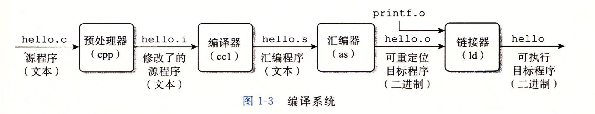

$$
\text{.c} \xrightarrow{\text{cpp}} \text{.i} \xrightarrow{\text{cc1}} \text{.s} \xrightarrow{\text{as}} \text{.o} \xrightarrow{\text{ld}} \text{prog}
$$

<div class="text-sm">

<v-clicks>


- `gcc`：编译器驱动程åº
- `cpp`：C 预处ç†ï¼ˆc preprocessor），将 xx.c 翻译æˆä¸€ä¸ª ASCII ç çš„ **中间文件**{.text-sky-5} xx.i（intermediate file）
- `cc1`：C 编译器（c compiler），将 xx.i 翻译æˆä¸€ä¸ª ASCII **汇编语言文件**{.text-sky-5} xx.s（assembly language file）
- `as`：汇编器（assembler），将 xx.s 翻译æˆä¸€ä¸ª **å¯é‡å®šä½ç›®æ ‡æ–‡ä»¶**{.text-sky-5} xx.o（relocatable object file）
- `ld`：链æ¥å™¨ï¼ˆlinker），将 xx.o 和其他的 xx.o，以åŠå¿…è¦çš„系统目标文件组åˆèµ·æ¥ï¼Œåˆ›å»ºä¸€ä¸ª**å¯æ‰§è¡Œç›®æ ‡æ–‡ä»¶**{.text-sky-5} prog

</v-clicks>

<span class="text-sm text-gray-5">

\* 书 1.2 章，知é“大家都没看，å¯ä»¥å›å»çœ‹ã€‚

</span>


</div>


---

# é™æ€é“¾æ¥

Static Linking

<div grid="~ cols-2 gap-12">
<div>

### main.c
```c
int sum(int *a, int n);  // 这里声æ˜äº†å‡½æ•°ï¼Œä½†æœªå®šä¹‰
int array[2] = {1, 2};  

int main()  
{  
    int val = sum(array, 2);  
    return val;  
}
```

### sum.c
```c
int sum(int *a, int n)   // 这里定义了函数
{  
    int i, s = 0;  
    for (i = 0; i < n; i++) {  
        s += a[i];  
    }  
    return s;  
}
```

</div>

<div flex="~ col gap-4 justify-center items-center">


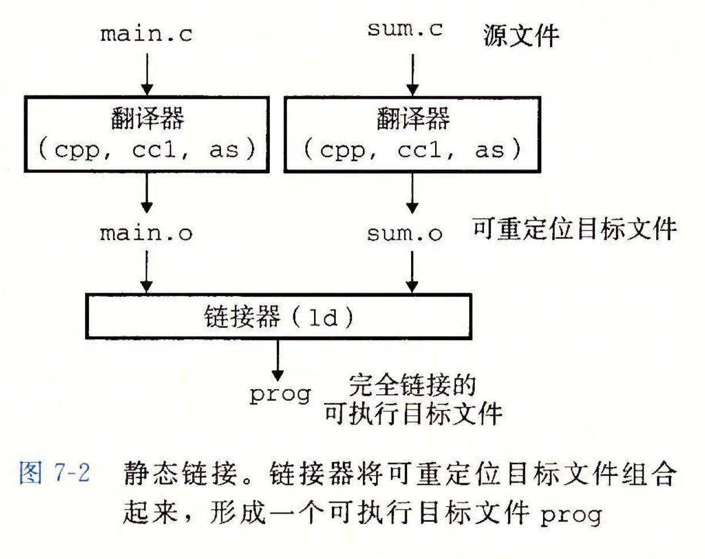{.h-60}

</div>
</div>

---

# é™æ€é“¾æ¥

Static Linking

在é™æ€é“¾æ¥ä¸­ï¼Œé“¾æ¥å™¨éœ€è¦å®ç°å¦‚下功能：

- **符å·è§£æ**{.text-sky-5}：将 **符å·å¼•ç”¨** ä¸è¾“入的å¯é‡å®šä½ç›®æ ‡æ–‡ä»¶ä¸­çš„ **符å·è¡¨** 中的一个确定的符å·ï¼ˆå…¨å±€å˜é‡ã€å‡½æ•°ç­‰ï¼‰å…³è”èµ·æ¥ã€‚
- **é‡å®šä½**{.text-sky-5}：**åˆå¹¶é‡å®šä½è¾“入模å—**，将符å·å®šä¹‰ä¸ä¸€ä¸ªåœ°å€å…³è”èµ·æ¥ï¼Œå¹¶ä¸ºæ‰¾åˆ°çš„æ¯ä¸ªç¬¦å·æŒ‡å‘对应的该地å€ã€‚

---

# 目标文件

Object File

1. **å¯é‡å®šä½ç›®æ ‡æ–‡ä»¶**
   - 这是一个包å«è®¡ç®—机能直æ¥ç†è§£çš„代ç å’Œæ•°æ®çš„文件，**但它还ä¸èƒ½å•ç‹¬è¿è¡Œ**{.text-sky-5}。
   - 它就åƒæ˜¯ä¸€ä¸ªåŠæˆå“，需è¦å’Œå…¶ä»–åŠæˆå“åˆå¹¶åœ¨ä¸€èµ·æ‰èƒ½å˜æˆä¸€ä¸ªå®Œæ•´çš„产å“。
2. **å¯æ‰§è¡Œç›®æ ‡æ–‡ä»¶**
   - 这是一个已ç»å‡†å¤‡å¥½ **å¯ä»¥ç›´æ¥åœ¨è®¡ç®—机上è¿è¡Œçš„文件**{.text-sky-5}。
   - 它就åƒæ˜¯ä¸€ä¸ªå·²ç»ç»„装好的ç©å…·ï¼Œæ‹¿åˆ°æ‰‹å°±å¯ä»¥ç©äº†ï¼Œä¸éœ€è¦å†åšå…¶ä»–æ“作。
3. **共享目标文件**
   - **特殊类å‹çš„å¯é‡å®šä½ç›®æ ‡æ–‡ä»¶**{.text-sky-5}，å¯ä»¥åœ¨ç¨‹åºè¿è¡Œçš„时候 **动æ€åŠ è½½**{.text-sky-5} è¿›æ¥ä½¿ç”¨ã€‚
   - 它就åƒæ˜¯ä¸€ä¸ªæ’件，å¯ä»¥åœ¨éœ€è¦çš„时候装上å»ï¼Œä¸éœ€è¦çš„时候å¯ä»¥å–下æ¥ã€‚

---

# å¯é‡å®šä½ç›®æ ‡æ–‡ä»¶

Relocatable Object File

<div grid="~ cols-2 gap-12">
<div>

```
ELF å¯é‡å®šä½ç›®æ ‡æ–‡ä»¶
│
├── ELF 头（ELF Header）[ä½åœ°å€]
│
├── 节（Sections）
│   ├── .text（机器代ç ï¼‰
│   ├── .rodata（åªè¯»æ•°æ®ï¼‰
│   ├── .data（已åˆå§‹åŒ–æ•°æ®ï¼‰
│   ├── .bss（未åˆå§‹åŒ–æ•°æ®ï¼‰
│   ├── .symtab（符å·è¡¨ï¼‰
│   ├── .rel.text（é‡å®šä½ä¿¡æ¯ï¼‰
│   ├── .rel.data（é‡å®šä½ä¿¡æ¯ï¼‰
│   ├── .debug（调试信æ¯ï¼‰
│   └── .strtab（字符串表）
│
├── 节头部表（Section Header Table）[高地å€]
│   ├── 节头部æ¡ç›® 1
│   ├── 节头部æ¡ç›® 2
│   ├── ...
│   └── 节头部æ¡ç›® N
```

</div>

<div>


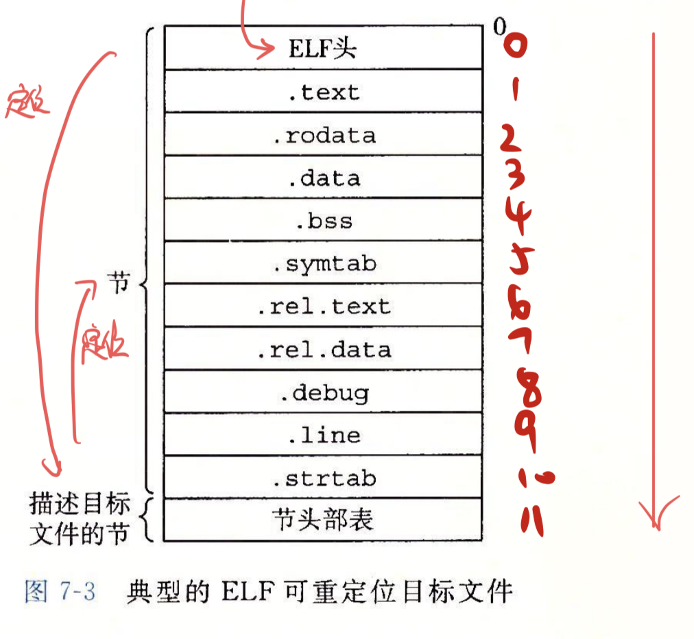

</div>
</div>

---

# å¯é‡å®šä½ç›®æ ‡æ–‡ä»¶

Relocatable Object File

<div grid="~ cols-2 gap-12">
<div>

### ELF 头

存储关äºè¿™ä¸ªäºŒè¿›åˆ¶æ–‡ä»¶çš„一般信æ¯ï¼š

文件的类å‹ã€å­—节åºã€ELF 头长度ã€èŠ‚头部表å移é‡ã€èŠ‚头部表æ¡ç›®å¤§å°å’Œæ•°é‡ç­‰ä¿¡æ¯ã€‚

è¿è¡Œæ—¶ï¼Œä¼šæ ¹æ®è¿™äº›ä¿¡æ¯ï¼š

1. 先定ä½åˆ° ELF 头
2. 然åæ ¹æ® ELF 头中的信æ¯æ‰¾åˆ°èŠ‚头部表
3. å†æ ¹æ®èŠ‚头部表找到相应的节

</div>

<div>


</div>
</div>

---

# å¯é‡å®šä½ç›®æ ‡æ–‡ä»¶

Relocatable Object File

<div grid="~ cols-2 gap-12">
<div>

### 节


`.text`：已编译程åºçš„机器代ç 

`.rodata`：åªè¯»<span class="text-sm text-gray-5">（read-only）</span>æ•°æ®ï¼Œå¦‚ `printf` 中的格å¼ä¸²ã€å¼€å…³è¯­å¥çš„跳转表ã€å­—符串常é‡ç­‰

`.data`：<span text-sky-5> å·²åˆå§‹åŒ–的全局ä¸é™æ€ C å˜é‡</span>

`.bss`：<span text-sky-5> 未åˆå§‹åŒ–的全局和é™æ€ C å˜é‡ï¼Œä»¥åŠæ‰€æœ‰è¢«åˆå§‹åŒ–为 0 的全局和é™æ€ C å˜é‡</span><br><span class="text-sm text-gray-5">（Block Storage Start / Better Save Space）</span>

<span class="text-sm text-gray-5">

\* å°†åˆå§‹åŒ–为 0 çš„å˜é‡æ”¾åœ¨ `.bss` 段而ä¸æ˜¯ `.data` 段，å¯ä»¥ä½¿å¯æ‰§è¡Œæ–‡ä»¶æ›´å°ï¼Œå› ä¸º `.bss` 段åªéœ€è¦è®°å½•å˜é‡çš„大å°å’Œä½ç½®ï¼Œè€Œä¸éœ€è¦å­˜å‚¨å®é™…çš„ 0 值（直到è¿è¡Œæ—¶æ‰çœŸçš„å»å†…存中分é…空间）。

</span>

</div>


<div>


</div>
</div>

---

# å¯é‡å®šä½ç›®æ ‡æ–‡ä»¶

Relocatable Object File

<div grid="~ cols-2 gap-12">
<div>

### 节


`.symtab`：符å·è¡¨ <span class="text-sm text-gray-5">（symbol table）</span>，存放定义和引用的函数ä¸å…¨å±€å˜é‡ä¿¡æ¯

`.rel.text`：é‡å®šä½ä¿¡æ¯ <span class="text-sm text-gray-5">（relocate text）</span>

`.rel.data`：é‡å®šä½ä¿¡æ¯ <span class="text-sm text-gray-5">（relocate data）</span>，（未åˆå§‹åŒ–或为 0 çš„å˜é‡ä¸éœ€è¦é‡å®šä½ï¼‰

`.strtab`：字符串表 <span class="text-sm text-gray-5">（string table）</span> ，包括： 

<span class="text-sm text-gray-5">

- `.symtab` å’Œ `.debug` 节中的符å·è¡¨
- 节头部中的节åå­—

字符串表就是以 null（`\0`）结尾的字符串的åºåˆ—。

</span>


</div>


<div>


</div>
</div>

<!-- 

还有 `.debug` 节，存储调试信æ¯ã€‚`.line` 节，存储行å·ä¿¡æ¯ã€‚

-->

---

# å¯é‡å®šä½ç›®æ ‡æ–‡ä»¶

Relocatable Object File

<div grid="~ cols-2 gap-12">
<div>

### 节头部表

存储ä¸åŒéƒ¨åˆ†çš„起始ä½ç½®ã€‚

</div>

<div>


</div>
</div>


---

# 符å·å’Œç¬¦å·è¡¨

Symbols and Symbol Table

æ¯ä¸ªå¯é‡å®šä½ç›®æ ‡æ¨¡å— $m$ 都有一个符å·è¡¨ï¼ŒåŒ…å«ç¬¦å·çš„定义和引用详情，它们包括：

- **全局符å·**：$m$ å®šä¹‰å¹¶èƒ½è¢«å…¶ä»–æ¨¡å— $n$ 引用的，对应éé™æ€çš„ C 函数和全局å˜é‡ã€‚
- **局部符å·**：$m$ 定义且 **åª**{.text-sky-5} åœ¨æ¨¡å— $m$ 内自己使用的，对应带 `static` å±æ€§çš„ C 函数和全局å˜é‡ï¼Œè¿™äº›ç¬¦å·åœ¨æ¨¡å— $m$ 内任何ä½ç½®éƒ½å¯è§ã€‚
- **外部符å·**：$m$ 引用但 $m$ 中 **未定义**{.text-sky-5} çš„ï¼Œå¯¹åº”å…¶ä»–æ¨¡å— $n$ 定义的函数或全局å˜é‡ã€‚

符å·è¡¨ **ä¸å…³å¿ƒæœ¬åœ°éé™æ€ç¨‹åºå˜é‡**，如：

```c{2}
int main() {
    int a = 1;
    return 0;
}
```

这里的 `a` 是局部å˜é‡ï¼Œä¸ä¼šå‡ºç°åœ¨ç¬¦å·è¡¨ä¸­ï¼Œè€Œæ˜¯å‡ºç°åœ¨æ ˆä¸­ã€‚

<button @click="$nav.go(14)">🔙</button>


---

# Static å±æ€§

`static` Attribute

`static` 定义的函数和全局å˜é‡ **åªèƒ½åœ¨å…¶å£°æ˜æ¨¡å—中使用（类似 C++ çš„ `private`）**{.text-sky-5}，对其他模å—ä¸å¯è§ã€‚

编译器会在 `.data` 或 `.bss` 中为其分é…空间，创造一个具有唯一å字的符å·ã€‚

<div grid="~ cols-2 gap-12">
<div text-sm>

在å³ä¾§ä»£ç ä¸­ï¼š

- 带有 `static` 关键字的å˜é‡ä¼šå‡ºç°åœ¨ç¬¦å·è¡¨ä¸­ï¼Œä¸”在 `.data` 或 `.bss` 中分é…空间
- 未带有 `static` 关键字的å˜é‡ä¸ä¼šå‡ºç°åœ¨ç¬¦å·è¡¨ä¸­ï¼Œè€Œæ˜¯å‡ºç°åœ¨æ ˆä¸­
- ç”±äºå‡ºç°äº†é‡åçš„ `static` å˜é‡ï¼Œç¼–译器生æˆä¸åŒå称的局部链æ¥å™¨ç¬¦å·ï¼Œå¦‚ `x.1` 表示函数 `f` 中的é™æ€å˜é‡ï¼Œè€Œ `x.2` 表示函数 `g` 中的é™æ€å˜é‡


</div>

<div>


```c
int f() {
    static int x = 0;
    int y = 1;
    return x + y;
}

int g() {
    static int x = 1;
    int y = 2;
    return x + y;
}
```

</div>
</div>

---

# 符å·è¡¨ç»“æ„

Symbol Table Structure

<div grid="~ cols-2 gap-12">
<div text-sm>

- `name`：指å‘符å·çš„ null（`\0`） 结æŸçš„字符串åå­—
- `value`
  - 对äºå¯é‡å®šä½çš„模å—æ¥è¯´ï¼Œè¡¨ç¤ºç›¸å¯¹äºå®šä¹‰æ‰€åœ¨èŠ‚（`section`）起始ä½ç½®çš„å移
  - 对äºå¯æ‰§è¡Œç›®æ ‡æ–‡ä»¶æ¥è¯´ï¼Œè¯¥å€¼æ˜¯ä¸€ä¸ªç»å¯¹è¿è¡Œæ—¶åœ°å€
- `size`：目标的大å°ï¼ˆå­—节为å•ä½ï¼‰
- `type`：符å·ç±»å‹ï¼ˆå‡½æ•°æˆ–æ•°æ®ï¼‰
- `binding`：符å·æ˜¯å¦æ˜¯æœ¬åœ°çš„还是全局的（是å¦å¯ä»¥è¢«å…¶ä»–模å—引用，å³æœ‰æ—  `static` 关键字）<button @click="$nav.go(12)">💡</button>
- `section`：符å·æ‰€åœ¨çš„节

</div>

<div>

```c
typedef struct {
    int name;        // .strtab 中的å移
    char type:4,     // 函数或数æ®
         binding:4;  // 局部或全局
    char reserved;   // 是å¦ä½¿ç”¨
    short section;   // 节头部表索引
    long value;      // 节内å移或ç»å¯¹åœ°å€
    long size;       // 对象大å°ï¼ˆå­—节）
} Elf64_Symbol;
```

</div>
</div>

---

# 符å·è¡¨æ¡ç›®åˆ†é…

Allocation of Symbol Table Entries

æ¯ä¸ªç¬¦å·å°†è¢«åˆ†é…到目标文件的æŸä¸ªèŠ‚（section），如 `.text` `.data` `.bss` 等。

有三个特殊的伪节（pseudosection），它们在节头部表中是没有æ¡ç›®çš„：

- `ABS`：代表ä¸è¯¥è¢«é‡å®šä½çš„符å·ï¼ˆabsolute）
- `UNDEF`：代表未定义的符å·ï¼ˆundefined）
- `COMMON`：未被分é…ä½ç½®çš„未åˆå§‹åŒ–çš„æ•°æ®ç›®æ ‡

`COMMON` vs `.bss`：

- `COMMON`：未åˆå§‹åŒ–的全局å˜é‡ï¼Œ**ä»è€Œå®ƒä»¬å¯èƒ½å®šä¹‰åœ¨å…¶ä»–模å—中**{.text-sky-5}
- `.bss`：未åˆå§‹åŒ–çš„é™æ€å˜é‡ï¼Œä»¥åŠåˆå§‹åŒ–为 0 的全局或é™æ€å˜é‡ï¼Œ**必然定义在当å‰æ¨¡å—中**{.text-sky-5}

<br>

```c
int a; // 未åˆå§‹åŒ–的全局å˜é‡ï¼Œå±äº COMMON
static int b; // 未被åˆå§‹åŒ–çš„é™æ€å˜é‡ï¼Œå±äº .bss
```


---
clicks: 5
---

# 符å·è¡¨æ¡ç›®åˆ†é…

Allocation of Symbol Table Entries

<div class="text-sm">

å¯¹äº `m.o` å’Œ `swap.o` 模å—，对æ¯ä¸ªç¬¦å·åœ¨ `swap.o` 中定义或引用的符å·ï¼ŒæŒ‡å‡ºæ˜¯å¦åœ¨ **æ¨¡å— `swap.o` çš„ `.symtab` 节**{.text-sky-5} 中有一个符å·æ¡ç›®ã€‚如æœæ˜¯ï¼Œè¯·æŒ‡å‡ºè¯¥ç¬¦å·çš„模å—（`swap.o` 或者 `m.o`）ã€ç¬¦å·ç±»å‹ï¼ˆå±€éƒ¨ã€å…¨å±€æˆ–者外部）以åŠå®ƒåœ¨æ¨¡å—中被分é…到的节（`.text`ã€`.data`ã€`.bss` 或 `COMMON`）。

<div grid="~ cols-2 gap-4">
<div grid="~ cols-2 gap-4">
<div>

```c
// m.c
void swap();
int buf[2] = {1, 2};

int main() 
{
    swap();
    return 0;
}
```

</div>

<div>

```c
// swap.c
extern int buf [];

int *bufp0 = &buf[0];
int *bufp1;

void swap(){
  int temp;

  bufp1 = &buf[1];
  temp = *bufp0;
  *bufp0 = *bufp1;
  *bufp1 = temp;
}
```

</div>
</div>

<div text-xs>

<div :class="$clicks>0 ? 'hidden' : ''">

| ç¬¦å·  | .symtab æ¡ç›®? | 符å·ç±»å‹ | 在哪个模å—中定义 | 节  |
| ----- | :-----------: | -------- | ---------------- | --- |
| buf   |               |          |                  |     |
| bufp0 |               |          |                  |     |
| bufp1 |               |          |                  |     |
| swap  |               |          |                  |     |
| temp  |               |          |                  |     |

</div>
<div :class="$clicks==1 ? '' : 'hidden'">

| ç¬¦å·  | .symtab æ¡ç›®? | 符å·ç±»å‹ | 在哪个模å—中定义 | 节   |
| ----- | :-----------: | -------- | ---------------- | ---- |
| buf   |       ✔       | 全局     | m.o              | .bss |
| bufp0 |               |          |                  |      |
| bufp1 |               |          |                  |      |
| swap  |               |          |                  |      |
| temp  |               |          |                  |      |


</div>
<div :class="$clicks==2 ? '' : 'hidden'">

| ç¬¦å·  | .symtab æ¡ç›®? | 符å·ç±»å‹ | 在哪个模å—中定义 | 节    |
| ----- | :-----------: | -------- | ---------------- | ----- |
| buf   |       ✔       | 全局     | m.o              | .bss  |
| bufp0 |       ✔       | 全局     | swap.o           | .data |
| bufp1 |               |          |                  |       |
| swap  |               |          |                  |       |
| temp  |               |          |                  |       |


</div>
<div :class="$clicks==3 ? '' : 'hidden'">

| ç¬¦å·  | .symtab æ¡ç›®? | 符å·ç±»å‹ | 在哪个模å—中定义 | 节     |
| ----- | :-----------: | -------- | ---------------- | ------ |
| buf   |       ✔       | 全局     | m.o              | .bss   |
| bufp0 |       ✔       | 全局     | swap.o           | .data  |
| bufp1 |       ✔       | 全局     | swap.o           | COMMON |
| swap  |               |          |                  |        |
| temp  |               |          |                  |        |


</div>
<div :class="$clicks==4 ? '' : 'hidden'">

| ç¬¦å·  | .symtab æ¡ç›®? | 符å·ç±»å‹ | 在哪个模å—中定义 | 节     |
| ----- | :-----------: | -------- | ---------------- | ------ |
| buf   |       ✔       | 全局     | m.o              | .bss   |
| bufp0 |       ✔       | 全局     | swap.o           | .data  |
| bufp1 |       ✔       | 全局     | swap.o           | COMMON |
| swap  |       ✔       | 全局     | swap.o           | .text  |
| temp  |               |          |                  |        |


</div>
<div :class="$clicks==5 ? '' : 'hidden'">

| ç¬¦å·  | .symtab æ¡ç›®? | 符å·ç±»å‹ | 在哪个模å—中定义 | 节     |
| ----- | :-----------: | -------- | ---------------- | ------ |
| buf   |       ✔       | 全局     | m.o              | .bss   |
| bufp0 |       ✔       | 全局     | swap.o           | .data  |
| bufp1 |       ✔       | 全局     | swap.o           | COMMON |
| swap  |       ✔       | 全局     | swap.o           | .text  |
| temp  |       ✘       | 局部     | swap.o           |        |


</div>
</div>
</div>
</div>

---

# 符å·è§£æ

Symbol Resolution

符å·è§£æ：在多个模å—间，将æ¯ä¸ªå¼•ç”¨ä¸ä¸€ä¸ªç¡®å®šçš„符å·å®šä¹‰å…³è”èµ·æ¥ã€‚

链æ¥æ—¶ï¼Œå°†ç¼–译器输出的全局符å·åˆ†ä¸ºï¼š

- **强符å·**{.text-sky-5}：包å«å‡½æ•°å’Œå·²åˆå§‹åŒ–的全局å˜é‡
- **弱符å·**{.text-sky-5}：未åˆå§‹åŒ–的全局å˜é‡

选择规则：

1. ä¸å…许有多个åŒå的强符å·
2. 如æœæœ‰ä¸€ä¸ªå¼ºç¬¦å·å’Œå¤šä¸ªå¼±ç¬¦å·åŒå，则选择强符å·
3. 如æœæœ‰å¤šä¸ªå¼±ç¬¦å·åŒå，则ä»è¿™äº›å¼±ç¬¦å·ä¸­ä»»æ„选择一个（一般选择第一个）

多个全局符å·åŒå的时候，å³ä½¿ä¸è¿èƒŒä¸Šè¿°è§„则，也有å¯èƒ½ä¼šå¯¼è‡´æ½œåœ¨é—®é¢˜ï¼šç±»å‹æ··æ·†ã€é¢„期以外的作用等。

为了安全，尽é‡ä½¿ç”¨ `static` å±æ€§å®šä¹‰å…¨å±€å˜é‡ã€‚

---

# 符å·è§£æ的问题

Symbol Resolution Problems

<div grid="~ cols-3 gap-4">
<div>

### Case 1

```c
// foo1.c
int main()
{
    return 0;
}

// bar1.c
int main() // é‡å¤å®šä¹‰å¼ºç¬¦å·
{
    return 0;
}
```

</div>

<div>

### Case 2

```c
// foo2.c
int x = 15213;
int main()
{
    return 0;
}

// bar2.c
int x = 15213; // é‡å¤å®šä¹‰å¼ºç¬¦å·
int f()
{
    return 0;
}
```


</div>

<div>

### Case 3

```c
// foo3.c
#include <stdio.h>
void f(void);
int x = 15213;
int main()
{
    f(); // 会修改 x 的值
    printf("x = %d\n", x);
    return 0;
}

// bar3.c
int x;
void f()
{
    x = 15212;
}
```

</div>
</div>

---

# 符å·è§£æ的问题

Symbol Resolution Problems

### Case 4

<div grid="~ cols-3 gap-8">
<div>


```c
// foo4.c
#include <stdio.h>
void f(void);

int y = 15212; // 高地å€
int x = 15213; // ä½åœ°å€

int main()
{
    f();
    printf("x = 0x%x y = 0x%x\n",
            x, y);
    // 0x0 0x80000000
    return 0;
}
```

</div>

<div>

```c
// bar4.c
double x;

void f()
{
    x = -0.0;
}
```

</div>

<div>

`x` 会按照 `double`（8 字节）的方å¼è®¡ç®—，但å®é™…上 `x` åªå ç”¨ 4 个字节的空间（因为它是 `int` ç±»å‹ï¼‰ï¼Œè¿™ä¼šå¯¼è‡´å¯¹å†…存的é法访问。

</div>
</div>


---

# é™æ€åº“

Static Libraries

**é™æ€åº“（Static Library）**：是一组目标文件的集åˆï¼Œé€šè¿‡å°†è¿™äº›ç›®æ ‡æ–‡ä»¶æ‰“包æˆä¸€ä¸ªå•ç‹¬çš„文件æ¥å®ç°ä»£ç çš„é‡ç”¨ã€‚é™æ€åº“在编译时链æ¥åˆ°åº”用程åºä¸­ï¼Œç”Ÿæˆä¸€ä¸ªåŒ…å«æ‰€æœ‰ä»£ç çš„å¯æ‰§è¡Œæ–‡ä»¶ã€‚

### Why é™æ€åº“？{.mb-4}

1. 区分标准函数 / 程åºå‡½æ•°ï¼šå¤æ‚ 
2. 所有标准函数放一起，存为å•ç‹¬çš„å¯é‡å®šä½ç›®æ ‡æ–‡ä»¶ï¼šæ–‡ä»¶ä½“积太大，维护è¦é‡æ–°æ‰“包
3. æ¯ä¸ªå‡½æ•°ä¸€ä¸ªæ¨¡å—：文件多ã€ç»´æŠ¤å¤æ‚，手动指定链æ¥ç´¯æ­»äº†
4. 相关的函数æ‰æ”¾åœ¨ä¸€èµ·ï¼šâœ”✔✔

---

# é™æ€åº“的创建和使用

Creating and Using Static Libraries

<div grid="~ cols-2 gap-8">
<div>


### 创建é™æ€åº“{.my-2}

1. 编译æºæ–‡ä»¶ç”Ÿæˆç›®æ ‡æ–‡ä»¶ï¼ˆ.o文件，object file）。
    ```bash
    gcc -c addvec.c multvec.c # -c åªç¼–译，ä¸é“¾æ¥
    ```
2. 使用 `ar`（archive）工具将目标文件打包æˆé™æ€åº“：
    ```bash
    ar rcs libvector.a addvec.o multvec.o
    ```
</div>

<div>


### 使用é™æ€åº“{.my-2}

1. 编译使用é™æ€åº“的程åºæ–‡ä»¶ã€‚
    ```bash
    gcc -c main2.c
    ```
2. 链æ¥ç”Ÿæˆå¯æ‰§è¡Œæ–‡ä»¶ï¼ŒæŒ‡å®šé™æ€åº“çš„ä½ç½®ã€‚
    ```bash
    gcc -static -o prog2c main2.o ./libvector.a
    ```
    `-static`：指定é™æ€é“¾æ¥ï¼Œæ— éœ€è¿è¡Œæ—¶é“¾æ¥<br>
    或者使用 `-L` å’Œ `-l` å‚数（library）：
    ```bash
    gcc -static -o prog2c main2.o -L. -lvector
    ```

</div>
</div>

---

# 解æé™æ€åº“引用

Resolving Static Library References

对äºä¸€è¡Œä»£ç ï¼Œé“¾æ¥å™¨ä»å·¦åˆ°å³æŒ‰éœ€è§£æ库中的符å·ï¼š

```bash
gcc foo.c libx.a liby.a libx.a
```

集åˆå®šä¹‰ï¼š

- $E$：最终所需è¦çš„æˆå‘˜ç›®æ ‡æ–‡ä»¶ï¼ˆExported），目标文件肯定丢进å»ï¼Œå­˜æ¡£æ–‡ä»¶çœ‹æœ‰æ²¡æœ‰ç”¨ä¸Šå†å†³å®šã€‚
- $U$：未解æ的符å·ï¼ˆUndefined），没定义的符å·å°±å…ˆåŠ è¿›å»ï¼Œé‡åˆ°å­˜æ¡£æ–‡ä»¶å†çœ‹èƒ½ä¸èƒ½åŒ¹é…上。
- $D$：已定义的符å·ï¼ˆDefined），已ç»åŒ¹é…上ã€æ‰¾åˆ°å®šä¹‰çš„符å·ã€‚

解æ完æˆå，ä¸åœ¨ $E$ 中的æˆå‘˜ç›®æ ‡æ–‡ä»¶ä¼šè¢«ä¸¢æ‰ï¼ˆç”¨ä¸ä¸Šï¼‰ã€‚

解æ完æˆå，$U$ é空，链æ¥å™¨ä¼šè¾“出一个错误并终止。

---

# 解æé™æ€åº“引用

Resolving Static Library References

因为ä»å·¦åˆ°å³è§£æ，所以在命令行链æ¥çš„顺åºå˜å¾—至关é‡è¦ã€‚

```bash
gcc foo.c libx.a liby.a libz.a
```

和

```bash
gcc foo.c libz.a liby.a libx.a
```

结æœä¸ä¸€æ ·ï¼Œå‰è€…会报错，å者ä¸ä¼šã€‚

- `.a` 文件中也å¯èƒ½æœ‰æœªå®šä¹‰çš„符å·ï¼Œä¹Ÿå¯èƒ½ä¾èµ–äºå…¶ä»– `.a` 文件
- 在解æ过程中，一个 `.a` 或 `.o` 文件å¯ä»¥å‡ºç°å¤šæ¬¡ã€‚

æ€ä¹ˆåšé¢˜ï¼š**画出ä¾èµ–图，满足最终的次åºèƒ½å¤Ÿéå†æ¯æ¡æœ‰å‘边。**

---

# é‡å®šä½

Relocation


**é‡å®šä½èŠ‚**：将所有相åŒç±»å‹çš„节åˆå¹¶ä¸ºåŒä¸€ç±»å‹çš„æ–°çš„èšåˆèŠ‚，并把è¿è¡Œæ—¶å†…存地å€èµ‹ç»™æ–°çš„èšåˆèŠ‚。这样，程åºä¸­çš„æ¯ä¸€æ¡æŒ‡ä»¤å’Œå…¨å±€å˜é‡éƒ½æœ‰å”¯ä¸€çš„è¿è¡Œæ—¶å†…存地å€äº†ã€‚

**é‡å®šä½ç¬¦å·**：链æ¥å™¨ä¼šä¿®æ”¹ä»£ç èŠ‚和数æ®èŠ‚中对æ¯ä¸ªç¬¦å·çš„引用，使得它们指å‘正确的è¿è¡Œæ—¶å†…存地å€ã€‚这一步ä¾èµ–äºå¯é‡å®šä½ç›®æ ‡æ¨¡å—中的 **é‡å®šä½æ¡ç›®**。

---

# é‡å®šä½æ¡ç›®

Relocation Entries

当 **汇编器** 生æˆä¸€ä¸ªç›®æ ‡æ¨¡å—时，它并ä¸çŸ¥é“æ•°æ®å’Œä»£ç æœ€ç»ˆå°†æ”¾åœ¨å†…存中的什么ä½ç½®ã€‚

所以，它就会生æˆä¸€ä¸ª**é‡å®šä½æ¡ç›®**，告诉 **链æ¥å™¨** 将目标文件åˆå¹¶æˆå¯æ‰§è¡Œæ–‡ä»¶æ—¶å¦‚何修改这个引用。

代ç çš„é‡å®šä½æ¡ç›®æ”¾åœ¨ `.rel.text` 中，数æ®çš„é‡å®šä½æ¡ç›®æ”¾åœ¨ `.rel.data` 中。

### ELF é‡å®šä½æ¡ç›®çš„æ ¼å¼

```c
typedef struct {
    long offset;    /* å移é‡ï¼šå¼•ç”¨é‡å®šä½çš„åç§»é‡ */
    long type:32;   /* é‡å®šä½ç±»å‹ */
    long symbol:32; /* 符å·è¡¨ç´¢å¼• */
    long addend;    /* 常é‡éƒ¨åˆ†ï¼šé‡å®šä½è¡¨è¾¾å¼çš„常é‡éƒ¨åˆ† */
} Elf64_Rela;
```

---

# é‡å®šä½è¿‡ç¨‹

Relocation Process

### é‡å®šä½ç±»å‹{.mb-2}

- `R_X86_64_PC32`：é‡å®šä½ä¸€ä¸ªä½¿ç”¨ 32 ä½ PC 相对地å€çš„引用
- `R_X86_64_32`：é‡å®šä½ä¸€ä¸ªä½¿ç”¨ 32 ä½ç»å¯¹åœ°å€çš„引用

相对地å€ï¼šè·ç¦» PC çš„**当å‰è¿è¡Œæ—¶å€¼**çš„å移é‡

---
clicks: 4
---

# é‡å®šä½è¿‡ç¨‹

Relocation Process

<div grid="~ cols-3 gap-4">
<div text-sm relative>

<div :class="$clicks==0 ? 'opacity-100' : 'opacity-0'" transition duration-200 absolute>

å‡è®¾ï¼š

- `ADDR(s)` å’Œ `ADDR(r.symbol)` 表示è¿è¡Œæ—¶åœ°å€ï¼Œä¸ä¹‹ç›¸å¯¹çš„，`s` 表示当å‰è¿˜æ²¡æœ‰é‡å®šä½æ—¶ï¼ŒåŸå§‹ç›®æ ‡æ–‡ä»¶çš„地å€ã€‚
- 第 3 行计算的是需è¦è¢«é‡å®šä½çš„ 4 字节引用的数值 $r$ 中的地å€ã€‚
- 如æœè¿™ä¸ªå¼•ç”¨ä½¿ç”¨çš„是 PC 相对寻å€ï¼Œé‚£ä¹ˆå®ƒå°±ç”¨ç¬¬ 5ï½9 è¡Œæ¥é‡å®šä½ã€‚
- 如æœè¯¥å¼•ç”¨ä½¿ç”¨çš„是ç»å¯¹å¯»å€ï¼Œå®ƒå°±é€šè¿‡ç¬¬ 11ï½13 è¡Œæ¥é‡å®šä½ã€‚

</div>

<div :class="$clicks==1 ? 'opacity-100' : 'opacity-0'" transition duration-200 absolute>

`refptr`：计算你è¦ä¿®æ”¹çš„地å€ï¼ˆåœ¨å“ªé‡Œï¼Œç°åœ¨ç•™ç€çš„是 00，我们需è¦å¡«å†™ä¸Šæ­£ç¡®çš„åç§»é‡ / 地å€ï¼‰

</div>

<div :class="$clicks==2 ? 'opacity-100' : 'opacity-0'" transition duration-200 absolute>

`refaddr`：链æ¥å，填写相对值的地å€

这里利用了：å移é‡ï¼ˆ`r.offset`）ä¸å˜ã€‚

</div>

<div :class="$clicks==3 ? 'opacity-100' : 'opacity-0'" transition duration-200 absolute>

`r.addend`ï¼šè¡¥å¿ `refaddr` å’Œè¿è¡Œæ—¶ `PC` 之间的差值

`refaddr = ADDR(PC) + r.addend`

这样，我们就有如下å¼å­ï¼š

`PC = refaddr - r.addend`

`PC + *refptr = ADDR(r.symbol)`

这正是我们想è¦çš„相对定ä½ã€‚

</div>

<div :class="$clicks==4 ? 'opacity-100' : 'opacity-0'" transition duration-200 absolute>

`r.addend`：对äºç»å¯¹é‡å®šä½æ¥è®²ï¼Œä¸€èˆ¬å°±è®¾ç½®ä¸º 0 了。

此时，我们直æ¥å°±æœ‰ï¼š

`*refptr = ADDR(r.symbol)`

</div>


</div>

<div col-span-2>

```c {all|3|3,7|5-10|12-16}{at:1}
foreach section s {  /* 迭代节 */
    foreach relocation entry r {  /* 迭代é‡å®šä½æ¡ç›® */
        refptr = s + r.offset;  /* 需è¦é‡å®šä½çš„引用的指针，è¦å†™å“ªé‡Œ */

        /* é‡å®šä½ PC-relative 引用 */
        if (r.type == R_X86_64_PC32) {
            refaddr = ADDR(s) + r.offset;  /* 引用的è¿è¡Œæ—¶åœ°å€ */
            /* addend = -4 */
            *refptr = (unsigned) (ADDR(r.symbol) + r.addend - refaddr);
        }

        /* é‡å®šä½ç»å¯¹å¼•ç”¨ */
        if (r.type == R_X86_64_32) {
            /* addend = 0 */
            *refptr = (unsigned) (ADDR(r.symbol) + r.addend); 
        }
    }
}
```

</div>
</div>

---

<div grid="~ cols-2 gap-8">
<div>

# 相对é‡å®šä½ä¸¾ä¾‹

PC-relative Relocation Example


<div class="text-xs">


```
r.offset = 0xf
r.symbol = sum
r.type = R_X86_64_PC32
r.addend = -4
```

- `r.offset`：`call` æŒ‡ä»¤ç¬¬äºŒä¸ªå­—èŠ‚ä¸ `main` 函数起始地å€çš„åç§»é‡ = `0xf`
- `r.refptr`：è¦ä¿®æ”¹çš„地å€ï¼Œ`s + r.offset` = `main + 0xf` = `0xf`
- `refaddr`：引用的è¿è¡Œæ—¶åœ°å€ = `ADDR(s) + r.offset` = `0x4004d0 + 0xf` = `0x4004df`
- `PC`：è¿è¡Œæ—¶çš„ PC，下一æ¡æŒ‡ä»¤çš„åœ°å€ = `0x4004e3`
- `r.addend`ï¼šè¡¥å¿ `refaddr` å’Œè¿è¡Œæ—¶ `PC` 之间的差值 = `0x4004df - 0x4004e3 = -4`
- `ADDR(r.symbol)`：真å®è¦å¾—到的地å€ï¼Œä¹Ÿå³ `sum` çš„è¿è¡Œæ—¶åœ°å€ = `0x4004e8`

`*refptr = (unsigned) (ADDR(r.symbol) + r.addend - refaddr) = (unsigned) (0x4004e8 + (-4) - 0x4004df) = 5`

</div>

</div>

<div>

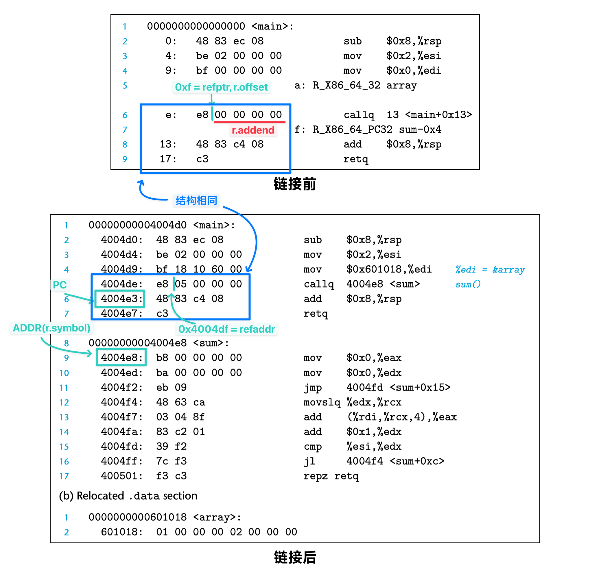{.mx-auto}

</div>
</div>

---

<div grid="~ cols-2 gap-8">
<div>


# ç»å¯¹é‡å®šä½ä¸¾ä¾‹

Absolute Relocation Example

<div class="text-xs">


```
r.offset = 0xa
r.symbol = array
r.type = R_X86_64_32
r.addend = 0
```

- `r.offset`：`call` æŒ‡ä»¤ç¬¬äºŒä¸ªå­—èŠ‚ä¸ `main` 函数起始地å€çš„åç§»é‡ = `0xa`
- `r.refptr`：è¦ä¿®æ”¹çš„地å€ï¼Œ`s + r.offset` = `main + 0xa` = `0xa`
- `r.addend`：对äºç»å¯¹é‡å®šä½ï¼Œè®¾ç½®ä¸º 0。
- `ADDR(r.symbol)`：真å®è¦å¾—到的地å€ï¼Œä¹Ÿå³ `array` çš„è¿è¡Œæ—¶åœ°å€ = `0x601018`

`*refptr = (unsigned) (ADDR(r.symbol) + r.addend) = (unsigned) (0x601018 + 0) = 0x601018`

</div>

</div>

<div>

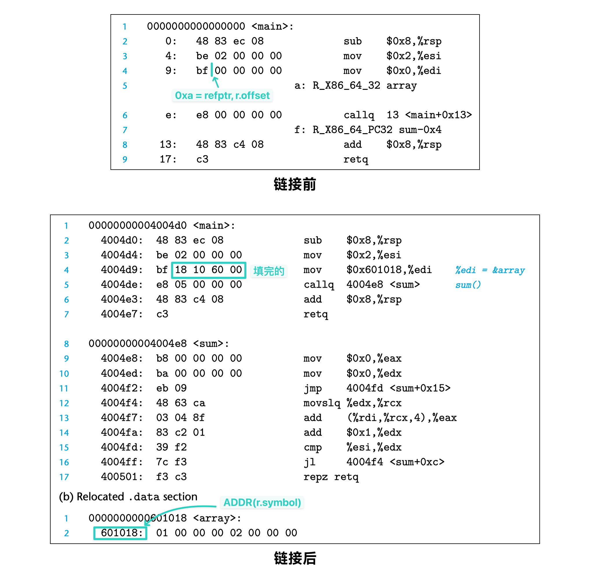{.mx-auto}

</div>
</div>

---

# å¯æ‰§è¡Œç›®æ ‡æ–‡ä»¶

Executable Object File

<div grid="~ cols-2 gap-12">
<div text-sm>


ELF 头æ述文件的整体格å¼ï¼ŒåŒ…å«ç¨‹åºçš„å…¥å£ç‚¹ï¼ˆentry point），å³ç¨‹åºè¿è¡Œæ—¶æ‰§è¡Œçš„第一æ¡æŒ‡ä»¤åœ°å€ã€‚

**段**：链æ¥å™¨æ ¹æ®ç›®æ ‡æ–‡ä»¶ä¸­ **å±æ€§ç›¸åŒçš„多个节åˆå¹¶å的节的集åˆ**{.text-sky-5}，这个集åˆç§°ä¸ºæ®µã€‚

- `.init` 段：比å¯é‡å®šä½ç›®æ ‡æ–‡ä»¶å¤šå‡ºæ¥çš„，包å«åˆå§‹ä»£ç ï¼ˆ`_init` 函数），会在程åºå¼€å§‹æ—¶è°ƒç”¨ã€‚
- `.text` `.rodata` `.data` 段：ä¸åŒå节对应，已被é‡å®šä½åˆ°æœ€ç»ˆçš„è¿è¡Œæ—¶å†…存地å€ã€‚
- `.rel.text` å’Œ `.rel.data` 节：ä¸å†å­˜åœ¨ï¼Œå› ä¸ºå·²ç»å®Œå…¨é“¾æ¥ã€‚

</div>

<div>

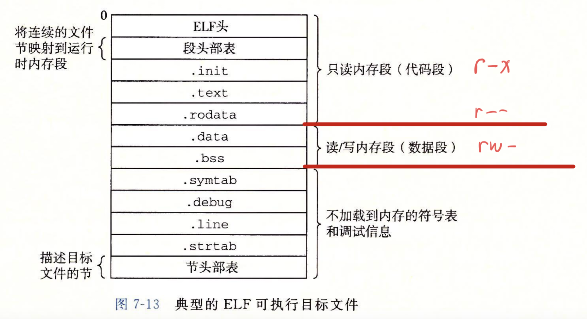{.mx-auto}

<span class="text-xs text-gray-5">

段代表的是å¯æ‰§è¡Œä»£ç å’Œæ•°æ®ç­‰å†…存区域，而节则更加抽象，它代表的是文件中的一组相关数æ®ã€‚在 ELF 文件中，节是按照功能和目的æ¥åˆ’分的，比如代ç èŠ‚ã€æ•°æ®èŠ‚ã€ç¬¦å·è¡¨èŠ‚等等，而段则是按照内存区域æ¥åˆ’分的。

</span>

</div>
</div>

---

# 加载å¯æ‰§è¡Œç›®æ ‡æ–‡ä»¶

Loading an Executable Object File

<div grid="~ cols-2 gap-12">
<div>

### 内存布局{.mb-2}

- **代ç æ®µ**：ä»åœ°å€ `0x400000` = $2^{21}$ 开始，åé¢æ˜¯æ•°æ®æ®µ
- **堆内存**：由 `malloc` 分é…，è¿è¡Œæ—¶å †åœ¨æ•°æ®æ®µä¹‹å
- **用户栈**：ä»æœ€å¤§åˆæ³•ç”¨æˆ·åœ°å€ $2^{48} - 1$ å‘下å¢é•¿
- **内核区**：ä»åœ°å€ $2^{48}$ 开始，用äºå†…核代ç å’Œæ•°æ®æ®µ

`_start`（入å£ç‚¹ï¼‰ → `_libc_start_main`（定义在 libc.so 中） → `main`

</div>

<div>

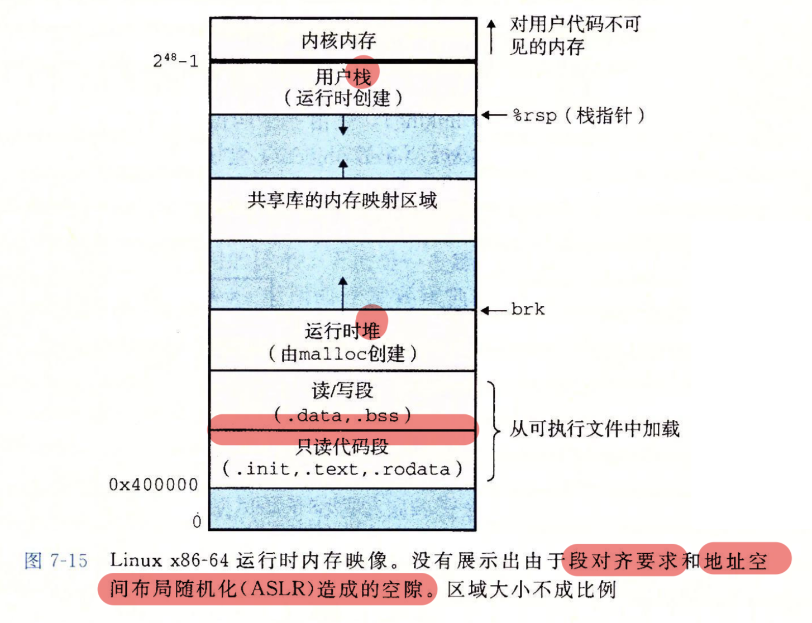{.mx-auto}

</div>
</div>

<!-- 

å®é™…上存在 è™šæ‹Ÿå†…å­˜æ˜ å°„ï¼Œä»¥åŠ ASLR（æ¯æ¬¡ç¨‹åºè¿è¡Œæ—¶ï¼Œè¿™äº›åŒºåŸŸçš„**地å€éƒ½ä¼šæ”¹å˜**，但**相对ä½ç½®ä¸å˜**）

libc.so：一定会被链æ¥ã€‚

-->

---

<div grid="~ cols-2 gap-12">
<div>

# 动æ€é“¾æ¥å…±äº«åº“

Dynamic Linking Shared Libraries

<div>

共享库：**在è¿è¡Œæ—¶è¢«åŠ¨æ€åŠ è½½å’Œé“¾æ¥çš„库文件**{.text-sky-5}，通常以 `.so`（Linux）或 `.dll`（Windows）为å缀。

- 节çœèµ„æºï¼šé¿å…é™æ€åº“å¤åˆ¶å¾ˆå¤šæ¬¡
- 简化更新：更新共享库åªéœ€æ›¿æ¢åº“文件，无需é‡æ–°ç¼–译所有ä¾èµ–的程åº
- 动æ€é“¾æ¥ï¼šè¿è¡Œæ—¶åŠ è½½åº“文件，多个程åºå…±äº«åŒä¸€ä»½åº“文件

C 标准库 `libc.so` 通常是动æ€é“¾æ¥çš„。

</div>

</div>

<div>

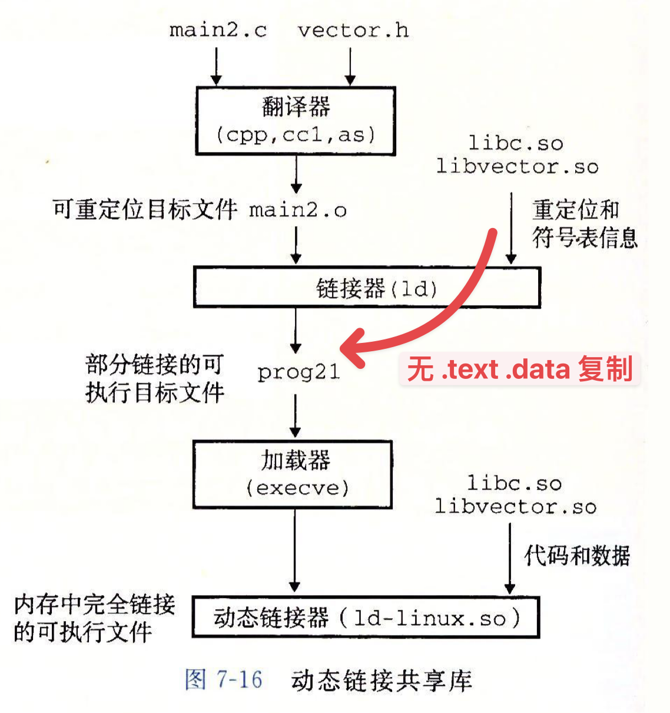{.mx-auto}

</div>
</div>

<!-- 

å›é¡¾é™æ€åº“的链æ¥æ–¹å¼ï¼Œæˆ‘们å¯ä»¥å‘ç°å…¶åœ¨é“¾æ¥çš„过程中ä»åº“中æå–出需è¦æ‰§è¡Œçš„代ç å’Œå…¶å®ƒå¯é‡å®šä½æ–‡ä»¶ä¸€èµ·ç”Ÿæˆå¯æ‰§è¡Œæ–‡ä»¶ã€‚但是这样åšä»æœ‰ä¸€äº›ä¸è¶³ä¹‹å¤„：
1.对äºä¸€äº›å¾ˆåŸºæœ¬çš„函数（比如I/Oæ“作中的printf,scanf等），在æ¯ä¸€ä¸ªå¯æ‰§è¡Œæ–‡ä»¶çš„text段中都会存在其的一个副本，这对äºç£ç›˜ç©ºé—´æ¥è¯´æ˜¯æ大的浪费行为。
2.如æœåº“进行了更新或者改动，必须é‡æ–°è¿›è¡Œé“¾æ¥è¡Œä¸ºä»¥ç”Ÿæˆæ–°çš„å¯æ‰§è¡Œæ–‡ä»¶ï¼ˆè¿™å¯¹ä¸€ä¸ªå¤æ‚的系统æ¥è¯´æ˜¯å¾ˆä¸å‹å¥½çš„，因为其æ„味ç€ä¸€ä¸ªå°æ”¹åŠ¨å¯èƒ½ä¼šç‰µæ¶‰åˆ°å¾ˆå¤šæ˜¾å¼æ“作）

å›å¿†æˆ‘们之å‰çš„链æ¥è¡Œä¸ºï¼Œæˆ‘们总是修改代ç å½“中的全局å˜é‡å’Œå‡½æ•°çš„地å€ä»è€Œå®Œæˆé‡å®šä½è¡Œä¸ºï¼Œè¿™ç§æ–¹æ³•æ˜¯ä½æ•ˆè€Œâ€œç¬¨é‡â€çš„：这æ„味ç€åœ¨åŠ¨æ€é“¾æ¥çš„过程，æ¯ä¸€æ¬¡å¯¹å…¨å±€å˜é‡å’Œå‡½æ•°åœ°å€çš„改动都会牵涉到引用其的所有代ç çš„改å˜ã€‚我们显然ä¸å¸Œæœ›çœ‹åˆ°è¿™ç§è¡Œä¸ºã€‚

所以我们需è¦ä½¿ç”¨ä½ç½®æ— å…³ä»£ç æ¥ä¿è¯å³ä½¿æ˜¯ä½¿ç”¨åŠ¨æ€é“¾æ¥å…±äº«åº“，我们也ä¸ä¼šåœ¨è¿è¡Œä¸­æ”¹å˜ä»£ç æ®µ(.text)（在é™æ€é“¾æ¥çš„过程中因为一个å¯æ‰§è¡Œæ–‡ä»¶åªä¼šç”¨åˆ°è‡ªå·±å¤åˆ¶åˆ°å†…存当中的东西，所以这件事情是显然的）


 -->

---

<div grid="~ cols-2 gap-12">
<div>

# 动æ€é“¾æ¥å…±äº«åº“

Dynamic Linking Shared Libraries

<div>

#### 链æ¥å™¨ã€åŠ è½½å™¨ã€åŠ¨æ€é“¾æ¥å™¨ {.mb-2.mt-4}

- **链æ¥å™¨**：在编译阶段之å工作，将多个目标文件和库文件链æ¥æˆä¸€ä¸ªå¯æ‰§è¡Œæ–‡ä»¶æˆ–库文件。
- **加载器**：在程åºæ‰§è¡Œé˜¶æ®µå·¥ä½œï¼Œå°†å¯æ‰§è¡Œæ–‡ä»¶åŠ è½½åˆ°å†…存并准备好执行ç¯å¢ƒã€‚
- **动æ€é“¾æ¥å™¨**：在加载器将程åºåŠ è½½åˆ°å†…å­˜åã€ç¨‹åºå¼€å§‹æ‰§è¡Œå‰å·¥ä½œï¼Œè´Ÿè´£åœ¨è¿è¡Œæ—¶åŠ è½½åŠ¨æ€åº“并解æ符å·ï¼ˆé‡å®šä½ï¼‰ã€‚

</div>

</div>

<div>

{.mx-auto}

</div>
</div>

---
clicks: 1
---

# ä½ç½®æ— å…³ä»£ç 

Position Independent Code

ä½ç½®å›ºå®šï¼šä¼šå¼•èµ·å†…存的浪费，无法高效利用（Why?）

<div :class="$clicks>0 ? 'opacity-100' : 'opacity-0'" transition duration-200>

ä½ç½®æ— å…³ï¼šå…±äº«åº“å¯ä»¥è¢«åŠ è½½åˆ°å†…存的任何ä½ç½®ï¼Œä»è€Œå¤šä¸ªç¨‹åºå¯ä»¥åŒæ—¶ä½¿ç”¨åŒä¸€ä¸ªå…±äº«åº“å®ä¾‹ï¼ŒèŠ‚çœå†…存。

<span class="text-sm text-gray-5">

需è¦ä½¿ç”¨ `-fpic` （flag position independent code）选项编译共享库

</span>

</div>

---

# 过程链æ¥è¡¨ï¼ˆPLT） å’Œ 全局å移表（GOT）

Procedure Link Table and Global Offset Table, PLT & GOT

å‡è®¾æœ‰ä¸€ä¸ªå…±äº«åº“函数 `foo`，以下是调用过程：

1. 在第一次调用 `foo` 时，程åºè·³è½¬åˆ° PLT 表的 `foo` å…¥å£
2. PLT 表的 `foo` å…¥å£è·³è½¬åˆ° **动æ€é“¾æ¥å™¨çš„解æ函数**{.text-sky-5}
3. 动æ€é“¾æ¥å™¨è§£æ `foo` 的地å€ï¼Œå¹¶å°†åœ°å€å†™å…¥ GOT 表中相应的æ¡ç›®
4. 动æ€é“¾æ¥å™¨è¿”å›ï¼Œç¨‹åºç»§ç»­æ‰§è¡Œ `foo` 函数
5. 下一次调用 `foo` 时，PLT 表直æ¥ä» GOT è¡¨ä¸­è¯»å– `foo` 的地å€å¹¶è·³è½¬ï¼Œ**无需å†æ¬¡è§£æ**{.text-sky-5}

<!-- 

如æœä»£ç ä½ç½®æ˜¯å›ºå®šçš„，那么æ¯ä¸ªç¨‹åºæˆ–库都需è¦åœ¨ç‰¹å®šçš„内存地å€æ‰§è¡Œã€‚这会导致内存ç¢ç‰‡çš„产生和浪费。例如，如æœä¸€ä¸ªç¨‹åºéœ€è¦å ç”¨ç‰¹å®šçš„内存区域，那么在该区域内的其他内存空间å¯èƒ½ä¼šè¢«æµªè´¹æ‰ã€‚ä½ç½®æ— å…³ä»£ç å…许程åºå’Œåº“在内存中的任æ„ä½ç½®åŠ è½½å’Œæ‰§è¡Œï¼Œä»è€Œæ›´é«˜æ•ˆåœ°åˆ©ç”¨å†…存空间。

 -->

---
clicks: 8
---

# PLT 和 GOT 举例

PLT & GOT Example

<div grid="~ cols-2 gap-12">
<div>

```asm{all|1,2|1,2|1,2,7|1,2,7|1,2,7|1,2,4,7|1,2,4-5,7}{at:1}
# æ•°æ®æ®µ
# 全局å移é‡è¡¨ (GOT)
GOT[0]: addr of .dynamic
GOT[1]: addr of reloc entries # é‡å®šä½æ¡ç›®çš„地å€
GOT[2]: addr of dynamic linker # 动æ€é“¾æ¥å™¨çš„地å€
GOT[3]: 0x4005b6 # sys startup
GOT[4]: 0x4005c6 # addvec()
GOT[5]: 0x4005d6 # printf()
```

```asm
# 代ç æ®µ
callq 0x4005c0 # call addvec()
```

```asm{all|1|6-7|6-7|6-8|6-9|1-3,6-9|1-4,6-9}{at:1}
# 过程链æ¥è¡¨ (PLT)
# PLT[0]: call dynamic linker
4005a0: pushq *GOT[1]
4005a6: jmpq *GOT[2]
...
# PLT[2]: call addvec()
4005c0: jmpq *GOT[4]
4005c6: pushq $0x1 # addvec çš„ ID
4005cb: jmpq 4005a0
```

</div>

<div v-click="8">

```asm{1-2,7}
# æ•°æ®æ®µ
# 全局å移é‡è¡¨ (GOT)
GOT[0]: addr of .dynamic
GOT[1]: addr of reloc entries
GOT[2]: addr of dynamic linker
GOT[3]: 0x4005b6 # sys startup
GOT[4]: &addvec()
GOT[5]: 0x4005d6 # printf()
```

```asm
# 代ç æ®µ
callq 0x4005c0 # call addvec()
```

```asm{1,6-7}
# 过程链æ¥è¡¨ (PLT)
# PLT[0]: call dynamic linker
4005a0: pushq *GOT[1]
4005a6: jmpq *GOT[2]
...
# PLT[2]: call addvec()
4005c0: jmpq *GOT[4]
4005c6: pushq $0x1
4005cb: jmpq 4005a0
```

</div>
</div>


---

# 库打桩机制

Library Interposition

**打桩**：在è¿è¡Œæ—¶æ›¿æ¢åº“函数的行为。

打桩机制有三ç§ä¸»è¦æ–¹æ³•ï¼š
- 编译时打桩
- 链æ¥æ—¶æ‰“æ¡©
- è¿è¡Œæ—¶æ‰“æ¡©

---

# 编译时打桩

Compile-Time Interposition

**概念**：通过在编译æºä»£ç æ—¶æ’入打桩函数æ¥å®ç°ã€‚

**å®ç°æ–¹å¼**：使用 `-D` 编译选项将标准函数替æ¢ä¸ºè‡ªå®šä¹‰å‡½æ•°ã€‚

编译命令：
```sh
gcc -I.-o intc int.c mymalloc.o
```

- `-I.`：告诉编译器在当å‰ç›®å½•ï¼ˆ`.`）中查找头文件（Include）
- `-o intc`：指定输出文件å为 `intc`
- `int.c`：æºæ–‡ä»¶
- `mymalloc.o`：自定义动æ€åº“

这样åšå，会在æœç´¢ `malloc` 时，优先æœç´¢ `mymalloc.o` 中的 `malloc`，然åå†æœç´¢é€šå¸¸çš„系统目录。

---


# 链æ¥æ—¶æ‰“æ¡©

Link-Time Interposition

<div grid="~ cols-2 gap-4">
<div class="children-[p]-mt-0">


**概念**：在链æ¥é˜¶æ®µï¼Œç”¨è‡ªå®šä¹‰å‡½æ•°æ›¿æ¢æ ‡å‡†åº“函数。

**å®ç°æ–¹å¼**：使用 `--wrap` 选项告诉链æ¥å™¨ç”¨è‡ªå®šä¹‰å‡½æ•°æ›¿æ¢æ ‡å‡†å‡½æ•°ã€‚

链æ¥å‘½ä»¤ï¼š
```sh
gcc -c mymalloc.c # -c åªç¼–译，ä¸é“¾æ¥ï¼Œå¾—到 mymalloc.o
gcc -c int.c # 得到 int.o
# -Wl：将åé¢çš„选项传递给链æ¥å™¨ ld。
gcc -Wl,--wrap,malloc \
    -Wl,--wrap,free \
    -o intl int.o mymalloc.o # 链æ¥æ—¶æ‰“æ¡©
```


</div>

<div>


```c
// mymalloc.c
void *__real_malloc(size_t size);
void *__wrap_malloc(size_t size) {
    void *ptr = __real_malloc(size); // 调用åŸå§‹malloc
    printf("malloc(%zu) = %p\n", size, ptr);
    return ptr;
}
...

// int.c
#include <stdio.h>
#include <malloc.h>
int main(){
    int *p = malloc(32);
    free(p);
    return(0);
}
```

</div>
</div>

---

# è¿è¡Œæ—¶æ‰“æ¡©

Runtime Interposition

**概念**：在程åºè¿è¡Œæ—¶ï¼ŒåŠ¨æ€æ›¿æ¢åº“函数。

**å®ç°æ–¹å¼**：使用 `LD_PRELOAD` ç¯å¢ƒå˜é‡åŠ è½½è‡ªå®šä¹‰åŠ¨æ€åº“。

```sh
gcc -shared -fpic -o mymalloc.so mymalloc.c -ldl
LD_PRELOAD="./mymalloc.so" ./myprogram
```

- `-shared`：生æˆå…±äº«åº“
- `-fpic`：生æˆä½ç½®æ— å…³ä»£ç ï¼Œ**这是共享库所必需的，因为共享库å¯ä»¥åŠ è½½åˆ°å†…存中的任何ä½ç½®**{.text-sky-5}
- `-ldl`：链æ¥åŠ¨æ€é“¾æ¥å™¨åº“，`libdl` 是动æ€é“¾æ¥å™¨åº“
- `LD_PRELOAD`：ç¯å¢ƒå˜é‡ï¼ŒæŒ‡å®šåœ¨è¿è¡Œç¨‹åºæ—¶åŠ è½½çš„自定义动æ€åº“


---
layout: center
---

<div>
  <text class="text-17 font-bold gradient-text">Emphasis
</text>
</div>

<style>
  .gradient-text {
    background-image: linear-gradient(45deg, #4ec5d4 10%, #146b8c 20%);
    -webkit-background-clip: text;
    color: transparent;
  }
</style>

---

# 编译æµç¨‹


预处ç†å™¨`cpp` $\rightarrow$ 编译器`ccl` $\rightarrow$ 汇编器`as`  $\rightarrow$ 链æ¥`ld` $\rightarrow$ 加载器`loader`

---

# 文件符å·

- **æºæ–‡ä»¶ï¼ˆ.c）**：包å«äººç±»å¯è¯»çš„æºä»£ç ã€‚
- **预处ç†æ–‡ä»¶ï¼ˆ.i）**：包å«å±•å¼€çš„å®å’Œå¤´æ–‡ä»¶å†…容（通过预处ç†ç”Ÿæˆï¼‰ã€‚
- **汇编文件（.s）**：C 文件编译å的汇编代ç ï¼ˆé€šè¿‡ç¼–译生æˆï¼‰ã€‚
- **目标文件（.o）**：汇编文件或 C 文件编译å的机器代ç ï¼ŒåŒ…å«ç¬¦å·è¡¨å’Œé‡å®šä½ä¿¡æ¯ã€‚
- **é™æ€åº“文件（.a）**：包å«å¤šä¸ª `.o` 文件的归档文件，用äºé™æ€é“¾æ¥ã€‚
- **共享库文件（.so）**：动æ€é“¾æ¥åº“文件，程åºè¿è¡Œæ—¶åŠ è½½ã€‚
- **å¯æ‰§è¡Œæ–‡ä»¶**：最终的å¯æ‰§è¡Œç¨‹åºï¼ŒåŒ…å«æ‰€æœ‰å·²è§£æ的符å·å’Œé‡å®šä½çš„代ç ã€‚

**.c -> .o -> .a / .so -> å¯æ‰§è¡Œæ–‡ä»¶** 是一个常è§çš„编译-链æ¥-执行的完整æµç¨‹

---


# 基本概念

- 引用：在 .text （代ç æ®µï¼‰çš„任何地方å–值或å–地å€

- 声æ˜ï¼š`(static/extern) type name ... ;`

- 定义：`(static) type name ... ;`

  

---


# 目标文件

- æ ¼å¼

  - Mac OS-X: Mach-O
  - Windows: PE
  - Linux: **ELF**

  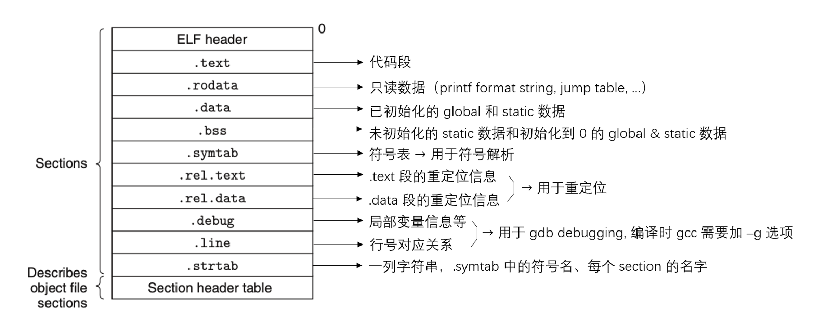

---


# å¯é‡å®šä½ç›®æ ‡æ–‡ä»¶

#### ELF


---


# 符å·å’Œç¬¦å·è¡¨

- `.symtab`：一个符å·è¡¨ï¼Œå®ƒå­˜æ”¾åœ¨ç¨‹åºä¸­**定义**å’Œ**引用**的函数和全局å˜é‡çš„ä¿¡æ¯

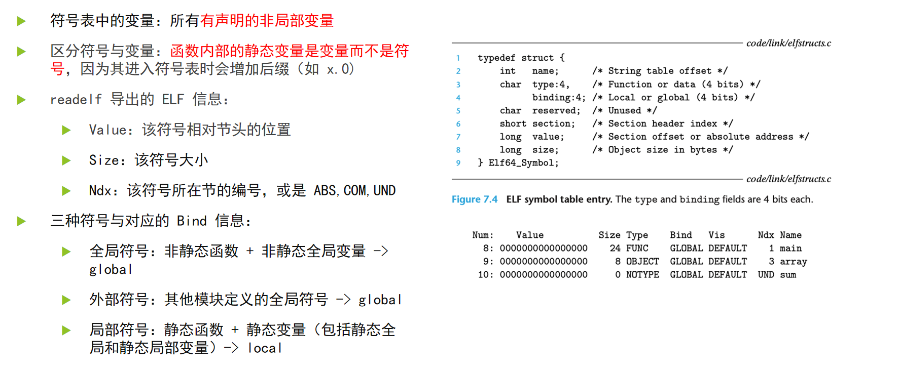

---


# 示例

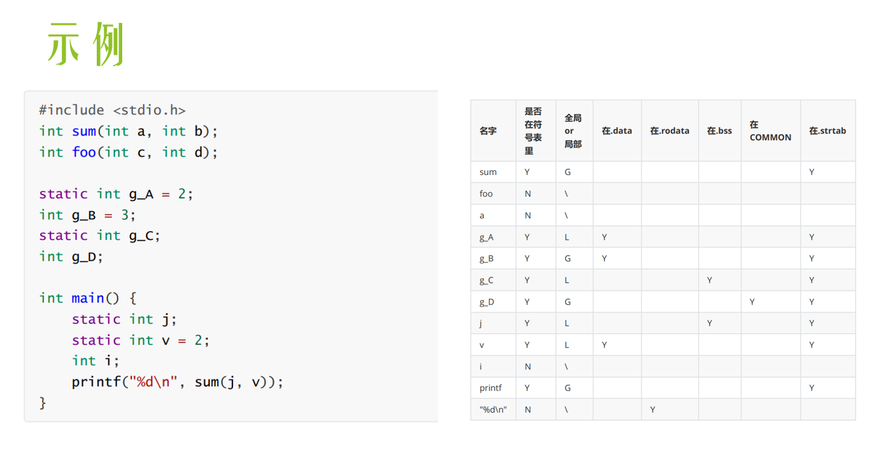

---


# 伪节

- 伪节åªå­˜åœ¨äºå¯é‡å®šä½ç›®æ ‡æ–‡ä»¶ä¸­ï¼Œä¸å­˜åœ¨äºå¯æ‰§è¡Œç›®æ ‡æ–‡ä»¶ä¸­
- `ABS`：ä¸è¯¥è¢«é‡å®šä½çš„符å·
- `UNDEF`：未定义的符å·ï¼ˆåªæœ‰å¼•ç”¨ï¼‰
- `COMMON`：未åˆå§‹åŒ–的全局å˜é‡ï¼ˆé€‚é…符å·è§£æ规则）
  - åˆå§‹åŒ–为 0 的全局å˜é‡ä¸æ‰€æœ‰é™æ€å˜é‡å­˜æ”¾äº .bss 中
  - 在å¯æ‰§è¡Œç›®æ ‡æ–‡ä»¶ä¸­ COMMON ä¿å­˜çš„æ•°æ®ä¼šè¿›å…¥ .bss

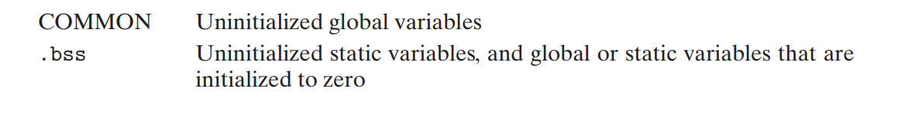

---


# å¯æ‰§è¡Œç›®æ ‡æ–‡ä»¶

## ELF

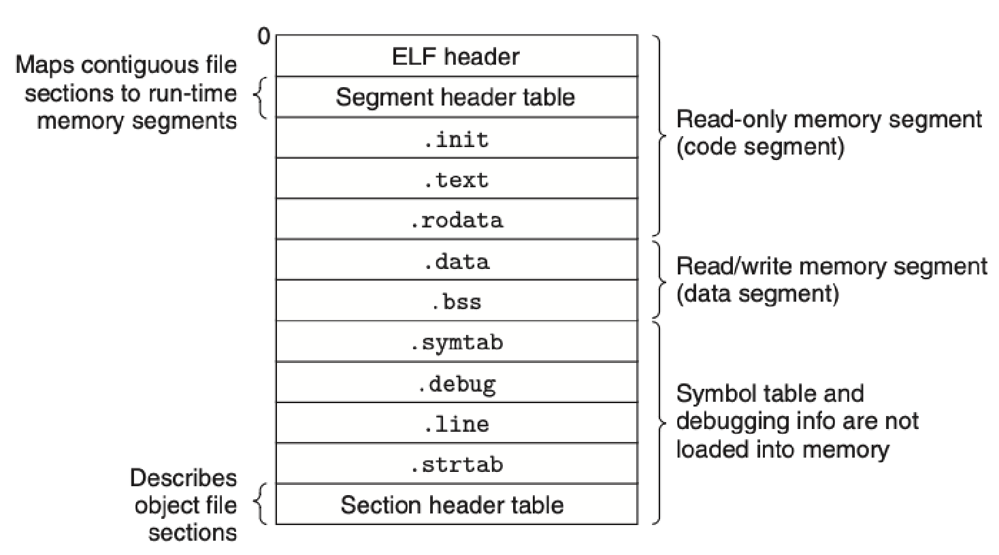

---


# 程åºå¤´éƒ¨è¡¨ï¼ˆæ®µå¤´éƒ¨è¡¨ï¼‰

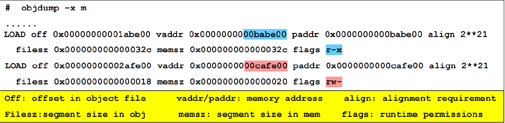

---


# 加载

- `loader -> _start() -> __libc_start_main() -> main()`

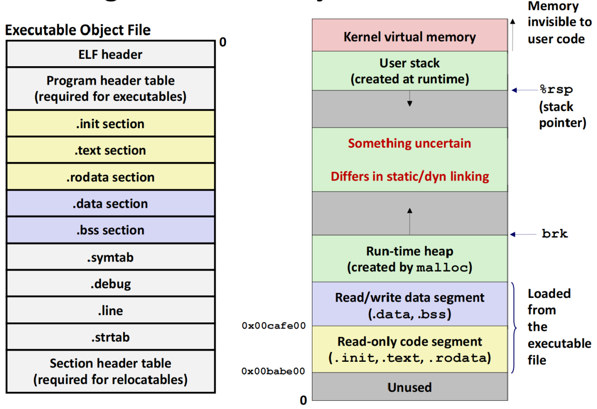

# 共享目标文件

---

| 特性               | å¯é‡å®šä½ç›®æ ‡æ–‡ä»¶ï¼ˆ.o）             | å¯æ‰§è¡Œç›®æ ‡æ–‡ä»¶ï¼ˆæ— ç‰¹å®šå缀或 .exe） | 共享目标文件（.so / .dll）     |
| ------------------ | ---------------------------------- | ----------------------------------- | ------------------------------ |
| **文件生æˆé˜¶æ®µ**   | 编译阶段                           | 链æ¥é˜¶æ®µ                            | 动æ€é“¾æ¥åº“ç”Ÿæˆ                 |
| **文件是å¦å¯æ‰§è¡Œ** | å¦ï¼Œéœ€è¿›ä¸€æ­¥é“¾æ¥                   | 是，å¯ç›´æ¥åŠ è½½å¹¶è¿è¡Œ                | å¦ï¼Œéœ€åŠ¨æ€é“¾æ¥åˆ°è¿›ç¨‹ä¸­         |
| **地å€ç±»å‹**       | 相对地å€ï¼ˆéœ€é‡å®šä½ï¼‰               | ç»å¯¹åœ°å€                            | å¯ç›¸å¯¹ä¹Ÿå¯å»¶è¿Ÿè§£æ             |
| **主è¦å†…容**       | 代ç æ®µã€æ•°æ®æ®µã€ç¬¦å·è¡¨ã€é‡å®šä½ä¿¡æ¯ | 代ç æ®µã€æ•°æ®æ®µã€å…¥å£åœ°å€            | 代ç æ®µã€æ•°æ®æ®µã€åŠ¨æ€æ®µã€ç¬¦å·è¡¨ |
| **应用场景**       | 链æ¥è¾“入文件，生æˆå¯æ‰§è¡Œæ–‡ä»¶æˆ–库   | å¯æ‰§è¡Œæ–‡ä»¶ï¼Œç¨‹åºå…¥å£ç”±ç³»ç»ŸåŠ è½½      | 共享库，在多个程åºä¸­å…±äº«ä½¿ç”¨   |
| **链æ¥æ–¹å¼**       | é™æ€é“¾æ¥                           | é™æ€æˆ–动æ€é“¾æ¥                      | 动æ€é“¾æ¥                       |
| **é‡å®šä½éœ€æ±‚**     | 需è¦åœ¨é“¾æ¥æ—¶é‡å®šä½                 | å·²é‡å®šä½å®Œæˆ                        | 加载时动æ€é‡å®šä½               |
| **共享性**         | 独立，ä¸å…±äº«                       | 独立，ä¸å…±äº«                        | 支æŒå¤šä¸ªè¿›ç¨‹å…±äº«               |

---

# å¯é‡å®šä½ç›®æ ‡æ–‡ä»¶

#### 文件类å‹

- **文件åç¼€**：通常以 `.o`（Unix/Linux）ã€`.obj`（Windows）为å缀。

- **生æˆæ–¹å¼**：通过编译æºæ–‡ä»¶ç”Ÿæˆã€‚例如：

  ```bash
  gcc -c example.c -o example.o
  ```

- **示例**：å‡è®¾æœ‰æ–‡ä»¶ `example.c`，将其编译为 `example.o`，得到的就是一个å¯é‡å®šä½ç›®æ ‡æ–‡ä»¶ã€‚

#### 内容

å¯é‡å®šä½ç›®æ ‡æ–‡ä»¶åŒ…å«ä»¥ä¸‹å†…容：

- **代ç æ®µ**：如 `.text` 段，包å«ç¼–译生æˆçš„机器指令。
- **æ•°æ®æ®µ**：如 `.data`（已åˆå§‹åŒ–的全局å˜é‡ï¼‰å’Œ `.bss`（未åˆå§‹åŒ–的全局å˜é‡ï¼‰æ®µã€‚
- **符å·è¡¨**：列出文件中的符å·ï¼ˆå‡½æ•°ã€å˜é‡ç­‰ï¼‰å®šä¹‰å’Œå¼•ç”¨ã€‚
- **é‡å®šä½ä¿¡æ¯**：标识出需è¦åœ¨é“¾æ¥é˜¶æ®µè°ƒæ•´çš„地å€ã€‚


---

# å¯æ‰§è¡Œç›®æ ‡æ–‡ä»¶

#### 文件类å‹

- **文件åç¼€**：在 Unix/Linux 系统上没有特定å缀，一般命å为 `a.out` 或直æ¥ä»¥ç¨‹åºå称命å；在 Windows 系统上通常以 `.exe` 作为å缀。

- **生æˆæ–¹å¼**：通过链æ¥å™¨å°†å¤šä¸ª `.o` 文件组åˆå¹¶é‡å®šä½ç”Ÿæˆã€‚例如：

  ```bash
  gcc main.o example.o -o example_program
  ```

- **示例**：è¿è¡Œ `gcc main.o example.o -o example_program` å生æˆçš„ `example_program` 就是一个å¯æ‰§è¡Œç›®æ ‡æ–‡ä»¶ã€‚

#### 内容

å¯æ‰§è¡Œç›®æ ‡æ–‡ä»¶åŒ…å«ä»¥ä¸‹å†…容：

- **代ç æ®µ**：包å«ç¨‹åºçš„指令，设置为å¯æ‰§è¡Œã€‚
- **æ•°æ®æ®µ**：包å«ç¨‹åºçš„æ•°æ®ï¼Œå·²å®Œæˆé‡å®šä½ã€‚
- **程åºå…¥å£**：指æ˜ç¨‹åºå¼€å§‹æ‰§è¡Œçš„å…¥å£åœ°å€ã€‚
- **动æ€é“¾æ¥ä¿¡æ¯**（若为动æ€é“¾æ¥ï¼‰ï¼šåŒ…å«å¯¹å…±äº«åº“çš„ä¾èµ–ä¿¡æ¯ã€‚


---


# 共享目标文件

#### 文件类å‹

- **文件åç¼€**：在 Unix/Linux 系统上以 `.so` 为å缀，在 Windows 系统上以 `.dll` 为å缀。

- **生æˆæ–¹å¼**：通过编译器或链æ¥å™¨æŒ‡å®šç”Ÿæˆå…±äº«åº“。例如：

  ```
  bash
  
  
  å¤åˆ¶ä»£ç 
  gcc -shared -fPIC example.c -o libexample.so
  ```

- **示例**：è¿è¡Œ `gcc -shared -fPIC example.c -o libexample.so` å生æˆçš„ `libexample.so` 就是一个共享目标文件。

#### 内容

共享目标文件包å«ä»¥ä¸‹å†…容：

- **代ç æ®µ**：包å«å…±äº«åº“的代ç ï¼Œå¯ä»¥è¢«å¤šä¸ªç¨‹åºåŠ è½½å¹¶å…±äº«ã€‚
- **æ•°æ®æ®µ**：包å«å…±äº«åº“的全局数æ®ã€‚
- **动æ€æ®µ**：记录共享库的ä¾èµ–和符å·è¡¨ï¼Œç”¨äºåŠ¨æ€é“¾æ¥æ—¶ç¬¦å·è§£æ。
- **全局å移表（GOT）和过程链æ¥è¡¨ï¼ˆPLT）**：用äºå»¶è¿Ÿç»‘定的符å·è§£æ机制。

---


# é™æ€é“¾æ¥

# 符å·è§£æ

> å°†æ¯ä¸ªç¬¦å·å¼•ç”¨æ­£å¥½å’Œä¸€ä¸ªç¬¦å·å®šä¹‰å…³è”èµ·æ¥


- 注：强弱仅针对全局符å·çš„定义，本地符å·ï¼ˆstatic）ã€å‡½æ•°å¼•ç”¨ã€éé™æ€å±€éƒ¨å˜é‡å‡ä¸å‚ä¸å¼ºå¼±è®¨è®º

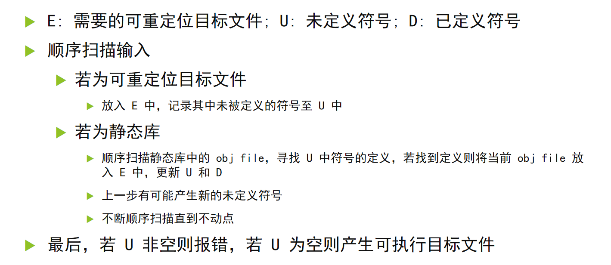

# é‡å®šä½

> 利用é‡å®šä½æ¡ç›®ï¼ŒæŠŠæ¯ä¸€ä¸ªç¬¦å·å®šä¹‰ä¸ä¸€ä¸ªå†…å­˜ä½ç½®å…³è”èµ·æ¥

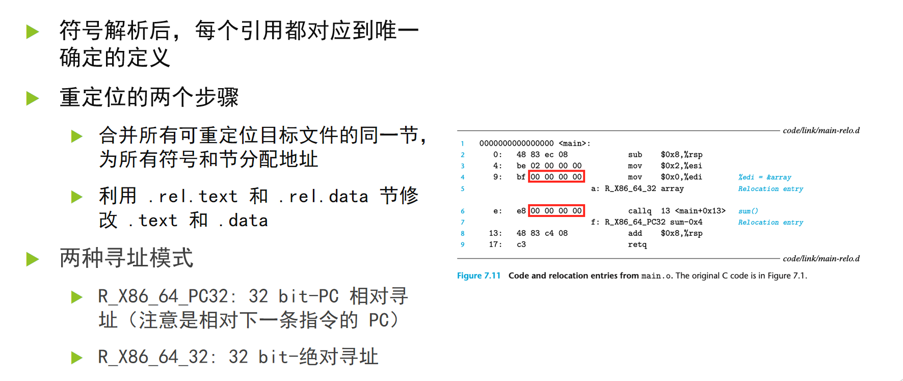

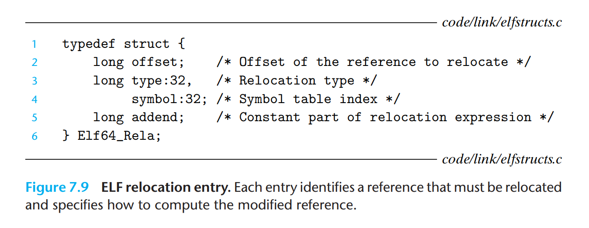

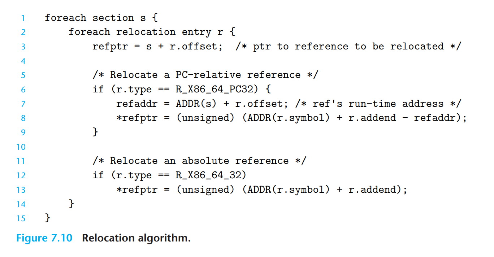

- é‡å®šä½å¼•ç”¨åœ°å€`refaddr`：指`ADDR(s) + r.offset`
- é‡å®šä½å¼•ç”¨å€¼`*refptr`：指32ä½æ•°å€¼`0x0000XXXX`


1. ä¾æ®é‡å®šä½æ¡ç›®ï¼Œå¾—知`r.offset`，`r.symbol`，`r.type`，`r.addend=-4/0`

2. ä¾æ®é“¾æ¥å™¨ï¼Œå¾—知`ADDR(s)`，`ADDR(r.symbol)`

3. 求得`*refptr`å³æŒ‡ä»¤ä¸­ç¼–ç çš„32ä½å€¼

   1. `r.type == R_X86_64_32`ç»å¯¹å¼•ç”¨

      `*refptr = ADDR(r.symbol)`

   2. `r.type == R_X86_64_PC32`相对引用

      - `*refptr = ADDR(r.symbol) - PC`
      - `PC = ADDR(s) + r.offset - r.addend`

# 共享库

# é™æ€åº“链æ¥

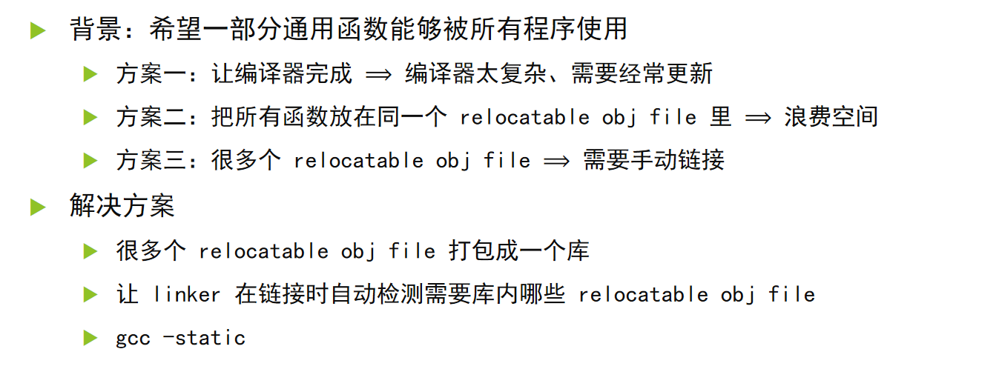

---

# é™æ€åº“链æ¥

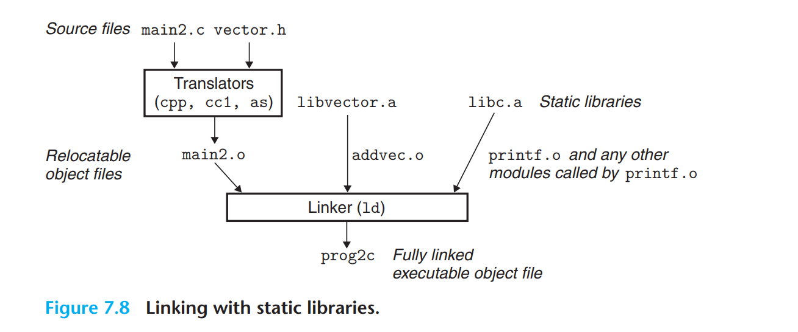

- 注æ„： .o ä¸ .a çš„ä¸åŒ
  - **.o 在链æ¥ç®—法中会直æ¥é‡å®šä½åŠ å…¥æ±‡ç¼–而 .a åªä¼šåŠ å…¥å…¶è¢«å¼•ç”¨çš„符å·**


---


# 动æ€åº“链æ¥

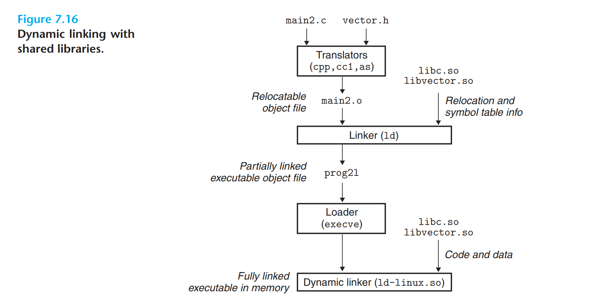

---


# ä½ç½®æ— å…³ä»£ç ï¼ˆPIC）

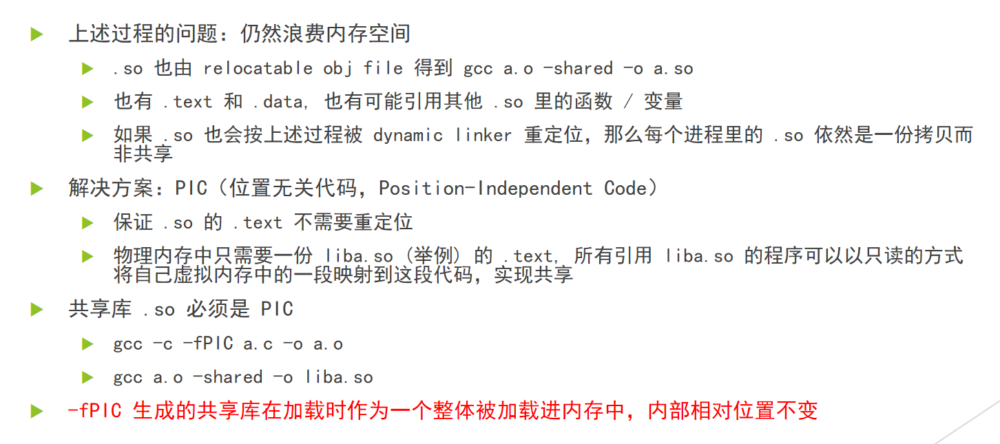

---

# GOT

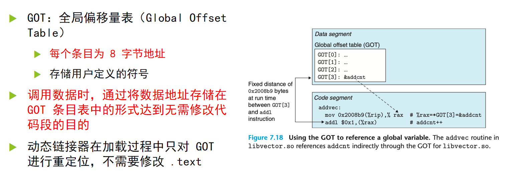

---

# PLT

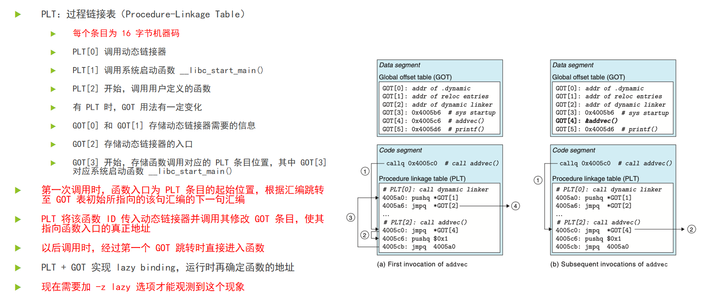


---

动æ€é“¾æ¥çš„过程如下：

1. **加载å¯æ‰§è¡Œæ–‡ä»¶å’Œå…±äº«åº“**，并å¯åŠ¨åŠ¨æ€é“¾æ¥å™¨ã€‚
2. **解æä¾èµ–关系**，加载所有ä¾èµ–的共享库。
3. **准备 GOT å’Œ PLT** 表，确ä¿ç¬¦å·å¯ä»¥è¢«åŠ¨æ€è§£æ。
4. **符å·è§£æå’Œé‡å®šä½**，在åˆæ¬¡åŠ è½½æ—¶å®Œæˆå¤§éƒ¨åˆ†ç¬¦å·çš„解æ。
5. **延迟绑定**，当第一次调用共享库的函数时，动æ€é“¾æ¥å™¨è§£æ符å·å¹¶ç»‘定。
6. **完æˆåˆå§‹åŒ–并跳转到入å£ç‚¹**，程åºå¼€å§‹æ­£å¸¸æ‰§è¡Œã€‚


---
layout: center
---

<div>
  <text class="text-17 font-bold gradient-text">Part1
</text>
</div>

<style>
  .gradient-text {
    background-image: linear-gradient(45deg, #4ec5d4 10%, #146b8c 20%);
    -webkit-background-clip: text;
    color: transparent;
  }
</style>


---

# col2

<div grid="~ cols-2 gap-2">

<div>


</div>

<div>


</div>
</div>


---
layout: center
---

<div>
  <text class="text-17 font-bold gradient-text">Part2
</text>
</div>

<style>
  .gradient-text {
    background-image: linear-gradient(45deg, #4ec5d4 10%, #146b8c 20%);
    -webkit-background-clip: text;
    color: transparent;
  }
</style>


---
layout: center
---

<div>
  <text class="text-17 font-bold gradient-text">Part3
</text>
</div>

<style>
  .gradient-text {
    background-image: linear-gradient(45deg, #4ec5d4 10%, #146b8c 20%);
    -webkit-background-clip: text;
    color: transparent;
  }
</style>

---
layout: center
---

<div>
  <text class="text-17 font-bold gradient-text">Homework Review</text>
</div>

<style>
  .gradient-text {
    background-image: linear-gradient(45deg, #4ec5d4 10%, #146b8c 20%);
    -webkit-background-clip: text;
    color: transparent;
  }
</style>


---
layout: center
---

<div>
  <text class="text-17 font-bold gradient-text">Exercises</text>
</div>

<style>
  .gradient-text {
    background-image: linear-gradient(45deg, #4ec5d4 10%, #146b8c 20%);
    -webkit-background-clip: text;
    color: transparent;
  }
</style>


---
layout: center
---

<div>
  <text class="text-17 font-bold gradient-text">Notices</text>
</div>

<style>
  .gradient-text {
    background-image: linear-gradient(45deg, #4ec5d4 10%, #146b8c 20%);
    -webkit-background-clip: text;
    color: transparent;
  }
</style>


---
layout: center
---

<div flex="~ gap-20"  mt-2 justify-center items-center>

<div  w-fit h-fit mb-2>

# THANKS

Made by WalkerCH 

changxinhai@stu.pku.edu.cn

<p class="text-gray-40">
  <font size = '3'>
    Reference: [Weicheng Lin]'s presentation.<br>
    Reference: [Arthals]'s templates and content.
  </font>
</p>

</div>

{.w-50.rounded-md}

</div>
